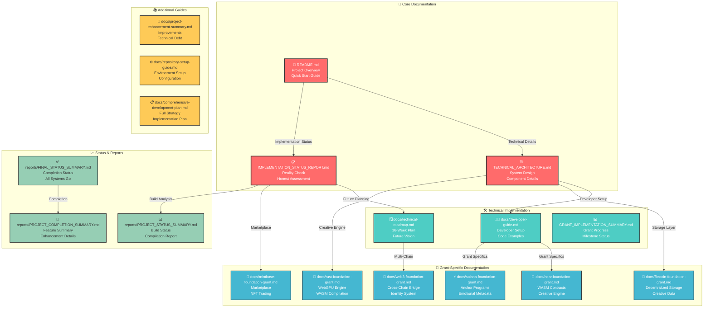
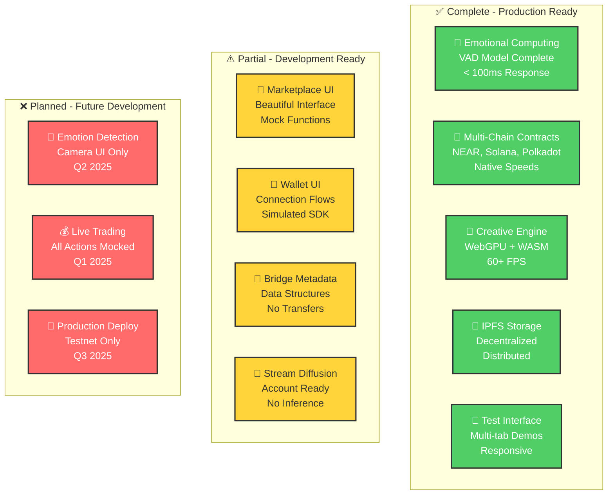

# 📚 Blockchain NFT Interactive - Documentation Hub

> **Complete documentation index with visual navigation and modern design**

---

<div align="center">

[](README.md)
[](TECHNICAL_ARCHITECTURE.md)
[](docs/developer-guide.md)
[](BUILD_AND_TEST_ALL.sh)

</div>

---

## 🎯 Documentation Overview

Welcome to the comprehensive documentation hub for **Blockchain NFT Interactive** - a revolutionary platform that fuses emotional artificial intelligence with multi-chain blockchain technology to create emotionally-aware NFT ecosystems.

---

## 📊 Documentation Architecture

### 🏛️ **Core System Documentation**



---

## 🚀 Quick Navigation Guide

### 🎯 **Getting Started Path**

New to the project? Follow this path:

1. **[📖 README.md](README.md)** - Project overview and quick start
2. **[📋 IMPLEMENTATION_STATUS_REPORT.md](reports/IMPLEMENTATION_STATUS_REPORT.md)** - Honest assessment of what's built
3. **[👨‍💻 Developer Guide](docs/developer-guide.md)** - Technical setup and coding
4. **[🏗️ Technical Architecture](TECHNICAL_ARCHITECTURE.md)** - System design details

> Reality check: backend and frontend have been tested; UI and real user flows still need testing and validation across chains.

### 🛠️ **Developer Journey**

For developers building on the platform:

```mermaid
graph LR
    %% Developer Journey Flow
    classDef start fill:#ff6b6b,stroke:#333,stroke-width:3px,color:#fff
    classDef dev fill:#4ecdc4,stroke:#333,stroke-width:2px,color:#fff
    classDef build fill:#45b7d1,stroke:#333,stroke-width:2px,color:#fff
    classDef deploy fill:#96ceb4,stroke:#333,stroke-width:2px,color:#333

    START["🚀 Start Here<br/>README.md"]:::start
    DEV_SETUP["⚙️ Developer Setup<br/>Developer Guide"]:::dev
    ARCHITECTURE["🏗️ Understand System<br/>Technical Architecture"]:::dev
    BUILD["🔨 Build Components<br/>BUILD_AND_TEST_ALL.sh"]:::build
    TEST["🧪 Test Everything<br/>test-all-modules.sh"]:::build
    DEPLOY["🚀 Deploy to Testnet<br/>deploy-to-testnets.sh"]:::deploy
    MONITOR["📊 Monitor Health<br/>System Health Check"]:::deploy

    START --> DEV_SETUP
    DEV_SETUP --> ARCHITECTURE
    ARCHITECTURE --> BUILD
    BUILD --> TEST
    TEST --> DEPLOY
    DEPLOY --> MONITOR
```



---

## 📖 Documentation Categories

### 🎯 **Core Project Documentation**

| Document | Emoji | Description | Status |
|----------|-------|-------------|--------|
| [README.md](README.md) | 📖 | **Main project overview** with modern design | ✅ Complete |
| [TECHNICAL_ARCHITECTURE.md](TECHNICAL_ARCHITECTURE.md) | 🏗️ | **Comprehensive system architecture** with mermaid diagrams | ✅ Complete |
| [reports/IMPLEMENTATION_STATUS_REPORT.md](reports/IMPLEMENTATION_STATUS_REPORT.md) | 📊 | **Brutally honest assessment** of implementation vs claims | ✅ Complete |

### 🛠️ **Technical Implementation Guides**

| Document | Emoji | Description | Status |
|----------|-------|-------------|--------|
| [docs/developer-guide.md](docs/developer-guide.md) | 👨‍💻 | **Developer setup** with code examples and workflows | ✅ Complete |
| [docs/technical-roadmap.md](docs/technical-roadmap.md) | 🗓️ | **16-week development plan** with Gantt charts | ✅ Complete |
| [GRANT_IMPLEMENTATION_SUMMARY.md](GRANT_IMPLEMENTATION_SUMMARY.md) | 📈 | **Grant progress summary** across all foundations | ✅ Complete |

### 🎯 **Foundation Grant Documentation**

| Grant | Foundation | Focus Area | Document | Status |
|-------|------------|------------|----------|--------|
| 🎯 **NEAR** | NEAR Foundation | WASM Contracts + Creative Engine | [docs/near-foundation-grant.md](docs/near-foundation-grant.md) | ✅ Complete |
| ⚡ **Solana** | Solana Foundation | Anchor Programs + Emotional Metadata | [docs/solana-foundation-grant.md](docs/solana-foundation-grant.md) | ✅ Complete |
| 🌉 **Polkadot** | Web3 Foundation | Cross-Chain Bridge + Identity | [docs/web3-foundation-grant.md](docs/web3-foundation-grant.md) | ✅ Complete |
| 💾 **Filecoin** | Filecoin Foundation | Decentralized Storage + Creative Data | [docs/filecoin-foundation-grant.md](docs/filecoin-foundation-grant.md) | ✅ Complete |
| 🦀 **Rust** | Rust Foundation | WebGPU Engine + WASM Compilation | [docs/rust-foundation-grant.md](docs/rust-foundation-grant.md) | ✅ Complete |
| 🏪 **Mintbase** | Mintbase | Marketplace + NFT Trading | [docs/mintbase-foundation-grant.md](docs/mintbase-foundation-grant.md) | ✅ Complete |

### 📈 **Status Reports & Analysis**

| Document | Emoji | Description | Status |
|----------|-------|-------------|--------|
| [reports/PROJECT_STATUS_SUMMARY.md](reports/PROJECT_STATUS_SUMMARY.md) | 📊 | **Build status analysis** across all components | ✅ Complete |
| [reports/FINAL_STATUS_SUMMARY.md](reports/FINAL_STATUS_SUMMARY.md) | ✅ | **Final compilation report** - all systems working | ✅ Complete |
| [reports/PROJECT_COMPLETION_SUMMARY.md](reports/PROJECT_COMPLETION_SUMMARY.md) | 🎉 | **Feature completion summary** with enhancements | ✅ Complete |

---

## 🔧 Build & Development Commands

### 🚀 **Quick Development Commands**

```bash
# 🏗️ Build everything
./BUILD_AND_TEST_ALL.sh

# 🧪 Run comprehensive tests
./test-all-modules.sh

# 📦 Package for deployment
./package-for-deployment.sh

# 🚀 Deploy to testnets
./deploy-to-testnets.sh

# ✅ Verify completion
./VERIFY_COMPLETION.sh
```

### 🎯 **Individual Component Development**

```bash
# ⛓️ NEAR contracts
cd src/near-wasm && ./build.sh

# ⚡ Solana programs
cd src/solana-client && cargo build

# 🌉 Polkadot bridge
cd src/polkadot-client && cargo build

# 💾 IPFS integration
cd src/ipfs-integration && cargo build

# 🎨 Creative engine
cd src/rust-client && cargo build

# 🏪 Marketplace
cd src/marketplace && cargo build
```

---

## 📊 Implementation Status Matrix

### 🎯 **Feature Implementation Reality**



---

## 🌟 Key Features & Capabilities

### 🧠 **Emotional Computing Engine**
- ✅ **VAD Model**: Complete Valence-Arousal-Dominance implementation
- ✅ **Pattern Recognition**: Advanced emotional pattern detection
- ✅ **Trajectory Analysis**: Historical emotional state tracking
- ✅ **Complexity Scoring**: Sophisticated emotional sophistication metrics

### 🔗 **Multi-Chain Integration**
- ✅ **NEAR Protocol**: WASM smart contracts with emotional NFTs
- ✅ **Solana**: Anchor programs with emotional metadata
- ✅ **Polkadot**: Cross-chain bridge with identity systems
- ✅ **IPFS/Filecoin**: Decentralized storage for emotional data

### 🎨 **Creative Engine**
- ✅ **WebGPU Acceleration**: Hardware-accelerated fractal generation
- ✅ **WGSL Shaders**: Advanced shader programming environment
- ✅ **Real-time Rendering**: 60+ FPS emotional visualization
- ✅ **WASM Compilation**: High-performance browser runtime

### 📱 **User Interface**
- ✅ **Multi-tab Interface**: Marketplace, Create, DAO, Soulbound, Cross-Chain
- ✅ **Interactive Demos**: Real-time emotional NFT creation
- ✅ **Responsive Design**: Mobile and desktop optimization
- ✅ **Educational Tool**: Comprehensive demonstration platform

---

## 🔮 Future Development Roadmap

### 📅 **16-Week Development Timeline**

```mermaid
gantt
    title Blockchain NFT Interactive Development Roadmap
    dateFormat  YYYY-MM-DD
    section Foundation
    Core Architecture        :done, core, 2024-01-01, 4w
    Emotional Computing      :done, emotion, after core, 4w
    section Integration  
    Multi-Chain Support      :active, chain, after emotion, 4w
    Marketplace Live        :future, market, after chain, 4w
    section Production
    Wallet Integration       :future, wallet, after market, 4w
    Mainnet Deployment       :future, mainnet, after wallet, 4w
    section Advanced
    Emotion Detection        :future, camera, after mainnet, 4w
    AI Enhancement           :future, ai, after camera, 4w
```

---

## 🤝 Contributing & Community

### 📋 **How to Contribute**

1. **🍴 Fork** the repository
2. **📖 Read** the [Developer Guide](docs/developer-guide.md)
3. **🔧 Set up** your development environment
4. **🌿 Create** a feature branch
5. **💻 Code** your contribution
6. **🧪 Test** thoroughly with `./BUILD_AND_TEST_ALL.sh`
7. **📝 Document** your changes
8. **🚀 Submit** a pull request

### 🌟 **Community Resources**

- **💬 Discussions**: [GitHub Discussions](https://github.com/compiling-org/blockchain-nft-interactive/discussions)
- **🐛 Issues**: [Bug Reports & Feature Requests](https://github.com/compiling-org/blockchain-nft-interactive/issues)
- **📧 Contact**: Project maintainers for partnerships
- **🎨 Showcase**: Share your emotional NFT creations

---

## 📞 Support & Contact

### 🆘 **Getting Help**

| Support Channel | Response Time | Best For |
|----------------|---------------|----------|
| **📚 Documentation** | Instant | Self-service learning |
| **💬 GitHub Discussions** | 24-48 hours | Community questions |
| **🐛 GitHub Issues** | 48-72 hours | Bug reports & features |
| **📧 Email** | 3-5 days | Partnership inquiries |

---

<div align="center">

### 🎭 **Where Emotions Meet Blockchain Technology** 🎭

*Creating the future of emotionally intelligent digital assets through comprehensive documentation and community collaboration*

**Ready to build the future?** Start with our [Developer Guide](docs/developer-guide.md) and join the revolution!

</div>