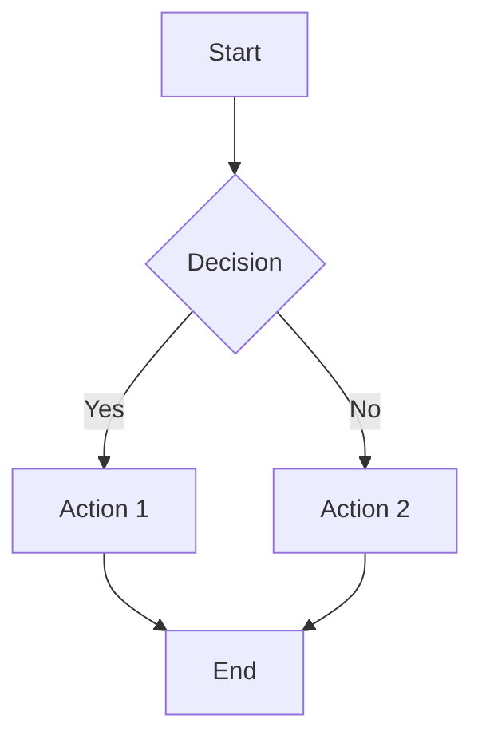
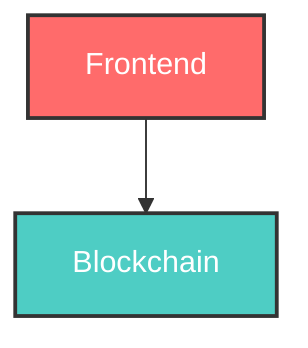

# Mermaid Chart Test

This page tests if mermaid charts are displaying correctly in the README.

## Test Chart 1: Simple Flow



## Test Chart 2: Styled Components



## Test Chart 3: Gantt Chart

```mermaid
gantt
    title Test Development Timeline
    dateFormat  YYYY-MM-DD
    section Foundation
    Core Architecture    :done, core, 2024-01-01, 4w
    Integration          :active, integration, after core, 4w
    section Production
    Deployment           :future, deploy, after integration, 4w
```

## Status

If you can see the charts above, mermaid is working correctly. If not, there may be a rendering issue.