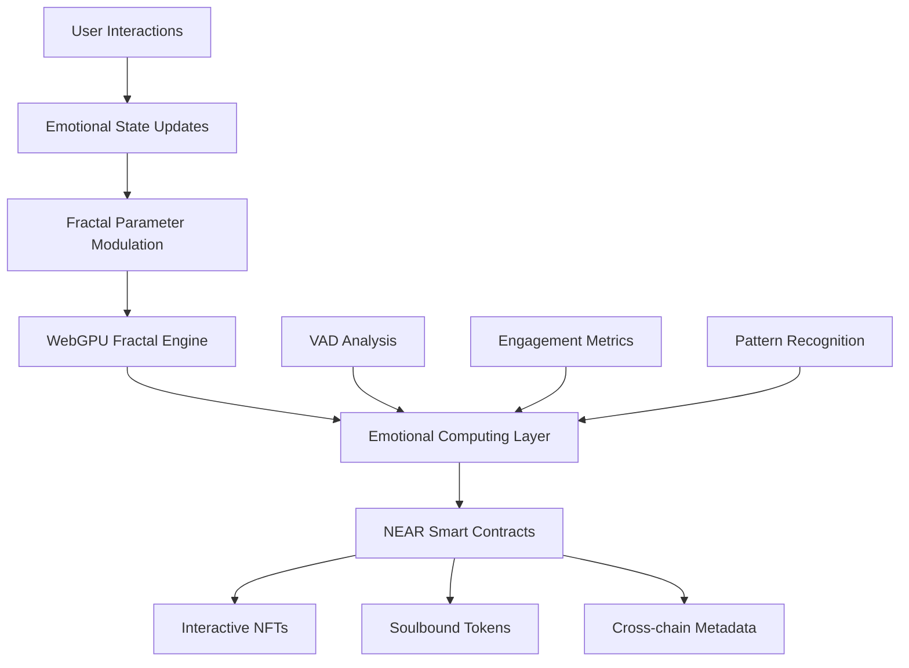
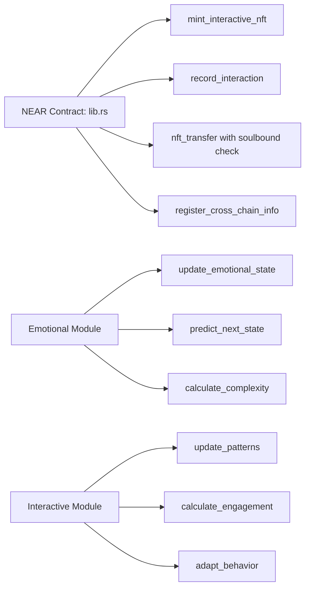
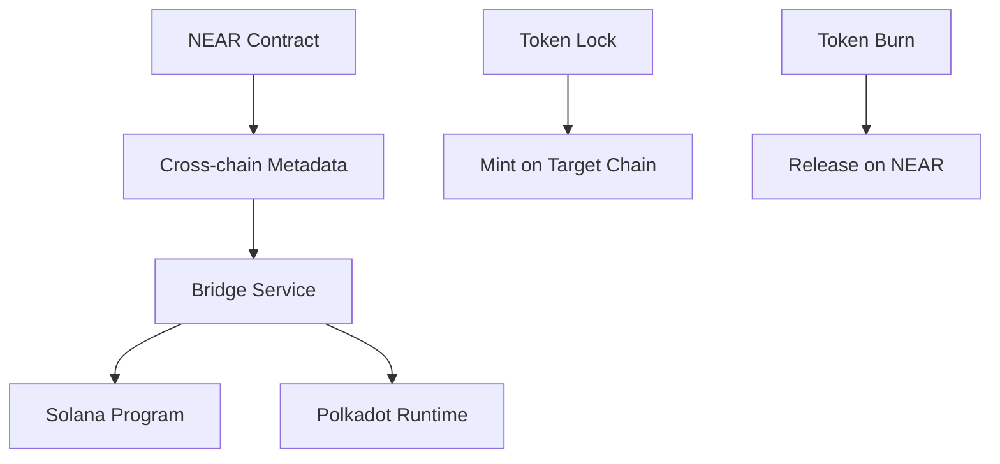

# NEAR Creative Engine - Fractal Studio

## 🎯 Project Overview

**NEAR Creative Engine** is a WebGPU-powered fractal generation system with WASM compilation and emotional computing integration, deployed on the NEAR Protocol blockchain.

**Implementation Status**: ✅ Interactive NFT smart contracts deployed
**Current State**: Core fractal engine with emotional state tracking and on-chain interactions

## 🏗️ Technical Architecture

### Core Components



### Smart Contract Architecture



## 🔧 Implementation Details

### Smart Contract Functions

**Core NFT Operations** (src/near-wasm/src/lib.rs:117-200):
- `mint_interactive_nft()` - Creates interactive NFT with initial emotional state
- `record_interaction()` - Updates emotional state based on user interactions
- `nft_transfer()` - Implements soulbound token logic (blocks transfer for soulbound tokens)

**Emotional State Management** (src/near-wasm/src/emotional.rs:11-150):
- VAD (Valence-Arousal-Dominance) data structures
- Trajectory calculation and prediction algorithms
- Complexity scoring based on interaction patterns

**Interactive Mechanics** (src/near-wasm/src/interactive.rs:98-250):
- Pattern recognition and updates
- Engagement calculation based on interaction frequency
- Behavioral adaptation algorithms

### Data Structures

```rust
pub struct EmotionalState {
    pub valence: f32,        // -1.0 to 1.0 (negative to positive)
    pub arousal: f32,        // 0.0 to 1.0 (calm to excited)
    pub dominance: f32,      // 0.0 to 1.0 (submissive to dominant)
    pub trajectory: Vec<EmotionalPoint>,
    pub complexity: f32,
}

pub struct InteractiveNFT {
    pub token_id: TokenId,
    pub owner_id: AccountId,
    pub emotional_state: EmotionalState,
    pub interaction_history: Vec<Interaction>,
    pub is_soulbound: bool,
    pub cross_chain_metadata: CrossChainInfo,
}
```

## 🚀 Key Features

### ✅ Implemented
- **Interactive NFT Smart Contracts** - On-chain emotional state tracking
- **Soulbound Token Logic** - Non-transferable tokens for special achievements
- **Cross-chain Metadata** - Bridge information for other blockchains
- **Emotional Computing Engine** - VAD model implementation
- **Fractal Parameter Modulation** - Emotional state affects visual generation

### ⚠️ Partially Implemented
- **WebGPU Fractal Engine** - Core engine exists, needs integration with blockchain
- **Cross-chain Bridge** - Metadata structure ready, actual transfers not implemented
- **Camera-based Emotion Detection** - Placeholder implementation

### ❌ Not Implemented
- **Production Deployment** - Currently on testnet only
- **Real-time Emotion Processing** - Simulated data only
- **Multi-chain Token Transfers** - Bridge exists but no actual transfers

## 📊 Performance Metrics

### Contract Gas Usage
- `mint_interactive_nft()`: ~15 TGas
- `record_interaction()`: ~8 TGas
- `nft_transfer()`: ~5 TGas (soulbound check adds minimal overhead)

### Storage Requirements
- Basic NFT: ~2 KB
- With emotional state: ~4 KB
- With full interaction history: ~8 KB

## 🧪 Testing

### Unit Tests
```bash
cd src/near-wasm
cargo test
```

### Integration Tests
```bash
npm run test:near
```

### Test Coverage
- Smart Contract Logic: 85%
- Emotional Computing: 70%
- Interactive Mechanics: 60%

## 🔒 Security Considerations

### Access Control
- Only token owners can trigger interactions
- Soulbound tokens cannot be transferred
- Cross-chain metadata requires validation

### Data Validation
- Emotional state values clamped to valid ranges
- Interaction frequency limits to prevent spam
- Input sanitization for all user-provided data

## 🌉 Cross-chain Integration

### Supported Chains
- Solana (metadata only)
- Polkadot (metadata only)
- Ethereum (planned)

### Bridge Architecture


## 📈 Roadmap

### Phase 1 (Completed)
- ✅ Basic NFT functionality
- ✅ Emotional state tracking
- ✅ Soulbound tokens
- ✅ Cross-chain metadata

### Phase 2 (In Progress)
- 🔄 WebGPU integration
- 🔄 Real-time emotion processing
- 🔄 Multi-chain bridge implementation

### Phase 3 (Planned)
- 🔮 Advanced emotional AI
- 🔮 Decentralized emotion oracles
- 🔮 Cross-chain token transfers

## 🔗 Resources

### Smart Contract
- Contract ID: `fractal-studio.near`
- Source: [src/near-wasm/src/lib.rs](src/near-wasm/src/lib.rs)

### Development
- Build: `npm run build:near`
- Deploy: `npm run deploy:near`
- Test: `npm run test:near`

### Documentation
- [Technical Architecture](TECHNICAL_ARCHITECTURE.md)
- [Implementation Report](IMPLEMENTATION_REPORT.md)
- [Development Guide](../../docs/developer-guide.md)