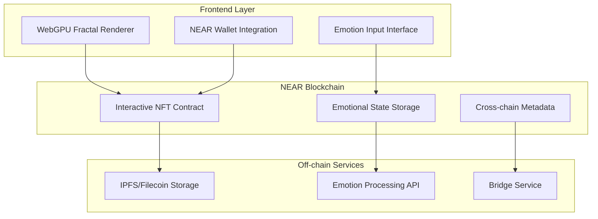
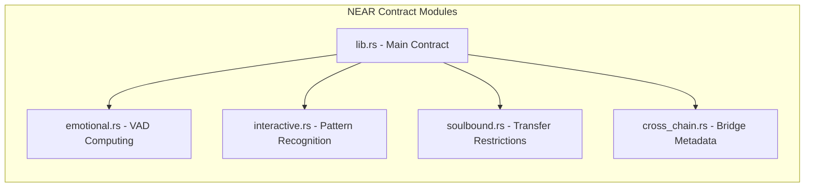
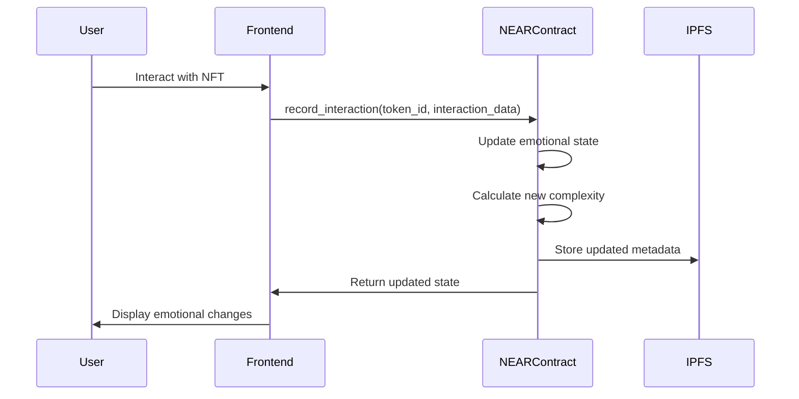
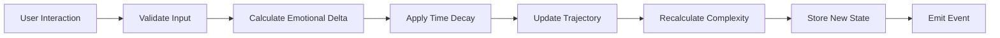
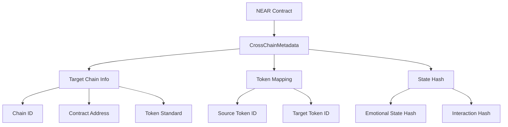
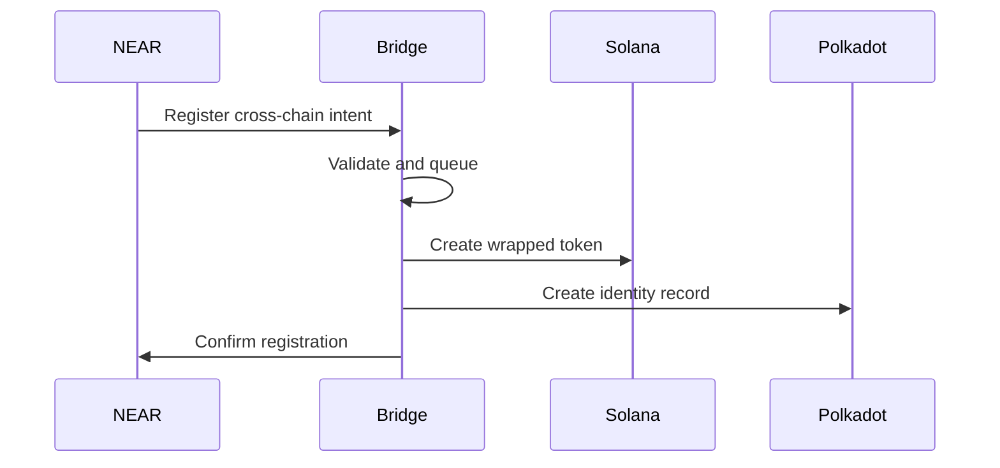
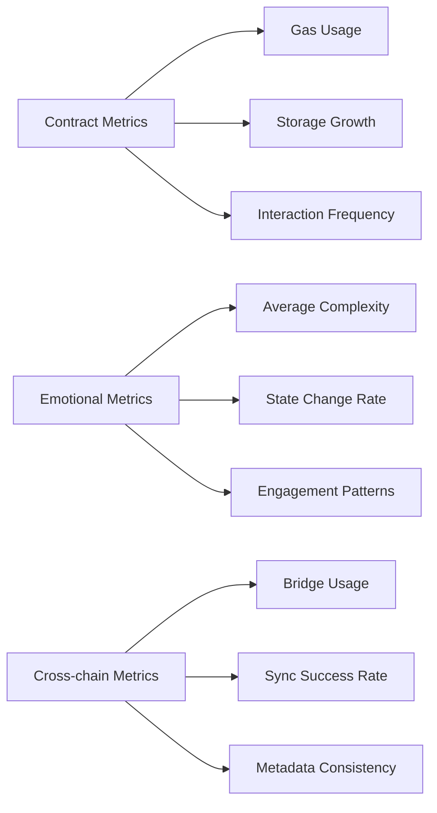

# NEAR Creative Engine - Technical Architecture

## 🏗️ System Overview

The NEAR Creative Engine combines WebGPU-based fractal generation with on-chain emotional computing, deployed on the NEAR Protocol blockchain.



## 🔧 Smart Contract Architecture

### Core Contract Structure



### Data Flow Architecture



## 📊 Data Models

### Emotional State Architecture

```mermaid
graph TD
    A[EmotionalState] --> B[valence: f32]
    A --> C[arousal: f32]
    A --> D[dominance: f32]
    A --> E[trajectory: Vec<EmotionalPoint>]
    A --> F[complexity: f32]
    
    E --> G[timestamp: u64]
    E --> H[values: (f32, f32, f32)]
    
    F --> I[interaction_count: u32]
    F --> J[pattern_variance: f32]
    F --> K[engagement_score: f32]
```

### Interactive NFT Structure

```rust
pub struct InteractiveNFT {
    // Standard NFT fields
    pub token_id: TokenId,
    pub owner_id: AccountId,
    pub metadata: TokenMetadata,
    
    // Emotional computing fields
    pub emotional_state: EmotionalState,
    pub interaction_history: Vec<Interaction>,
    pub pattern_recognition: PatternData,
    
    // Special properties
    pub is_soulbound: bool,
    pub creation_time: u64,
    pub last_interaction: u64,
    
    // Cross-chain compatibility
    pub cross_chain_info: CrossChainMetadata,
}
```

## 🔄 Interaction Processing Pipeline

### Emotional Update Algorithm



### Complexity Calculation

The complexity score is calculated using:
- Interaction frequency variance
- Emotional state change magnitude
- Pattern unpredictability
- Engagement consistency

```rust
fn calculate_complexity(state: &EmotionalState, history: &[Interaction]) -> f32 {
    let variance = calculate_variance(history);
    let magnitude = calculate_change_magnitude(state);
    let unpredictability = calculate_unpredictability(history);
    let engagement = calculate_engagement(history);
    
    (variance * 0.3 + magnitude * 0.3 + unpredictability * 0.2 + engagement * 0.2).clamp(0.0, 1.0)
}
```

## 🌉 Cross-chain Integration Architecture

### Metadata Bridge Design



### Bridge Service Architecture



## 🚀 Performance Optimization

### Gas Optimization Strategies

1. **Batch Operations**: Group multiple interactions into single transactions
2. **Lazy Updates**: Defer complex calculations until needed
3. **State Compression**: Use efficient data structures for emotional states
4. **Event-Driven**: Emit events for off-chain processing

### Storage Optimization

```rust
// Compact emotional state representation
pub struct CompactEmotionalState {
    pub vad_packed: u32,        // 10-bit valence, 10-bit arousal, 10-bit dominance
    pub complexity: u8,          // 8-bit complexity (0-255)
    pub timestamp: u32,        // Unix timestamp (seconds)
}

impl CompactEmotionalState {
    fn pack_vad(valence: f32, arousal: f32, dominance: f32) -> u32 {
        let v = ((valence + 1.0) * 512.0) as u32 & 0x3FF;
        let a = (arousal * 1024.0) as u32 & 0x3FF;
        let d = (dominance * 1024.0) as u32 & 0x3FF;
        (v << 20) | (a << 10) | d
    }
    
    fn unpack_vad(packed: u32) -> (f32, f32, f32) {
        let v = ((packed >> 20) & 0x3FF) as f32 / 512.0 - 1.0;
        let a = ((packed >> 10) & 0x3FF) as f32 / 1024.0;
        let d = (packed & 0x3FF) as f32 / 1024.0;
        (v, a, d)
    }
}
```

## 🔒 Security Architecture

### Access Control Matrix

| Function | Owner | Approved | Public |
|----------|--------|----------|---------|
| mint_interactive_nft | ✅ | ❌ | ❌ |
| record_interaction | ✅ | ❌ | ❌ |
| nft_transfer | ✅* | ✅ | ❌ |
| view_emotional_state | ✅ | ✅ | ✅ |
| update_cross_chain | ✅ | ❌ | ❌ |

*Soulbound tokens cannot be transferred by anyone

### Validation Layers

1. **Input Validation**: All user inputs sanitized and range-checked
2. **State Validation**: Emotional state values clamped to valid ranges
3. **Access Validation**: Ownership and approval checks
4. **Time Validation**: Rate limiting and timestamp validation
5. **Cross-chain Validation**: Bridge message authentication

## 📈 Monitoring and Analytics

### Key Metrics



### Alerting Thresholds

- Gas usage > 20 TGas per transaction
- Storage growth > 10 KB per day
- Interaction frequency > 1000 per hour
- Bridge sync failures > 5%
- Emotional state anomalies > 3 standard deviations

## 🔗 Development Resources

### Contract Deployment

```bash
# Build contract
cd src/near-wasm
cargo build --target wasm32-unknown-unknown --release

# Deploy to testnet
near deploy --accountId fractal-studio.testnet --wasmFile target/wasm32-unknown-unknown/release/near_wasm.wasm

# Initialize contract
near call fractal-studio.testnet new '{"owner_id": "your-account.testnet"}' --accountId your-account.testnet
```

### Testing

```bash
# Unit tests
cargo test

# Integration tests
npm run test:near

# Load testing
npm run test:load
```

### Monitoring

```bash
# View contract state
near view fractal-studio.testnet get_contract_info

# Check emotional states
near view fractal-studio.testnet get_emotional_state '{"token_id": "1"}'

# Monitor interactions
near view fractal-studio.testnet get_interaction_history '{"token_id": "1", "limit": 10}'
```