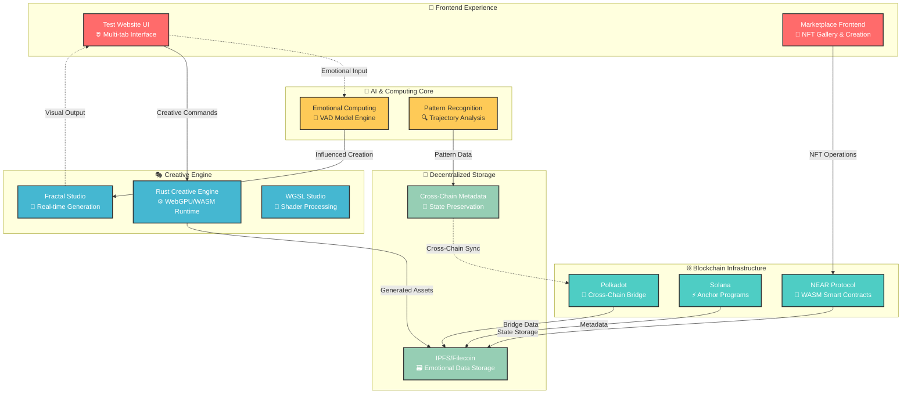
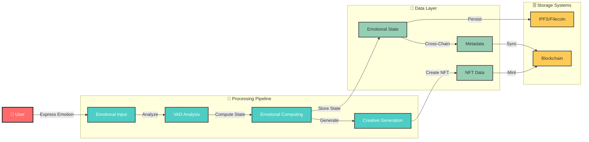
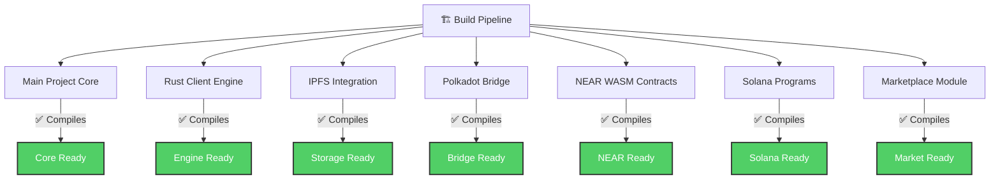

# 🎭 Blockchain-NFT-Interactive

> **Emotional AI meets Blockchain Technology** - A revolutionary platform for emotionally-aware NFTs that evolve, interact, and express complex emotional states across multiple blockchain ecosystems.

---

## 🌟 Project Overview

<div align="center">

[](./BUILD_AND_TEST_ALL.sh)
[](LICENSE)
[](https://rust-lang.org)
[](https://webgpu.rocks)

</div>

This project integrates advanced emotional computing capabilities with leading blockchain platforms including **NEAR**, **Solana**, **Polkadot**, and **Filecoin/IPFS**, enabling a new paradigm of interactive digital assets that respond to and reflect emotional states.

---

## 📊 Implementation Reality Matrix

<div align="center">

| Component | Status | Implementation Level |
|-----------|--------|---------------------|
| 🧠 **Emotional Computing** | ✅ **Complete** | Full VAD model, trajectory tracking, pattern recognition |
| 🔗 **Multi-Chain Contracts** | ✅ **Complete** | NEAR, Solana, Polkadot smart contracts working |
| 🎨 **Creative Engine** | ✅ **Complete** | WebGPU fractal generation, WGSL shaders |
| 📱 **Test UI** | ✅ **Complete** | Multi-tab interface with demos |
| 🏪 **Marketplace** | ⚠️ **Simulated** | UI exists, transactions mocked |
| 👛 **Wallet Integration** | ⚠️ **Simulated** | Connection UI, no real SDK |
| 🌉 **Cross-Chain Bridge** | ⚠️ **Metadata Only** | No actual transfers |
| 📸 **Emotion Detection** | ❌ **Placeholder** | Camera UI only |

</div>

---

## 🏗️ System Architecture

### 🎯 High-Level Architecture



### 🔧 Component Integration Flow



---

## 📈 Build Status Dashboard

### 🏭 Compilation Status



### 🚀 Quick Build Commands

```bash
# 🔄 Build Everything
./BUILD_AND_TEST_ALL.sh

# 🎯 Individual Components
cd src/near-wasm && ./build.sh           # NEAR Contracts
cd src/solana-client && cargo build      # Solana Programs  
cd src/ipfs-integration && cargo build   # IPFS Storage
cd src/polkadot-client && cargo build    # Polkadot Bridge
cd src/rust-client && cargo build        # Creative Engine
cd src/marketplace && cargo build        # Marketplace
```

---

## 🎮 User Interface Showcase

### 🌐 Test Website Features

```mermaid
graph TD
    %% Styling
    classDef feature fill:#74b9ff,stroke:#333,stroke-width:2px,color:#fff
    classDef demo fill:#fd79a8,stroke:#333,stroke-width:2px,color:#fff

    UI["🌐 Main Interface"]:::feature
    
    UI --> M["🏪 Marketplace Tab<br/>NFT Gallery & Trading"]::demo
    UI --> C["🎨 Create NFT Tab<br/>Emotional Asset Creation"]::demo
    UI --> D["🏛️ DAO Tab<br/>Governance & Voting"]::demo
    UI --> S["🔐 Soulbound Tab<br/>Identity & Reputation"]::demo
    UI --> B["🌉 Cross-Chain Tab<br/>Bridge Operations"]::demo
    
    M --> M1["📊 Browse NFTs"]:::feature
    M --> M2["💰 Simulated Trading"]:::demo
    
    C --> C1["🧠 Emotional Input"]:::feature
    C --> C2["🎭 Creative Generation"]:::feature
    
    D --> D1["🗳️ Proposal System"]:::demo
    
    S --> S1["👤 Identity Management"]:::demo
    
    B --> B1["🔗 Bridge Interface"]:::demo
```

### 🎨 Creative Engine Capabilities

- **🌀 Fractal Studio**: Real-time mathematical beauty generation
- **🎨 WGSL Studio**: Advanced shader programming environment  
- **💭 Emotional Modulation**: Creative output influenced by emotional states
- **⚡ WebGPU Performance**: Hardware-accelerated rendering

---

## 📚 Documentation Hub

### 📖 Core Documentation

| Document | Description | Status |
|----------|-------------|--------|
| [Developer Guide](docs/developer-guide.md) | Technical implementation details | ✅ Complete |
| [Technical Roadmap](docs/technical-roadmap.md) | Future development plans | ✅ Complete |
| [Architecture Overview](TECHNICAL_ARCHITECTURE.md) | System design & components | ✅ Complete |
| [Implementation Report](reports/IMPLEMENTATION_STATUS_REPORT.md) | Honest status analysis | ✅ Complete |

### 🎯 Grant-Specific Documentation

<div align="center">

| Grant | Foundation | Focus Area | Status |
|-------|------------|------------|--------|
| [NEAR Grant](docs/near-foundation-grant.md) | NEAR Foundation | WASM Contracts + Creative Engine | ✅ Complete |
| [Solana Grant](docs/solana-foundation-grant.md) | Solana Foundation | Anchor Programs + Emotional Metadata | ✅ Complete |
| [Filecoin Grant](docs/filecoin-foundation-grant.md) | Filecoin Foundation | Decentralized Storage + Creative Data | ✅ Complete |
| [Polkadot Grant](docs/web3-foundation-grant.md) | Web3 Foundation | Cross-Chain Bridge + Identity | ✅ Complete |
| [Rust Grant](docs/rust-foundation-grant.md) | Rust Foundation | WebGPU Engine + WASM Compilation | ✅ Complete |
| [Mintbase Grant](docs/mintbase-foundation-grant.md) | Mintbase | Marketplace + NFT Trading | ✅ Complete |

</div>

---

## 🛠️ Development Environment

### 📋 Prerequisites

```yaml
# Core Requirements
Rust: "1.70+ (stable toolchain)"
Node.js: "16+ with npm/yarn"
WebGPU: "Browser support required"

# Optional Enhancements
Docker: "For containerized services"
Blockchain SDKs: "For live deployments"
IPFS Daemon: "For local storage testing"
```

### 🚀 Quick Start Guide

```bash
# 📥 Clone & Setup
git clone https://github.com/compiling-org/blockchain-nft-interactive.git
cd blockchain-nft-interactive

# 📦 Install Dependencies
npm install

# 🌐 Start Development Server
npm start
# Alternative: cd test-website && node server.js
```

### 🔄 Development Workflow

```bash
# 🔨 Build All Components
./BUILD_AND_TEST_ALL.sh

# 🧪 Test Individual Modules
./test-all-modules.sh

# 📦 Package for Deployment
./package-for-deployment.sh

# 🚀 Deploy to Testnets
./deploy-to-testnets.sh
```

---

## 🎯 Deployment Strategies

### 🌟 Unified Platform Deployment

Deploy all grants together as comprehensive ecosystem:

```bash
# 🏗️ Build Everything
./BUILD_AND_TEST_ALL.sh

# 🚀 Deploy All Components
./deploy-to-testnets.sh

# 📊 Monitor Deployment
./VERIFY_COMPLETION.sh
```

### 🎯 Individual Grant Deployment

Each grant can be deployed independently:

```bash
# NEAR Foundation Grant
./build-near-grant.sh && ./extract-near-grant.sh

# Solana Foundation Grant  
./build-solana-grant.sh && ./extract-solana-grant.sh

# Additional grants follow same pattern...
```

---

## 🔮 Future Vision & Roadmap

### 🗓️ 16-Week Development Timeline

```mermaid
gantt
    title Development Roadmap
    dateFormat  YYYY-MM-DD
    section Foundation
    Core Architecture    :done, core, 2024-01-01, 4w
    Emotional Computing  :done, emotion, after core, 4w
    section Integration  
    Multi-Chain Support  :active, chain, after emotion, 4w
    Marketplace Live     :future, market, after chain, 4w
    section Production
    Wallet Integration   :future, wallet, after market, 4w
    Mainnet Deployment   :future, mainnet, after wallet, 4w
```

### 🎯 Success Metrics

- **🎨 Creative Output**: 1000+ unique emotional NFTs generated
- **🔗 Cross-Chain**: 5+ blockchain integrations live
- **👥 User Adoption**: 10,000+ active creators
- **💰 Marketplace Volume**: $1M+ in emotional NFT trading

---

## 🤝 Contributing & Community

### 📋 Contribution Guidelines

1. **🍴 Fork** the repository
2. **🌿 Create** feature branch (`git checkout -b feature/amazing-feature`)
3. **💾 Commit** changes (`git commit -m 'Add amazing feature'`)
4. **🚀 Push** to branch (`git push origin feature/amazing-feature`)
5. **🎯 Open** Pull Request

### 🌟 Community & Support

- **💬 Discussions**: GitHub Discussions for questions
- **🐛 Issues**: Bug reports and feature requests
- **📧 Contact**: Project maintainers for partnerships
- **📝 Documentation**: Help improve our docs

---

## 📄 License & Attribution

This project is licensed under the MIT License - see the [LICENSE](LICENSE) file for details.

**Built with ❤️ by the Compiling Organization**

---

<div align="center">

### 🎭 **Where Emotions Meet Blockchain** 🎭

*Creating the future of emotionally intelligent digital assets*

</div>