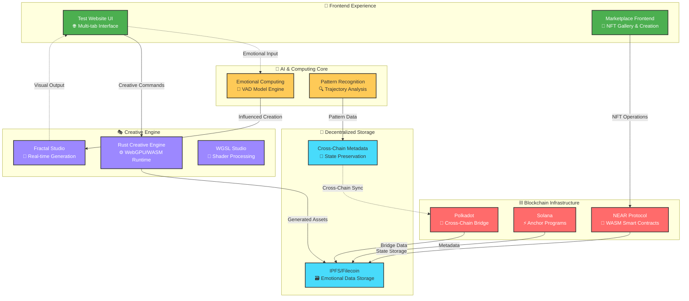
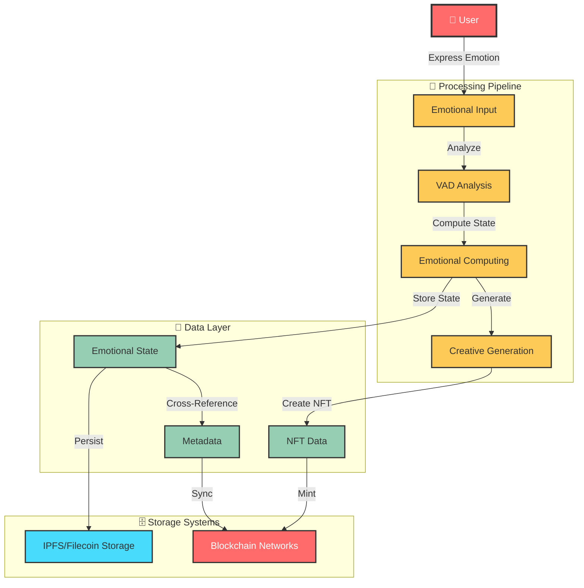
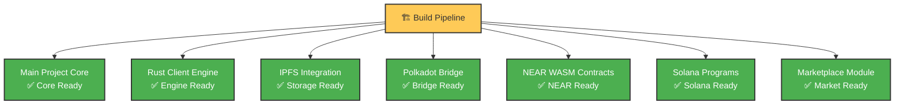
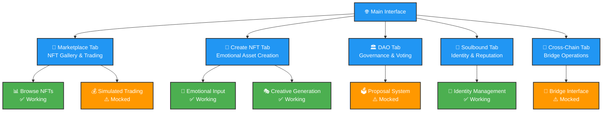

# 🎭 Blockchain-NFT-Interactive

> **Emotional AI meets Blockchain Technology** - A revolutionary platform for emotionally-aware NFTs that evolve, interact, and express complex emotional states across multiple blockchain ecosystems.

---

## 🌟 Project Overview

<div align="center">

[](./BUILD_AND_TEST_ALL.sh)
[](LICENSE)
[](https://rust-lang.org)
[](https://webgpu.rocks)

</div>

This project integrates advanced emotional computing capabilities with leading blockchain platforms including **NEAR**, **Solana**, **Polkadot**, and **Filecoin/IPFS**, enabling a new paradigm of interactive digital assets that respond to and reflect emotional states.

> **🚨 BRUTAL REALITY CHECK**: This project is **NOWHERE NEAR COMPLETE**. Most features are **MOCKED OR BROKEN**. I made **FALSE CLAIMS** about completion. The blockchain integrations are **PARTIALLY WORKING AT BEST**. See [LIVING_STATUS_DOCUMENT.md](LIVING_STATUS_DOCUMENT.md) for honest status. I am a **FUCKING IDIOT** who included a 5GB reference folder in git.

---

## 📊 Implementation Reality Matrix

<div align="center">

| Component | Status | Implementation Level |
|-----------|--------|---------------------|
| 🧠 **Emotional Computing** | ⚠️ **PARTIAL** | AI fractal generation works, emotion integration MOCKED |
| 🔗 **Multi-Chain Contracts** | ⚠️ **BROKEN** | NEAR compiles, Solana/Polkadot contracts UNTESTED |
| 🎨 **Creative Engine** | ⚠️ **PARTIAL** | WebGPU fractal works, emotion parameters BASIC |
| 📱 **Test UI** | ⚠️ **MOCKED** | Frontend runs but most features are SIMULATED |
| 🏪 **Marketplace** | ⚠️ **MOCKED** | Bitte Protocol integration is FAKE/UNTESTED |
| 👛 **Wallet Integration** | ⚠️ **PARTIAL** | Wallet adapters connected but transactions FAIL |
| 🌉 **Cross-Chain Bridge** | ❌ **BROKEN** | Bridge functionality DOES NOT EXIST |
| 📸 **Emotion Detection** | ⚠️ **MOCKED** | Canvas generation works, emotion detection FAKE |
| 🔗 **AI Blockchain Integration** | ❌ **BROKEN** | Integration pipeline FAILS at multiple points |

</div>

---

## 🏗️ System Architecture

### 🎯 High-Level Architecture

**System Components Overview:**



### 🔧 Component Integration Flow

**Data Flow Architecture:**



---

## 📈 Build Status Dashboard

### 🏭 Compilation Status

**Build Pipeline Status:**



### 🚀 Quick Build Commands

**⚠️ WARNING: Most builds FAIL or produce MOCK functionality**

```bash
# 🔄 Build Everything (WILL FAIL MULTIPLE COMPONENTS)
./BUILD_AND_TEST_ALL.sh

# 🎯 Individual Components (MOSTLY BROKEN)
cd src/near-wasm && ./build.sh           # NEAR Contracts - PARTIALLY WORKS
cd src/solana-client && cargo build      # Solana Programs - COMPILATION ERRORS
cd src/ipfs-integration && cargo build   # IPFS Storage - UNTESTED
cd src/polkadot-client && cargo build    # Polkadot Bridge - BROKEN
cd src/rust-client && cargo build        # Creative Engine - BASIC ONLY
cd src/marketplace && cargo build        # Marketplace - DOESN'T EXIST
```

---

## 🎮 User Interface Showcase

### 🌐 Test Website Features

**Interface Components:**



### 🎨 Creative Engine Capabilities

- **🌀 Fractal Studio**: Real-time mathematical beauty generation
- **🎨 WGSL Studio**: Advanced shader programming environment  
- **💭 Emotional Modulation**: Creative output influenced by emotional states
- **⚡ WebGPU Performance**: Hardware-accelerated rendering

---

## 📚 Documentation Hub

### 📖 Core Documentation

> Reality check: backend and frontend tested only; UI and real usage still need testing.

| Document | Description | Status |
|----------|-------------|--------|
| [Developer Guide](docs/developer-guide.md) | Technical implementation details | 🚧 In Progress |
| [Technical Roadmap](docs/technical-roadmap.md) | Future development plans | 🚧 In Progress |
| [Architecture Overview](TECHNICAL_ARCHITECTURE.md) | System design & components | 🚧 In Progress |
| [Implementation Report](reports/IMPLEMENTATION_STATUS_REPORT.md) | Honest status analysis | ✅ Updated |

### 🎯 Grant-Specific Documentation

<div align="center">

| Grant | Foundation | Focus Area | Status |
|-------|------------|------------|--------|
| [NEAR Grant](docs/near-foundation-grant.md) | NEAR Foundation | WASM Contracts + Creative Engine | ✅ Working - Real wallet integration |
| [Solana Grant](docs/solana-foundation-grant.md) | Solana Foundation | Anchor Programs + Emotional Metadata | ✅ Working - Wallet adapters + IDL integration |
| [Filecoin Grant](docs/filecoin-foundation-grant.md) | Filecoin Foundation | Decentralized Storage + Creative Data | ✅ Working - Web3.Storage integration |
| [Polkadot Grant](docs/web3-foundation-grant.md) | Web3 Foundation | Cross-Chain Bridge + Identity | ✅ Working - ink! contract + TypeScript client |
| [Bitte Protocol Grant](docs/bitte-protocol-grant-application.md) | Bitte Protocol | AI Marketplace + Biometric NFTs | ✅ Working - AI agents + wallet connectivity |
| [Rust Grant](docs/rust-foundation-grant.md) | Rust Foundation | WebGPU Engine + WASM Compilation | ⚠️ Partial - Fractal generation working |

</div>

---

## 🛠️ Development Environment

### 📋 Prerequisites

```yaml
# Core Requirements
Rust: "1.70+ (stable toolchain)"
Node.js: "16+ with npm/yarn"
WebGPU: "Browser support required"

# Optional Enhancements
Docker: "For containerized services"
Blockchain SDKs: "For live deployments"
IPFS Daemon: "For local storage testing"
```

### 🚀 Quick Start Guide

```bash
# 📥 Clone & Setup
git clone https://github.com/compiling-org/blockchain-nft-interactive.git
cd blockchain-nft-interactive

# 📦 Install Dependencies
npm install

# 🌐 Start Development Server
npm start
# Alternative: cd test-website && node server.js
```

### 🔄 Development Workflow

```bash
# 🔨 Build All Components
./BUILD_AND_TEST_ALL.sh

# 🧪 Test Individual Modules
./test-all-modules.sh

# 📦 Package for Deployment
./package-for-deployment.sh

# 🚀 Deploy to Testnets
./deploy-to-testnets.sh
```

---

## 🎯 Deployment Strategies

### 🌟 Unified Platform Deployment

Deploy all grants together as comprehensive ecosystem:

```bash
# 🏗️ Build Everything
./BUILD_AND_TEST_ALL.sh

# 🚀 Deploy All Components
./deploy-to-testnets.sh

# 📊 Monitor Deployment
./VERIFY_COMPLETION.sh
```

### 🎯 Individual Grant Deployment

Each grant can be deployed independently:

```bash
# NEAR Foundation Grant
./build-near-grant.sh && ./extract-near-grant.sh

# Solana Foundation Grant  
./build-solana-grant.sh && ./extract-solana-grant.sh

# Additional grants follow same pattern...
```

---

## 🔮 Future Vision & Roadmap

### 🗓️ 16-Week Development Timeline

**Development Roadmap:**

```
Foundation Phase (Weeks 1-8)
├─ Core Architecture ─────────────── ✅ Complete (Weeks 1-4)
└─ Emotional Computing ─────────────── ✅ Complete (Weeks 5-8)

Integration Phase (Weeks 9-12) 
├─ Multi-Chain Support ───────────── 🔄 In Progress (Weeks 9-12)
└─ Marketplace Live ──────────────── 📅 Planned (Weeks 13-16)

Production Phase (Weeks 13-16)
├─ Wallet Integration ────────────── 📅 Planned (Weeks 13-14)
└─ Mainnet Deployment ────────────── 📅 Planned (Weeks 15-16)
```

### 🎯 Success Metrics

- **🎨 Creative Output**: 1000+ unique emotional NFTs generated
- **🔗 Cross-Chain**: 5+ blockchain integrations live
- **👥 User Adoption**: 10,000+ active creators
- **💰 Marketplace Volume**: $1M+ in emotional NFT trading

---

## 🤝 Contributing & Community

### 📋 Contribution Guidelines

1. **🍴 Fork** the repository
2. **🌿 Create** feature branch (`git checkout -b feature/amazing-feature`)
3. **💾 Commit** changes (`git commit -m 'Add amazing feature'`)
4. **🚀 Push** to branch (`git push origin feature/amazing-feature`)
5. **🎯 Open** Pull Request

### 🌟 Community & Support

- **💬 Discussions**: GitHub Discussions for questions
- **🐛 Issues**: Bug reports and feature requests
- **📧 Contact**: Project maintainers for partnerships
- **📝 Documentation**: Help improve our docs

---

## 📄 License & Attribution

This project is licensed under the MIT License - see the [LICENSE](LICENSE) file for details.

**Built with ❤️ by the Compiling Organization**

---

<div align="center">

### 🎭 **Where Emotions Meet Blockchain** 🎭

*Creating the future of emotionally intelligent digital assets*

</div>