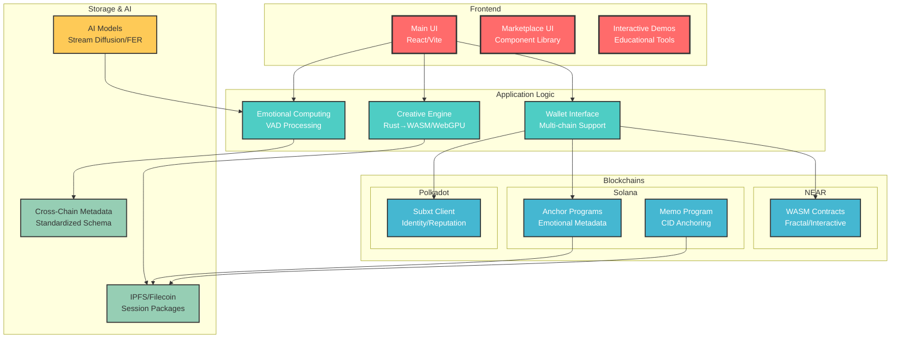
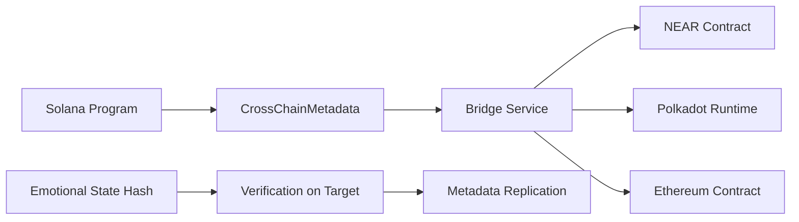
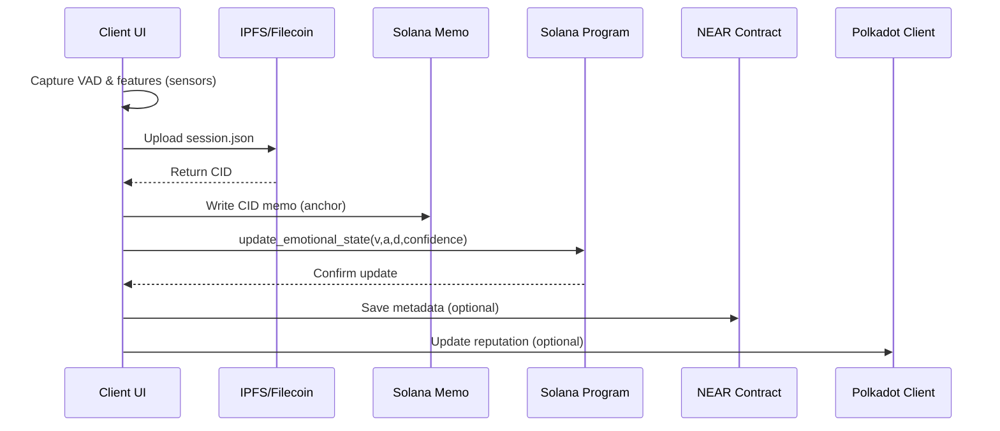
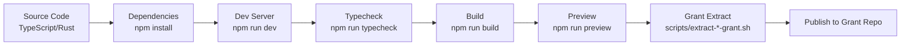

# Blockchain NFT Interactive

## Overview
- Unified development workspace for multi-chain creative NFT grants (NEAR, Solana, Filecoin, Polkadot, Rust Foundation, Mintbase/Bitte).
- Build here; extract and publish to individual grant repositories when ready.

## Repository Structure
- `src/` — Frontend, blockchain clients, integrations
- `contracts/` — On-chain program code (per chain)
- `docs/` — Grant-specific and technical architecture documents
- `scripts/` — Extraction, deployment, and tooling
- `reports/` — Implementation status and verification summaries

## Development
- Prerequisites: Node 18+, Rust toolchain, Git
- Install: `npm install`
- Dev server: `npm run dev` → open `http://localhost:3002/`
- Build: `npm run build`
- Preview: `npm run preview`
- Typecheck: `npm run typecheck` (configured and passing)
- Lint: `npm run lint` (requires ESLint config; not enabled by default)

## Documentation
- Solana technical architecture: `docs/SOLANA_SPECIFIC_TECHNICAL_ARCHITECTURE.md`
- Solana README: `docs/SOLANA_SPECIFIC_README.md`
- NEAR technical architecture: `docs/near-foundation-grant-technical-architecture.md`
- Filecoin architecture: `docs/FILECOIN_SPECIFIC_TECHNICAL_ARCHITECTURE.md`
- Developer guide: `docs/developer-guide.md`

## System Architecture

```mermaid
graph TB
    classDef frontend fill:#ff6b6b,stroke:#333,stroke-width:3px,color:#fff
    classDef application fill:#4ecdc4,stroke:#333,stroke-width:2px,color:#fff
    classDef blockchain fill:#45b7d1,stroke:#333,stroke-width:2px,color:#fff
    classDef storage fill:#96ceb4,stroke:#333,stroke-width:2px,color:#333
    classDef ai fill:#feca57,stroke:#333,stroke-width:2px,color:#333
    
    subgraph "Frontend"
        UI["Main UI<br/>React/Vite"]:::frontend
        MARKET["Marketplace UI<br/>Component Library"]:::frontend
        DEMOS["Interactive Demos<br/>Educational Tools"]:::frontend
    end
    
    subgraph "Application Logic"
        CREATIVE["Creative Engine<br/>Rust→WASM/WebGPU"]:::application
        EMOTION["Emotional Computing<br/>VAD Processing"]:::application
        WALLET["Wallet Interface<br/>Multi-chain Support"]:::application
    end
    
    subgraph "Blockchains"
        subgraph "NEAR"
            NEAR_CONTRACT["WASM Contracts<br/>Fractal/Interactive"]:::blockchain
        end
        subgraph "Solana"
            SOL_PROG["Anchor Programs<br/>Emotional Metadata"]:::blockchain
            SOL_MEMO["Memo Program<br/>CID Anchoring"]:::blockchain
        end
        subgraph "Polkadot"
            DOT_CLIENT["Subxt Client<br/>Identity/Reputation"]:::blockchain
        end
    end
    
    subgraph "Storage & AI"
        IPFS["IPFS/Filecoin<br/>Session Packages"]:::storage
        META["Cross-Chain Metadata<br/>Standardized Schema"]:::storage
        AI_MODELS["AI Models<br/>Stream Diffusion/FER"]:::ai
    end
    
    UI --> WALLET
    UI --> CREATIVE
    UI --> EMOTION
    WALLET --> NEAR_CONTRACT
    WALLET --> SOL_PROG
    WALLET --> DOT_CLIENT
    CREATIVE --> IPFS
    EMOTION --> META
    SOL_PROG --> IPFS
    SOL_MEMO --> IPFS
    AI_MODELS --> EMOTION
```

## Cross-Chain Bridge Overview

```mermaid
graph LR
    SOLANA["Solana Program"] --> CCMD["CrossChainMetadata"]
    CCMD --> BRIDGE["Bridge Service"]
    BRIDGE --> NEAR["NEAR Contract"]
    BRIDGE --> DOT["Polkadot Runtime"]
    BRIDGE --> ETH["Ethereum Contract"]
    
    HASH["Emotional State Hash"] --> VERIFY["Verification on Target"]
    VERIFY --> REPL["Metadata Replication"]
```

## Data & Storage Flow

```mermaid
sequenceDiagram
    participant UI as Client UI
    participant IPFS as IPFS/Filecoin
    participant MEMO as Solana Memo
    participant PROG as Solana Program
    participant NEAR as NEAR Contract
    participant DOT as Polkadot Client
    
    UI->>UI: Capture VAD & features (sensors)
    UI->>IPFS: Upload session.json
    IPFS-->>UI: Return CID
    UI->>MEMO: Write CID memo (anchor)
    UI->>PROG: update_emotional_state(v,a,d,confidence)
    PROG-->>UI: Confirm update
    UI->>NEAR: Save metadata (optional)
    UI->>DOT: Update reputation (optional)
```

## Development Pipeline

```mermaid
graph LR
    CODE["Source Code<br/>TypeScript/Rust"] --> INSTALL["Dependencies<br/>npm install"]
    INSTALL --> DEV["Dev Server<br/>npm run dev"]
    DEV --> TEST["Typecheck<br/>npm run typecheck"]
    TEST --> BUILD["Build<br/>npm run build"]
    BUILD --> PREVIEW["Preview<br/>npm run preview"]
    PREVIEW --> EXTRACT["Grant Extract<br/>scripts/extract-*-grant.sh"]
    EXTRACT --> PUBLISH["Publish to Grant Repo"]
```

## Notes
- This repository does not claim mainnet/testnet deployments; use grant-specific repos for deployment artifacts and instructions.
- Large binaries and nested vendor directories are ignored via `.gitignore`.

## License
MIT
