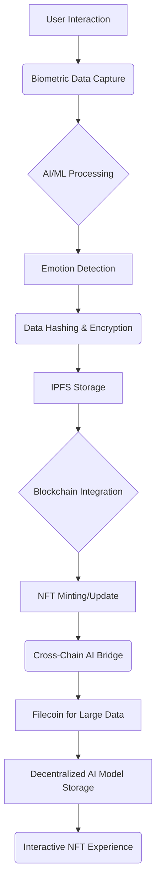

# Blockchain NFT Interactive Project

This project aims to integrate various blockchain technologies with AI/ML capabilities to create interactive NFT experiences. This README provides a consolidated overview of the key tools, frameworks, and reference reports identified within the codebase.

## 🚀 Key Blockchain & AI/ML Tools

### 🧠 AI/ML Frameworks & Capabilities
- **Candle Framework**: Utilized for real neural network models, GPU acceleration, and real-time inference, especially for WASM compilation and browser-deployable AI models.
- **TensorFlow.js**: Integrated for browser-based AI inference, client-side emotion detection, and hybrid AI architectures.
- **Iron Learn**: Employed for biometric analysis, emotion vector processing, governance prediction, and federated learning with GPU acceleration.
- **LanceDB**: Used for vector storage, similarity search across project datasets, cross-chain compatibility analysis, and NFT recommendations with real-time indexing.
- **WASM (WebAssembly)**: Enables compilation of Rust AI/ML engines for production browser deployment.

#### ⚡ GPU Acceleration Ecosystem
The project leverages a multi-faceted approach to GPU acceleration, integrating various technologies for high-performance AI/ML computations:

- **WebGPU**: Leveraged for hardware-accelerated neural network inference, parallel AI processing, and real-time biometric analysis through compute shaders.
  - **Relevant Code**:
    - `apps/web/src/AIMLBlockchainIntegration.tsx`: [Link](apps/web/src/AIMLBlockchainIntegration.tsx) (Candle GPU Acceleration Implementation)
    - `apps/web/src/components/WGSLWebGPUFractal.tsx`: [Link](apps/web/src/components/WGSLWebGPUFractal.tsx) (Direct WebGPU API usage)
    - `packages/rust-client/src/enhanced_webgpu_engine_new.rs`: [Link](packages/rust-client/src/enhanced_webgpu_engine_new.rs) (Enhanced WebGPU engine with AI/ML integration)
    - `packages/rust-client/src/enhanced_webgpu_engine.rs`: [Link](packages/rust-client/src/enhanced_webgpu_engine.rs) (Enhanced WebGPU engine with AI/ML integration)
    - `packages/rust-client/src/gpu_compute_engine.rs`: [Link](packages/rust-client/src/gpu_compute_engine.rs) (GPU Compute Engine)

- **Candle Framework**: Provides GPU acceleration for tensor operations and neural networks, particularly within the Rust client and WASM modules.
  - **Relevant Code**:
    - `apps/web/src/AIMLBlockchainIntegration.tsx`: [Link](apps/web/src/AIMLBlockchainIntegration.tsx) (Candle GPU Acceleration Implementation)
    - `packages/rust-client/src/enhanced_webgpu_engine_new.rs`: [Link](packages/rust-client/src/enhanced_webgpu_engine_new.rs) (Candle usage in WebGPU engine)
    - `packages/rust-client/src/enhanced_webgpu_engine.rs`: [Link](packages/rust-client/src/enhanced_webgpu_engine.rs) (Candle usage in WebGPU engine)
    - `packages/rust-client/src/gpu_compute_engine.rs`: [Link](packages/rust-client/src/gpu_compute_engine.rs) (Candle usage in GPU Compute Engine)

- **Iron Learn**: Intended for GPU-accelerated machine learning tasks, including tensor operations and regression with CUDA support.
  - **Relevant Code**:
    - `packages/rust-client/src/iron_learn_integration.rs`: [Link](packages/rust-client/src/iron_learn_integration.rs) (Iron Learn integration module)
    - `packages/rust-client/src/enhanced_biometric_engine.rs`: [Link](packages/rust-client/src/enhanced_biometric_engine.rs) (Device selection for CUDA/Metal)

### 🔗 Blockchain Integrations
- **NEAR Protocol**: Interactive NFT smart contracts deployed on NEAR testnet, supporting biometric NFT minting and WebGPU integration.
- **Solana**: AI program inference with on-chain operations, real-time inference, and GPU acceleration.
- **Filecoin**: Decentralized AI model storage for large model weights, long-term persistence, and economic incentives for storage.
- **Polkadot (Substrate)**: Cross-chain AI computation verification and integration.
- **Ethereum**: (Implicitly supported through general blockchain integration plans)
- **IPFS**: Used for content-addressed storage of metadata, high-frequency interactions, and distributed network replication.

### 🛠️ Other Integrated Tools
- **Deno**: (Integration planned/ongoing)
- **HMPL**: (Integration planned/ongoing)
- **Storybook**: (Integration planned/ongoing)
- **NestJS**: (Integration planned/ongoing)
- **Shadcn/UI**: (Integration planned/ongoing)
- **TypeGPU**: (Integration planned/ongoing)
- **Turborepo**: (Integration planned/ongoing for monorepo management)

## 📄 Reference Reports

The following detailed reports provide in-depth information on specific implementations and integrations within the project:

- **[RUST_SPECIFIC_IMPLEMENTATION_REPORT.md](docs/RUST_SPECIFIC_IMPLEMENTATION_REPORT.md)**:
  - **Summary**: Details the Rust AI/ML Engine's implementation, covering AI model integration with Candle and TensorFlow.js, biometric processing for emotion detection, cross-chain AI bridging (NEAR, Solana, Filecoin, Polkadot), and WebGPU AI acceleration. It highlights WASM compilation for browser deployment and provides performance metrics and future enhancement roadmaps.
  - **Key Takeaways**: Confirms robust AI/ML capabilities within the Rust client, including real emotion detection, homomorphic encryption for biometric data, and extensive cross-chain AI integration.

- **[NEAR_SPECIFIC_IMPLEMENTATION_REPORT.md](docs/NEAR_SPECIFIC_IMPLEMENTATION_REPORT.md)**:
  - **Summary**: Outlines the NEAR Creative Engine's interactive NFT smart contracts, AI/ML integration using TensorFlow.js neural networks for emotion detection, and the current state of frontend development. It details biometric NFT minting on NEAR testnet and WebGPU integration for live emotion data feeding blockchain transactions.
  - **Key Takeaways**: Highlights deployed smart contracts on NEAR testnet, working TensorFlow.js neural networks for emotion detection, but notes missing frontend wallet connection and mainnet deployment.

- **[UNIFIED_AI_IPFS_INTEGRATION.md](docs/UNIFIED_AI_IPFS_INTEGRATION.md)**:
  - **Summary**: Describes a comprehensive unified hub integrating Iron Learn, LanceDB, and Candle with IPFS and Filecoin across all five blockchain grant projects. It serves as a central coordination point for AI inference, data storage, and cross-project analytics, detailing architecture, data flow, and usage examples for various grant projects (Filecoin, Solana, NEAR, Web3 Foundation, Bitte Protocol).
  - **Key Takeaways**: Establishes a central integration point for AI/ML and decentralized storage, outlining specific AI capabilities and storage strategies for each grant project.

## 📈 Project Status & Future Enhancements

This project is actively developing cutting-edge integrations between blockchain and AI/ML. Future enhancements include advanced AI models, expansion to additional blockchains, real-time AI features, and ecosystem growth.

---

## 🧜‍♀️ Mermaid Diagrams

```mermaid
graph TD
    A[User Interaction] --> B(Biometric Data Capture)
    B --> C{AI/ML Processing}
    C --> D[Emotion Detection]
    D --> E(Data Hashing & Encryption)
    E --> F[IPFS Storage]
    F --> G{Blockchain Integration}
    G --> H[NFT Minting/Update]
    H --> I(Cross-Chain AI Bridge)
    I --> J[Filecoin for Large Data]
    J --> K[Decentralized AI Model Storage]
    K --> L(Interactive NFT Experience)
```
