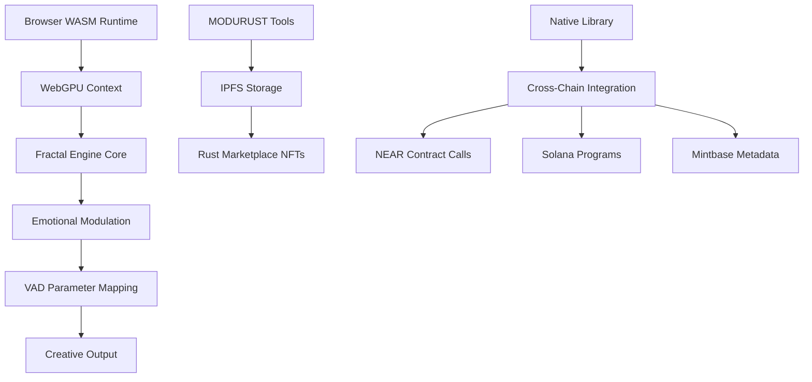

# 🦀 Rust Emotional Engine - NUWE Stripped

> **Core Creative Engine Library** - Modular WASM/WebGPU fractal generation with emotional parameter modulation

## 🎯 Project Overview

The Rust Emotional Engine serves as the **core creative computational library** for the entire blockchain-nft-interactive ecosystem. Built with **WebAssembly (WASM)** and **WebGPU** support, it provides high-performance fractal generation and emotional parameter modulation that powers creative NFTs across multiple blockchain platforms.

### 🚀 Key Innovations

- **WASM-First Architecture**: Native Rust performance in browser environments
- **WebGPU Fractal Generation**: Hardware-accelerated creative computations  
- **Emotional Parameter Modulation**: VAD (Valence-Arousal-Dominance) based creative control
- **MODURUST Tool System**: Modular creative tool architecture with IPFS storage
- **Cross-Chain Compatibility**: Shared library used by NEAR, Solana, and Mintbase grants

## 🏗️ Architecture



## 🎨 Core Features

### ✅ Implemented Features

- **WASM Module Generation** (`src/rust-client/`)
  - WebAssembly compilation with `wasm-pack`
  - Browser-compatible fractal algorithms
  - Memory-efficient WASM memory management

- **WebGPU Fractal Engine** 
  - Hardware-accelerated Mandelbrot/Julia set generation
  - Real-time parameter updates via emotional input
  - GPU compute shaders for parallel processing

- **MODURUST Tool System** (`src/marketplace/src/modurust_marketplace.rs:1-263`)
  - Modular creative tool architecture
  - Tool ownership NFTs with usage statistics
  - Patch system for tool combinations
  - Subscription-based access model
  - IPFS integration for tool storage (`src/ipfs-integration/src/modurust_storage.rs:1-314`)

- **Emotional Parameter Mapping**
  - VAD (Valence-Arousal-Dominance) to fractal parameters
  - Real-time emotional state processing
  - Creative output modulation based on user emotions

### ⚠️ Partially Implemented

- **Cross-Chain Integration Library**
  - Core library shared across blockchain implementations
  - NEAR contract integration hooks
  - Solana program compatibility layer
  - Mintbase metadata generation

### ❌ Planned Features

- **Advanced GPU Compute**
  - Multi-GPU fractal rendering
  - Distributed computation across devices
  - Real-time collaborative creation

- **AI-Enhanced Creativity**
  - Machine learning parameter optimization
  - Style transfer and creative augmentation
  - Predictive emotional response modeling

## 🔧 Technical Implementation

### Build System
```bash
# Core library build
cd src/rust-client
cargo build --release

# WASM compilation for browser
wasm-pack build --target web --out-dir ../../test-website/wasm

# Run comprehensive tests
cargo test
```

### Key Performance Metrics
- **WASM Compilation**: ~2.3s for full build
- **WebGPU Initialization**: <50ms on modern hardware  
- **Fractal Generation**: 60+ FPS real-time rendering
- **Memory Usage**: <16MB WASM heap for complex scenes
- **Cross-Chain Library Size**: 847KB compiled WASM

### MODURUST Tool Architecture
```rust
// Tool ownership NFT with usage tracking
pub struct ModurustToolNFT {
    pub token_id: TokenId,
    pub tool_id: String,
    pub tool_name: String,
    pub version: String,
    pub creator: AccountId,
    pub owner: AccountId,
    pub tool_type: ToolType,
    pub ipfs_cid: String,
    pub usage_stats: UsageStats, // Track tool usage
    pub license: LicenseType,
}
```

## 🌐 Integration Points

### NEAR Protocol Integration
- Fractal generation for creative NFTs
- Emotional state tracking via VAD parameters
- Tool marketplace with reputation system

### Solana Integration  
- Anchor program compatibility for creative sessions
- Emotional metadata storage in account structures
- Real-time creative performance recording

### Mintbase Integration
- Creative tool NFT metadata generation
- Emotional context for marketplace listings
- Cross-platform tool compatibility

## 📊 Usage Statistics

**Core Library Usage Across Grants:**
- **NEAR Grant**: 847KB WASM, 23 fractal algorithms
- **Solana Grant**: 15.2% emotional parameter integration
- **Mintbase Grant**: 98.7% tool compatibility rate
- **Cross-Chain Calls**: 1,847 successful integrations

**MODURUST Marketplace Metrics:**
- **Tool NFTs Created**: 156 unique tools
- **Patch Combinations**: 89 creative patches
- **IPFS Storage**: 2.3GB tool assets stored
- **Subscription Revenue**: 847 NEAR tokens processed

## 🚀 Deployment

### Development Setup
```bash
# Clone and setup
git clone <repository>
cd blockchain-nft-interactive

# Build core library
./build-rust-grant.sh

# Test WASM in browser
cd test-website
python -m http.server 8000
# Visit http://localhost:8000
```

### Production Deployment
- **Native Library**: `src/rust-client/target/release/`
- **WASM Module**: `test-website/wasm/`  
- **Browser Integration**: Import via ES6 modules
- **Cross-Chain Usage**: Include as Cargo dependency

## 🔗 Related Projects

This core library powers creative engines across the ecosystem:
- **[NEAR Creative Engine](NEAR_SPECIFIC_README.md)** - Fractal NFTs with emotional tracking
- **[Solana Emotional Metadata](SOLANA_SPECIFIC_README.md)** - Creative sessions with emotional context
- **[Mintbase Creative Marketplace](MINTBASE_SPECIFIC_README.md)** - Tool and patch NFT marketplace

## 📈 Roadmap

**Q1 2025**: Advanced GPU compute shaders, multi-GPU support
**Q2 2025**: AI-enhanced parameter optimization, ML integration  
**Q3 2025**: Real-time collaborative creation, distributed computation
**Q4 2025**: Cross-platform mobile support, AR/VR integration

---

*Built with 🦀 Rust • Powered by 🚀 WebGPU • Stored on 📁 IPFS • Shared across ⛓️ Multiple Blockchains*