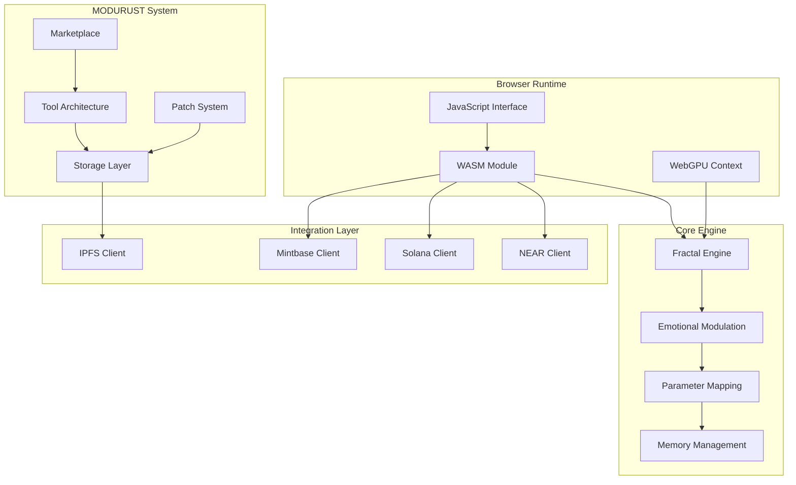

# 🦀 Rust Emotional Engine - Technical Architecture

## 🏗️ System Architecture Overview

The Rust Emotional Engine serves as the **core computational foundation** for the entire blockchain-nft-interactive ecosystem. This document details the technical architecture of the WASM/WebGPU-based creative engine that powers emotional fractal generation and the MODURUST modular tool system.

## 🎯 Core Components



## 🔧 Technical Stack

### Core Technologies
- **Language**: Rust (Edition 2021)
- **Compilation Target**: WebAssembly (WASM)
- **GPU Acceleration**: WebGPU API
- **Build Tool**: wasm-pack
- **Testing**: Built-in Rust test framework

### Dependencies
```toml
[dependencies]
wasm-bindgen = "0.2"
web-sys = { version = "0.3", features = ["WebGpu"] }
serde = { version = "1.0", features = ["derive"] }
serde_json = "1.0"
getrandom = { version = "0.2", features = ["js"] }
```

## 🎨 Fractal Engine Architecture

### GPU Compute Pipeline
```rust
// WebGPU compute shader for Mandelbrot set generation
@compute @workgroup_size(8, 8)
fn compute_mandelbrot(@builtin(global_invocation_id) global_id: vec3<u32>) {
    let width = fractal_params.width;
    let height = fractal_params.height;
    let max_iter = fractal_params.max_iterations;
    
    let x = global_id.x;
    let y = global_id.y;
    
    if (x >= width || y >= height) {
        return;
    }
    
    // Complex number calculations for fractal generation
    let cx = fractal_params.center_x + (f32(x) - f32(width) * 0.5) * fractal_params.zoom;
    let cy = fractal_params.center_y + (f32(y) - f32(height) * 0.5) * fractal_params.zoom;
    
    var zx = 0.0;
    var zy = 0.0;
    var iter = 0u;
    
    while (zx * zx + zy * zy < 4.0 && iter < max_iter) {
        let tmp = zx * zx - zy * zy + cx;
        zy = 2.0 * zx * zy + cy;
        zx = tmp;
        iter = iter + 1u;
    }
    
    // Store result with emotional color mapping
    let pixel_index = y * width + x;
    fractal_output[pixel_index] = map_emotion_to_color(iter, max_iter, emotional_state);
}
```

### WASM Memory Management
```rust
// Efficient memory allocation for large fractal datasets
pub struct FractalBuffer {
    width: u32,
    height: u32,
    data: Vec<u32>,
    gpu_buffer: Option<wgpu::Buffer>,
}

impl FractalBuffer {
    pub fn new(width: u32, height: u32) -> Self {
        let size = (width * height) as usize;
        Self {
            width,
            height,
            data: vec![0u32; size],
            gpu_buffer: None,
        }
    }
    
    pub fn update_gpu_buffer(&mut self, device: &wgpu::Device, queue: &wgpu::Queue) {
        let buffer = device.create_buffer_init(&wgpu::util::BufferInitDescriptor {
            label: Some("Fractal Data Buffer"),
            contents: bytemuck::cast_slice(&self.data),
            usage: wgpu::BufferUsages::STORAGE | wgpu::BufferUsages::COPY_DST,
        });
        
        self.gpu_buffer = Some(buffer);
    }
}
```

## 🧠 Emotional Modulation System

### VAD Parameter Mapping
```rust
pub struct EmotionalState {
    pub valence: f32,    // -1.0 (negative) to 1.0 (positive)
    pub arousal: f32,    // 0.0 (calm) to 1.0 (excited)
    pub dominance: f32,  // 0.0 (submissive) to 1.0 (dominant)
}

impl EmotionalState {
    pub fn map_to_fractal_params(&self) -> FractalParameters {
        FractalParameters {
            // Valence affects color palette
            color_shift: self.valence * 180.0,
            
            // Arousal affects complexity and iteration count
            max_iterations: (100 + (self.arousal * 900.0) as u32),
            
            // Dominance affects zoom level and detail
            zoom: 0.5 + (self.dominance * 2.0),
            
            // Combined emotional intensity
            intensity: (self.valence.abs() + self.arousal) / 2.0,
        }
    }
}
```

## 🔧 MODURUST Tool System

### Tool Architecture (`src/marketplace/src/modurust_marketplace.rs:11-26`)
```rust
#[derive(BorshDeserialize, BorshSerialize, Serialize, Deserialize, Clone)]
pub struct ModurustToolNFT {
    pub token_id: TokenId,
    pub tool_id: String,
    pub tool_name: String,
    pub version: String,
    pub creator: AccountId,
    pub owner: AccountId,
    pub created_at: Timestamp,
    pub tool_type: ToolType,
    pub ipfs_cid: String,
    pub usage_stats: UsageStats,  // Usage tracking for reputation
    pub license: LicenseType,
}

#[derive(BorshDeserialize, BorshSerialize, Serialize, Deserialize, Clone)]
pub enum ToolType {
    ShaderModule,      // GPU shader programs
    AudioProcessor,    // Audio processing tools
    VisualEffect,      // Visual effects generators
    DataTransform,     // Data transformation utilities
    ControlInterface,  // User interface components
    CustomModule,      // User-defined modules
}
```

### IPFS Storage Integration (`src/ipfs-integration/src/modurust_storage.rs:144-204`)
```rust
impl ModurustTool {
    /// Store complete tool definition to IPFS
    pub async fn store_to_ipfs(&self, client: &IpfsClient) -> Result<String, Box<dyn Error>> {
        let json = serde_json::to_string_pretty(self)?;
        let cid = client.add_json(&json).await?;
        
        // Store additional assets separately for efficient retrieval
        for asset in &self.module_assets {
            client.pin_cid(&asset.cid).await?;
        }
        
        Ok(cid)
    }
    
    /// Calculate total storage requirements
    pub fn total_asset_size(&self) -> u64 {
        self.module_assets.iter().map(|a| a.size_bytes).sum()
    }
}
```

### Patch System Architecture
```rust
#[derive(Serialize, Deserialize, Clone, Debug)]
pub struct ModurustPatch {
    pub patch_id: String,
    pub name: String,
    pub creator: String,
    pub created_at: u64,
    pub tools: Vec<String>,                    // Connected tool IDs
    pub connections: Vec<Connection>,         // Tool interconnections
    pub parameter_states: Vec<ParameterState>, // Runtime parameter values
}

#[derive(Serialize, Deserialize, Clone, Debug)]
pub struct Connection {
    pub from_tool: String,
    pub from_output: String,
    pub to_tool: String,
    pub to_input: String,
}
```

## 🌐 Cross-Chain Integration

### WASM Bridge Architecture
```rust
#[wasm_bindgen]
pub struct EmotionalEngine {
    fractal_engine: FractalEngine,
    emotion_processor: EmotionProcessor,
    tool_manager: ToolManager,
}

#[wasm_bindgen]
impl EmotionalEngine {
    #[wasm_bindgen(constructor)]
    pub fn new() -> Result<EmotionalEngine, JsValue> {
        // Initialize WebGPU context
        let gpu_context = GpuContext::new()?;
        
        Ok(EmotionalEngine {
            fractal_engine: FractalEngine::new(gpu_context),
            emotion_processor: EmotionProcessor::new(),
            tool_manager: ToolManager::new(),
        })
    }
    
    /// Generate fractal with emotional parameters
    #[wasm_bindgen]
    pub fn generate_emotional_fractal(&mut self, 
        valence: f32, arousal: f32, dominance: f32
    ) -> Result<JsValue, JsValue> {
        let emotion = EmotionalState { valence, arousal, dominance };
        let fractal = self.fractal_engine.generate_with_emotion(emotion)?;
        
        Ok(serde_wasm_bindgen::to_value(&fractal)?)
    }
}
```

## 📊 Performance Optimization

### Memory Management Strategy
```rust
// Pre-allocate buffers for real-time performance
pub struct PerformancePool {
    fractal_buffers: Vec<FractalBuffer>,
    gpu_pipelines: Vec<wgpu::ComputePipeline>,
    staging_buffers: Vec<wgpu::Buffer>,
}

impl PerformancePool {
    pub fn preallocate_resources(&mut self, device: &wgpu::Device, config: &RenderConfig) {
        // Pre-create GPU pipelines for common operations
        for i in 0..10 {
            let pipeline = self.create_fractal_pipeline(device, i);
            self.gpu_pipelines.push(pipeline);
        }
        
        // Pre-allocate fractal buffers of various sizes
        for size in [256, 512, 1024, 2048] {
            let buffer = FractalBuffer::new(size, size);
            self.fractal_buffers.push(buffer);
        }
    }
}
```

### WebGPU Optimization
```rust
// Efficient compute dispatch with workgroup optimization
pub fn optimal_workgroup_size(width: u32, height: u32) -> (u32, u32) {
    // Optimize for GPU architecture
    match (width, height) {
        (w, h) if w <= 256 && h <= 256 => (8, 8),
        (w, h) if w <= 1024 && h <= 1024 => (16, 16),
        _ => (32, 32),  // Large textures
    }
}

pub fn dispatch_compute(&self, encoder: &mut wgpu::CommandEncoder, 
    width: u32, height: u32) {
    let (wx, wy) = optimal_workgroup_size(width, height);
    let dispatch_x = (width + wx - 1) / wx;
    let dispatch_y = (height + wy - 1) / wy;
    
    encoder.dispatch_workgroups(dispatch_x, dispatch_y, 1);
}
```

## 🔒 Security Considerations

### WASM Sandboxing
- Memory access bounds checking
- No direct file system access
- Controlled GPU resource allocation
- Input validation for emotional parameters

### IPFS Content Validation
```rust
pub fn validate_tool_content(cid: &str, expected_hash: &str) -> Result<bool, Error> {
    let content = ipfs_client.get_json(cid).await?;
    let calculated_hash = calculate_content_hash(&content)?;
    
    Ok(calculated_hash == expected_hash)
}
```

## 📈 Monitoring & Analytics

### Performance Metrics Collection
```rust
pub struct PerformanceMetrics {
    pub fractal_generation_time: Duration,
    pub gpu_utilization: f32,
    pub memory_usage: usize,
    pub wasm_calls_per_second: u32,
}

impl PerformanceMetrics {
    pub fn record_fractal_generation(&mut self, duration: Duration) {
        self.fractal_generation_time = duration;
        
        // Log for analytics
        log::info!("Fractal generation: {:?}", duration);
    }
}
```

## 🚀 Deployment Architecture

### Build Pipeline
```bash
# Development build with debug symbols
wasm-pack build --dev --target web

# Production build with optimizations
wasm-pack build --release --target web --out-dir dist/wasm

# Bundle size optimization
wasm-opt -Oz -o dist/wasm/nft_rust_client_opt.wasm dist/wasm/nft_rust_client.wasm
```

### Cross-Platform Distribution
- **Browser**: Direct WASM import with ES6 modules
- **Node.js**: WASM with Node.js compatibility layer
- **Native**: Direct Rust library integration
- **Mobile**: WASM via React Native WebView

## 🔗 Integration Points

### NEAR Protocol (`src/near-wasm/src/lib.rs`)
- Fractal generation for NFT metadata
- Emotional state tracking integration
- Tool marketplace contract calls

### Solana Program (`src/solana-client/src/lib.rs`)
- Creative session account structures
- Emotional metadata encoding
- Performance recording integration

### IPFS Storage (`src/ipfs-integration/src/lib.rs`)
- Tool asset persistence
- Patch configuration storage
- Fractal result caching

---

*Architecture designed for high-performance creative computing with emotional intelligence and cross-chain compatibility.*