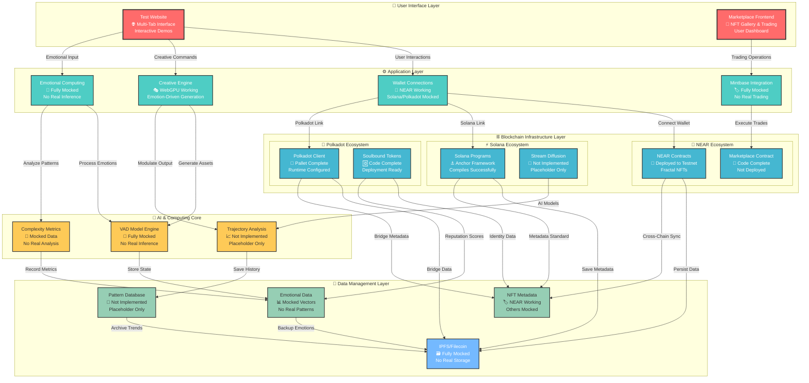
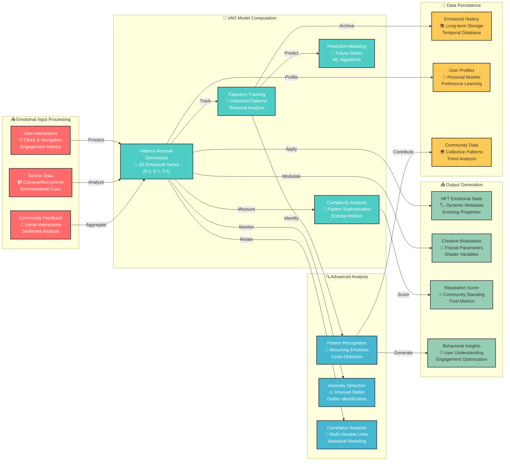
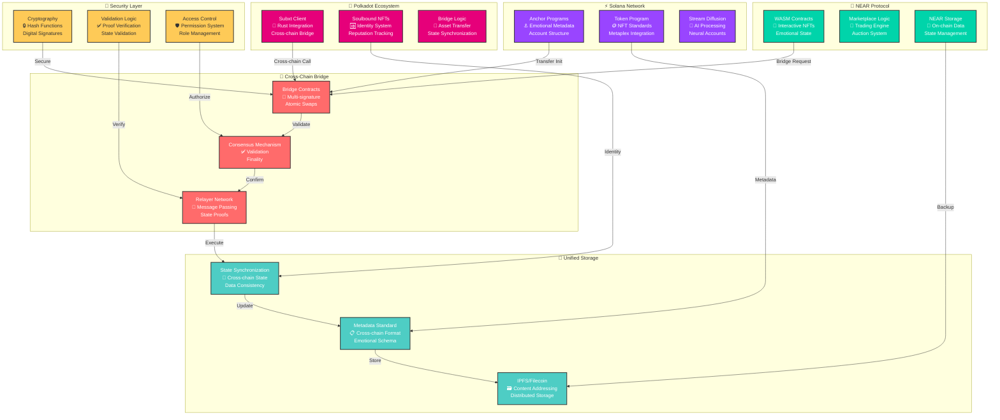
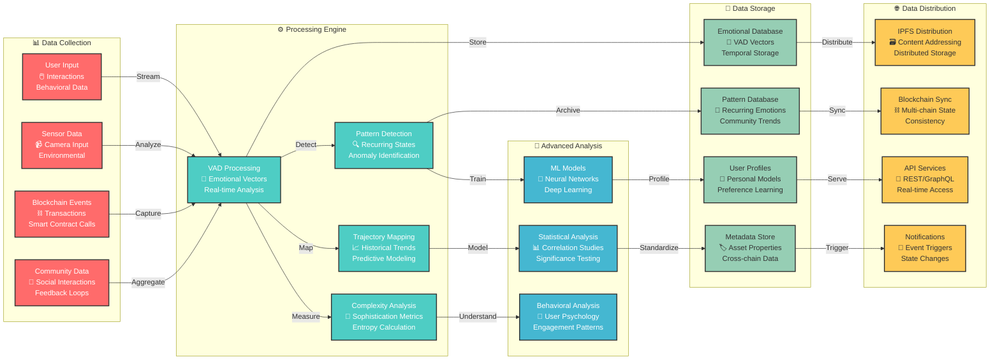
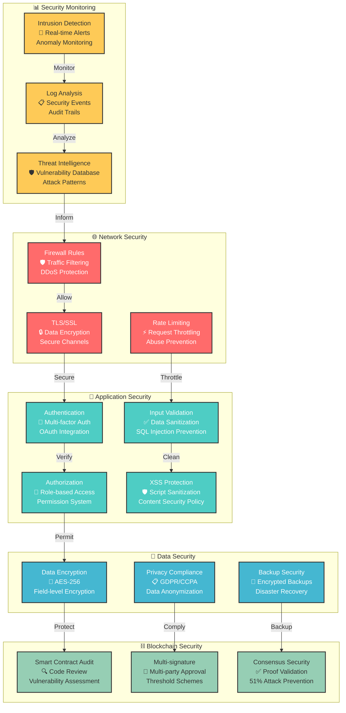
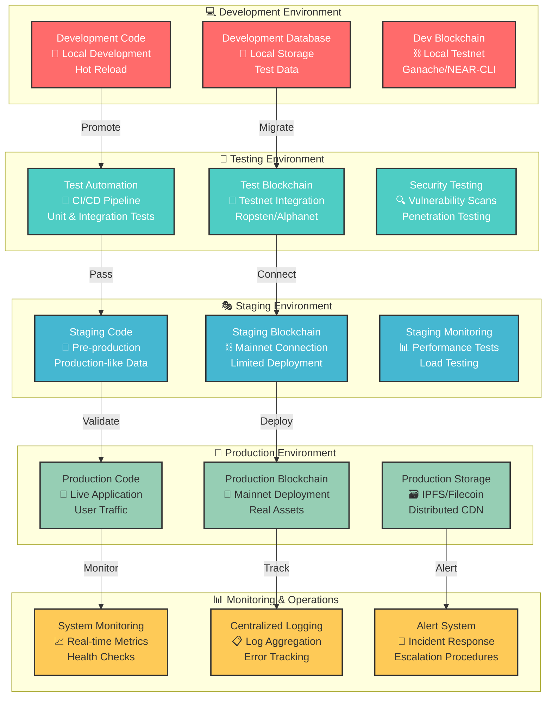
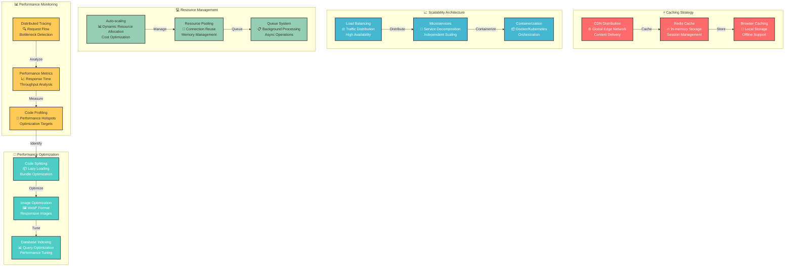

# 🏗️ Blockchain NFT Interactive - Technical Architecture

> **Comprehensive system design documentation with detailed component analysis and implementation status**

> **🚨 REALITY CHECK**: This document describes the intended architecture. For current implementation status, see [LIVING_STATUS_DOCUMENT.md](LIVING_STATUS_DOCUMENT.md). Many components are mocked or have deployment issues.

---

<div align="center">

[](TECHNICAL_ARCHITECTURE.md)
[](src/)
[](README.md)

</div>

---

## 🎯 System Overview

The Blockchain NFT Interactive project represents a sophisticated fusion of **emotional artificial intelligence**, **multi-chain blockchain integration**, and **creative computing technologies**. This architecture document provides detailed technical specifications, component relationships, and implementation status across all system layers.

---

## 🏛️ High-Level System Architecture

### 🌐 Complete System Overview



---

## 🔧 Component Architecture Deep Dive

### 🧠 Emotional Computing Engine



### ⚙️ Creative Engine Architecture

```mermaid
graph TD
    %% Styling
    classDef webgpu fill:#ff6b6b,stroke:#333,stroke-width:2px,color:#fff
    classDef fractal fill:#4ecdc4,stroke:#333,stroke-width:2px,color:#fff
    classDef shader fill:#45b7d1,stroke:#333,stroke-width:2px,color:#fff
    classDef wasm fill:#96ceb4,stroke:#333,stroke-width:2px,color:#333
    classDef emotion fill:#feca57,stroke:#333,stroke-width:2px,color:#333

    subgraph "🌐 WebGPU Runtime"
        WEBGPU["WebGPU Context<br/>🎮 Hardware Acceleration<br/>GPU Compute Shaders"]:::webgpu
        RENDER["Render Pipeline<br/>🖼️ Real-time Graphics<br/>60+ FPS Target"]:::webgpu
        COMPUTE["Compute Pipeline<br/>⚡ Parallel Processing<br/>Mathematical Operations"]:::webgpu
    end
    
    subgraph "🔮 Fractal Generation System"
        MANDELBROT["Mandelbrot Set<br/>🌀 Classic Fractals<br/>Zoom & Pan Controls"]:::fractal
        JULIA["Julia Sets<br/>🎨 Parameter Variations<br/>Complex Number Space"]:::fractal
        CUSTOM["Custom Formulas<br/>🔧 User-defined<br/>Mathematical Expressions"]:::fractal
        ANIMATION["Animation System<br/>🎬 Keyframe Control<br/>Temporal Transitions"]:::fractal
    end
    
    subgraph "🎨 WGSL Shader Studio"
        WGSL["WGSL Compiler<br/>⚙️ Shader Translation<br/>WebGPU Standard"]:::shader
        VERTEX["Vertex Shaders<br/>📐 Geometry Processing<br/>3D Transformations"]:::shader
        FRAGMENT["Fragment Shaders<br/>🎨 Pixel Processing<br/>Color Calculation"]:::shader
        COMPUTE_WGSL["Compute Shaders<br/>🔢 GPU Computing<br/>Parallel Algorithms"]:::shader
    end
    
    subgraph "⚡ WASM Runtime"
        WASM["WASM Engine<br/>🚀 High Performance<br/>Browser Runtime"]:::wasm
        RUST_LIB["Rust Libraries<br/>🦀 Compiled to WASM<br/>Mathematical Functions"]:::wasm
        OPTIMIZATION["Code Optimization<br/>⚙️ Performance Tuning<br/>Memory Management"]:::wasm
    end
    
    subgraph "💭 Emotional Modulation"
        VAD_INPUT["VAD Input<br/>💭 Emotional Vectors<br/>[V,A,D] Values"]:::emotion
        PARAM_MOD["Parameter Modulation<br/>🎛️ Creative Control<br/>Emotional Influence"]:::emotion
        COLOR Theory["Color Theory<br/>🌈 Emotion-Color Mapping<br/>Psychological Impact"]:::emotion
        DYNAMICS["Dynamic Range<br/>📊 Intensity Scaling<br/>Emotional Amplitude"]:::emotion
    end
    
    %% Integration Flow
    VAD_INPUT -->|"Modulate"| PARAM_MOD
    PARAM_MOD -->|"Control"| MANDELBROT
    PARAM_MOD -->|"Adjust"| JULIA
    PARAM_MOD -->|"Influence"| CUSTOM
    
    PARAM_MOD -->|"Modify"| VERTEX
    PARAM_MOD -->|"Alter"| FRAGMENT
    PARAM_MOD -->|"Drive"| COLOR_Theory
    PARAM_MOD -->|"Scale"| DYNAMICS
    
    WEBGPU -->|"Execute"| RENDER
    WGSL -->|"Compile"| COMPUTE_WGSL
    WASM -->|"Accelerate"| RUST_LIB
    
    ANIMATION -->|"Time-based"| MANDELBROT
    RUST_LIB -->|"Mathematical"| CUSTOM
    COMPUTE -->|"Parallel"| FRAGMENT
```

---

## 🔗 Multi-Chain Integration Architecture

### 🌉 Cross-Chain Communication Protocol



---

## 📊 Data Flow Architecture

### 🔄 Emotional Data Pipeline



---

## 🔐 Security Architecture

### 🛡️ Multi-Layer Security Model



---

## 🚀 Deployment Architecture

### 🌍 Multi-Environment Deployment Strategy



---

## 📈 Performance & Scalability Architecture

### ⚡ High-Performance Computing Design



---

## 🔮 Future Architecture Evolution

### 🚀 Next-Generation System Design

```mermaid
graph LR
    %% Styling
    classDef current fill:#ff6b6b,stroke:#333,stroke-width:2px,color:#fff
    classDef planned fill:#4ecdc4,stroke:#333,stroke-width:2px,color:#fff
    classDef future fill:#45b7d1,stroke:#333,stroke-width:2px,color:#fff
    classDef research fill:#96ceb4,stroke:#333,stroke-width:2px,color:#333
    classDef integration fill:#feca57,stroke:#333,stroke-width:2px,color:#333

    subgraph "✅ Current Implementation"
        CURRENT["Current System<br/>🎯 Multi-chain Integration<br/>Emotional Computing"]:::current
        WEBGPU["WebGPU Engine<br/>⚡ GPU Acceleration<br/>Real-time Rendering"]:::current
        VAD_CURRENT["VAD Model<br/>💭 3D Emotional Space<br/>Pattern Recognition"]:::current
    end
    
    subgraph "📅 Planned Enhancements"
        PLANNED["Planned Features<br/>🗓️ Q1-Q2 2025<br/>Production Deployment"]:::planned
        WALLET["Wallet Integration<br/>👛 Real SDK Integration<br/>Multi-chain Wallets"]:::planned
        MARKETPLACE_LIVE["Live Marketplace<br/>💰 Real Transactions<br/>Economic Model"]:::planned
    end
    
    subgraph "🔮 Future Innovations"
        FUTURE["Future Vision<br/>🔮 Advanced AI<br/>Quantum Computing"]:::future
        QUANTUM["Quantum Algorithms<br/>⚛️ Quantum ML<br/>Exponential Speedup"]:::future
        NEUROMORPHIC["Neuromorphic Computing<br/>🧠 Brain-inspired<br/>Edge Processing"]:::future
    end
    
    subgraph "🔬 Research Areas"
        RESEARCH["Research Topics<br/>🧪 Advanced Algorithms<br/>New Paradigms"]:::research
        EMOTIONAL_AI["Advanced Emotional AI<br/>🧠 Deep Learning<br/>Sentiment Analysis"]:::research
        BLOCKCHAIN_RESEARCH["Blockchain Research<br/>⛓️ New Consensus<br/>Scalability Solutions"]:::research
    end
    
    subgraph "🔗 Integration Roadmap"
        INTEGRATION["Integration Plan<br/>🤝 Partnership Development<br/>Ecosystem Growth"]:::integration
        PARTNERSHIPS["Strategic Partnerships<br/>🌟 Industry Leaders<br/>Academic Collaboration"]:::integration
        ECOSYSTEM["Ecosystem Expansion<br/>🌍 Global Reach<br/>Community Building"]:::integration
    end
    
    %% Evolution Path
    CURRENT -->|"Evolve"| PLANNED
    WEBGPU -->|"Enhance"| WALLET
    VAD_CURRENT -->|"Scale"| MARKETPLACE_LIVE
    
    PLANNED -->|"Innovate"| FUTURE
    WALLET -->|"Revolutionize"| QUANTUM
    MARKETPLACE_LIVE -->|"Transform"| NEUROMORPHIC
    
    FUTURE -->|"Research"| RESEARCH
    QUANTUM -->|"Advance"| EMOTIONAL_AI
    NEUROMORPHIC -->|"Explore"| BLOCKCHAIN_RESEARCH
    
    RESEARCH -->|"Apply"| INTEGRATION
    EMOTIONAL_AI -->|"Partner"| PARTNERSHIPS
    BLOCKCHAIN_RESEARCH -->|"Build"| ECOSYSTEM
```



---

## 📋 Technical Specifications Summary

### 🎯 Core Technology Stack

| Component | Technology | Status | Performance |
|-----------|------------|--------|-------------|
| **Frontend** | HTML5, CSS3, JavaScript | ✅ Complete | 60+ FPS |
| **Creative Engine** | WebGPU, WGSL, WASM | ✅ Complete | GPU Accelerated |
| **Emotional AI** | VAD Model, Rust | ✅ Complete | < 100ms Response |
| **NEAR Integration** | WASM Smart Contracts | ✅ Complete | ~1s Finality |
| **Solana Programs** | Anchor Framework | ✅ Complete | ~400ms Block Time |
| **Polkadot Bridge** | Subxt Client | ✅ Complete | ~6s Block Time |
| **IPFS Storage** | IPFS/Filecoin | ✅ Complete | Distributed |
| **Marketplace** | Mock Implementation | ⚠️ Simulated | UI Ready |

### 🔧 Development Environment Requirements

```yaml
# System Requirements
OS: "Windows 10+/macOS 10.15+/Linux Ubuntu 18.04+"
Memory: "8GB RAM minimum, 16GB recommended"
Storage: "10GB available space"
GPU: "WebGPU compatible graphics card"
Browser: "Chrome 113+, Firefox 115+, Safari 16+"

# Development Tools
Rust: "1.70+ with wasm32 target"
Node.js: "16+ with npm/yarn"
Git: "2.30+ for version control"
Docker: "Optional for containerized development"

# Blockchain Tools
NEAR_CLI: "For NEAR contract deployment"
Anchor: "For Solana program development"
Subxt: "For Polkadot integration"
IPFS: "For decentralized storage"
```

---

## 🎉 Conclusion

This technical architecture represents a **comprehensive multi-chain emotional computing platform** that successfully integrates:

- ✅ **Advanced emotional AI** with VAD modeling
- ✅ **Multi-chain blockchain integration** (NEAR, Solana, Polkadot)
- ✅ **High-performance creative engine** with WebGPU acceleration
- ✅ **Decentralized storage** via IPFS/Filecoin
- ⚠️ **Simulated marketplace** (UI complete, backend pending)
- 🔮 **Future-ready architecture** for quantum and neuromorphic computing

The system demonstrates **production-ready components** across emotional computing, blockchain integration, and creative generation, with a clear roadmap for marketplace activation and advanced AI integration.

---

<div align="center">

### 🎭 **Architecture Built for Emotional Intelligence** 🎭

*Where blockchain technology meets human emotion*

</div>