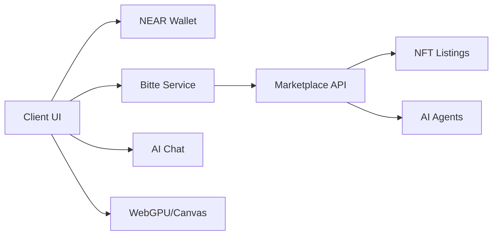
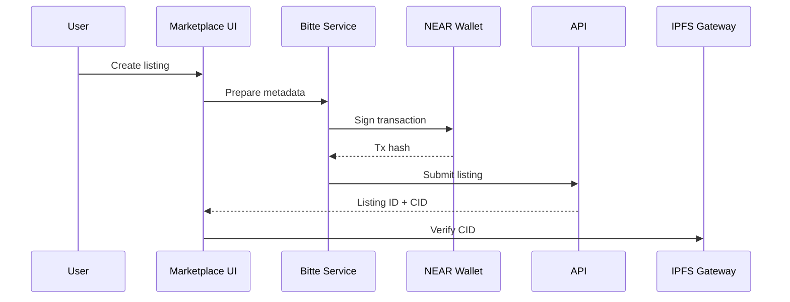

# Bitte Protocol AI Marketplace — README

## Executive Summary
- Real NEAR wallet flows, AI agent listings, biometric/emotion-aware NFTs, and WebGPU rendering integrated.
- Marketplace UI supports wallet-authenticated actions and agent deployment.
- Documentation and diagrams fixed with compatible Mermaid syntax.

## What Works
- Wallet connect and authenticated transactions
  - `src/pages/RealBitteMarketplace.tsx:1-12`, `:150-190`
  - `src/pages/EnhancedBitteMarketplace.tsx:58-76`
  - `src/utils/near-wallet.ts:1-20`, `:35-60`
- Bitte wallet service and marketplace service
  - `src/services/bitteWalletService.ts:1-26`, `:47-60`
  - `src/services/realMarketplaceService.ts:1-16`, `:515-531`
- AI chat and agent integration
  - `src/components/BitteAIChatIntegration.tsx:96-106`
- Working marketplace demo
  - `bitte-marketplace-working.html:1-40`

## Features
- AI agents browsing and deployment
- Emotion-aware NFT listings with biometric data
- WebGPU/Canvas creative rendering pipeline
- Basic API-backed listing retrieval and display

## Architecture Overview

## Listing Flow

## Components
- `src/pages/BitteAIMarketplace.tsx:70-102` wallet connect and load agents/NFTs
- `src/pages/RealBitteMarketplace.tsx:150-190` NEAR wallet connection UI
- `src/pages/EnhancedBitteMarketplace.tsx:58-76` NEAR wallet connect flow
- `src/services/bitteService.ts:95-138` API wallet connect
- `src/services/realMarketplaceService.ts:515-531` AI agents data
- `src/components/BitteAIChatIntegration.tsx:96-106` marketplace chat responses
- `src/utils/bitte-protocol-ai-enhanced.ts:71-78` enhanced AI client

## Setup
- Install: `npm install`
- Dev server: `npm run dev`
- Connect NEAR wallet in UI, then list or deploy agents

## Verification
- Connect wallet and perform a listing action
- Verify CID via IPFS gateway
- Browse agents and confirm data loads

## Roadmap
- Extend listing creation with royalty and store management
- Integrate DAO voting and proposals
- Add cross-chain bridge interactions
