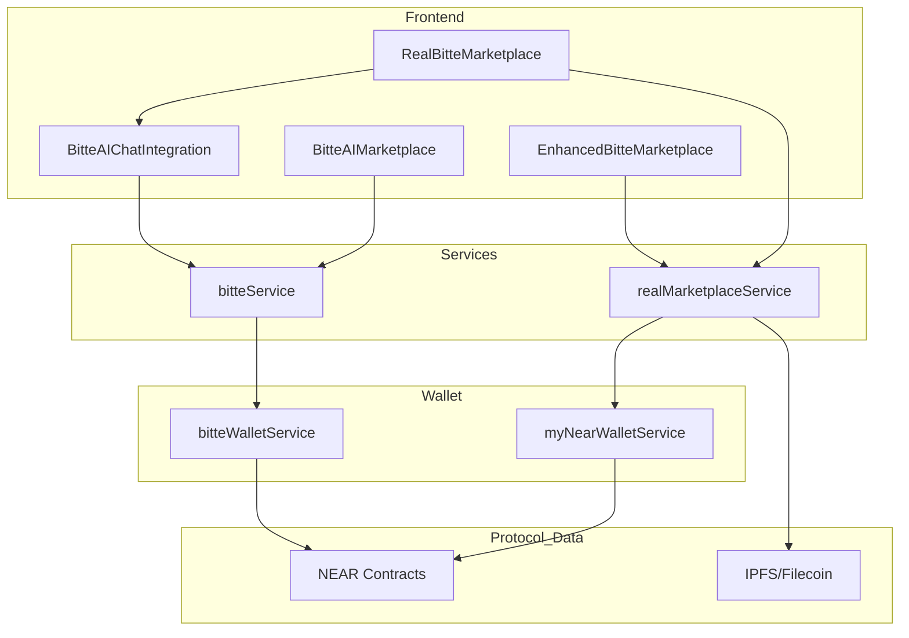
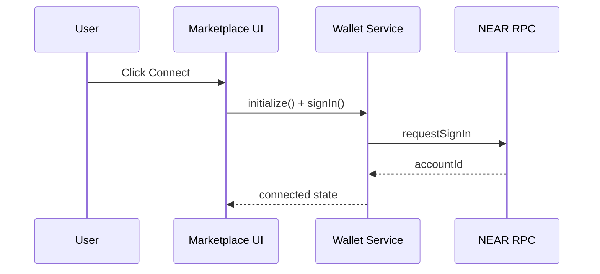
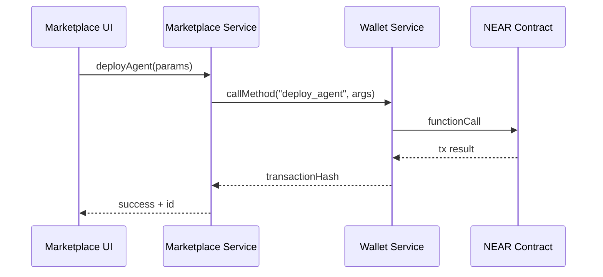
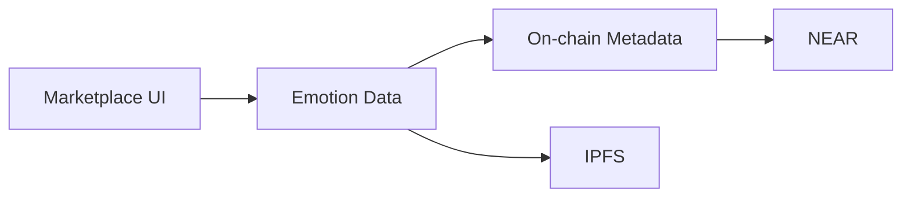
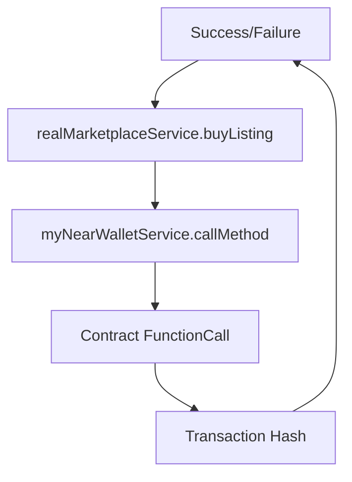

# Bitte AI Marketplace — Technical Architecture

## Overview
- Purpose: Real Bitte AI marketplace on NEAR with biometric NFTs and AI agents
- Scope: Wallet connect, listings, bids, minting, agent deployment, chat integration
- Reality: Uses `myNearWalletService` for transactions; demo flows via `bitteService`
- UI: `RealBitteMarketplace`, `EnhancedBitteMarketplace`, `BitteAIMarketplace`, `BitteAIChatIntegration`

## Architecture Overview

## Wallet Connect Flow

## Agent Deployment Flow

## Data & Storage

## Components
- Marketplace UI: `apps/web/src/pages/RealBitteMarketplace.tsx`, `apps/web/src/pages/EnhancedBitteMarketplace.tsx`
- Wallet: `apps/web/src/services/myNearWalletService.ts`, `apps/web/src/services/bitteService.ts` (API service, replaces bitteWalletService)
- Marketplace service: `apps/web/src/services/realMarketplaceService.ts`
- Bitte service: `apps/web/src/services/bitteService.ts`
- NEAR Visualizer: `apps/web/src/components/NEARVisualizer.tsx`

## Flows
- Wallet connect: `myNearWalletService.signIn()` at `apps/web/src/services/myNearWalletService.ts`
- Buy listing: `realMarketplaceService.buyListing()` at `apps/web/src/services/realMarketplaceService.ts`
- Place bid: `realMarketplaceService.placeBid()` at `apps/web/src/services/realMarketplaceService.ts`
- Mint biometric NFT: `realMarketplaceService.mintBiometricNFT()` at `src/services/realMarketplaceService.ts:362`
- Demo wallet connect: `bitteService.connectWallet()` at `src/services/bitteService.ts:95`
- AI marketplace demo connect: `src/pages/BitteAIMarketplace.tsx:70`

## Transaction Flow

## Data Schema
- Emotion vector: `{ valence, arousal, dominance }` used in NFT metadata
- Attached deposit: yoctoNEAR strings via `near-api-js` format utilities
- Example mint: see `src/services/realMarketplaceService.ts:362`

## Notes
- All diagrams use simple Mermaid syntax compatible with IDE renderers
- Labels avoid special characters; code references are listed outside diagrams
