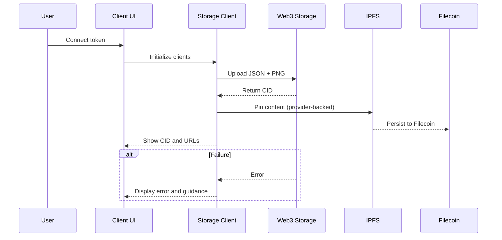
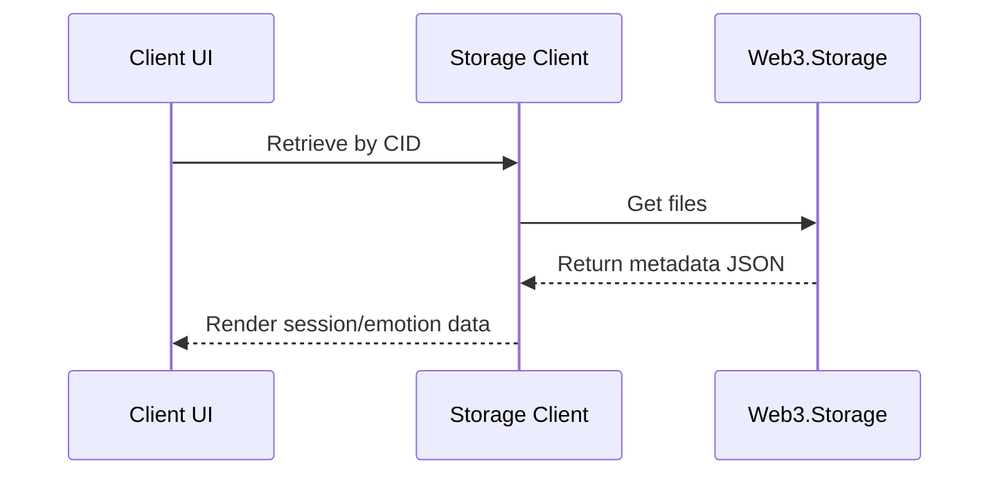

# Filecoin/IPFS Emotional Storage — Comprehensive README

## Executive Summary
- Real uploads work via `Web3.Storage` and `NFT.Storage` when a token is configured.
- Fallback mode uses realistic mock CIDs only when no token is provided.
- Direct Lotus/Filecoin deal negotiation is scaffolded and currently mocked.
- Calibration configuration exists for future direct deal testing (`src/config/filecoin-calibration.env:1-8`).

## Architecture Overview
```mermaid
flowchart LR
    UI[Client UI] --> API[Storage Client]
    API --> W3S[Web3.Storage]
    API --> NFTS[NFT.Storage]
    W3S --> IPFS[IPFS]
    NFTS --> IPFS
    IPFS --> FIL[Filecoin Persistence]
    API -.optional.-> LOTUS[Lotus Deals (mocked)]
```

## Upload Workflow


## Retrieval Workflow


## Data Model
```json
{
  "name": "Emotional Art Session",
  "description": "Session metadata and emotional state",
  "image": "ipfs://<png-cid>",
  "properties": {
    "emotion": { "valence": 0.42, "arousal": 0.63, "dominance": 0.51, "confidence": 0.88 },
    "biometrics": {
      "heartRate": [72, 74, 76],
      "breathingRate": [12.1, 11.8],
      "eegBands": [{ "alpha": 0.33, "beta": 0.22, "gamma": 0.05, "delta": 0.15, "theta": 0.25 }]
    },
    "sessionId": "uuid",
    "timestamp": 1734200000
  }
}
```

## Configuration
- Token setup: `docs/WEB3_STORAGE_SETUP.md:1-64`
- Environment variable: `WEB3_STORAGE_TOKEN` or `.env`
- Calibration env: `src/config/filecoin-calibration.env:1-8`

## UI Integration
- Connect-and-upload panel: `src/components/FilecoinStorageIntegration.tsx:1-34`
- Token connect and status: `src/components/FilecoinStorageIntegration.tsx:180-213`
- Upload progress and result: `src/components/FilecoinStorageIntegration.tsx:214-297`

## API Integration
- Client initialization: `src/utils/filecoin-storage.ts:1-18`
- Retrieval by CID: `src/utils/filecoin-ai-integration.ts:269-294`
- Mock deal scaffold: `src/utils/unified-ai-ipfs-hub.ts:93-110`

## Verification Checklist
- Set a valid `WEB3_STORAGE_TOKEN`.
- Use the Filecoin panel to connect and upload a test session.
- Confirm a real CID is returned and gateways resolve content.
- Retrieve metadata by CID to verify end-to-end.

## Roadmap
- Implement direct Lotus deal negotiation and verification.
- Add persistence checks, renewal scheduling, and provider redundancy.
- Integrate cost monitoring and availability health checks.
