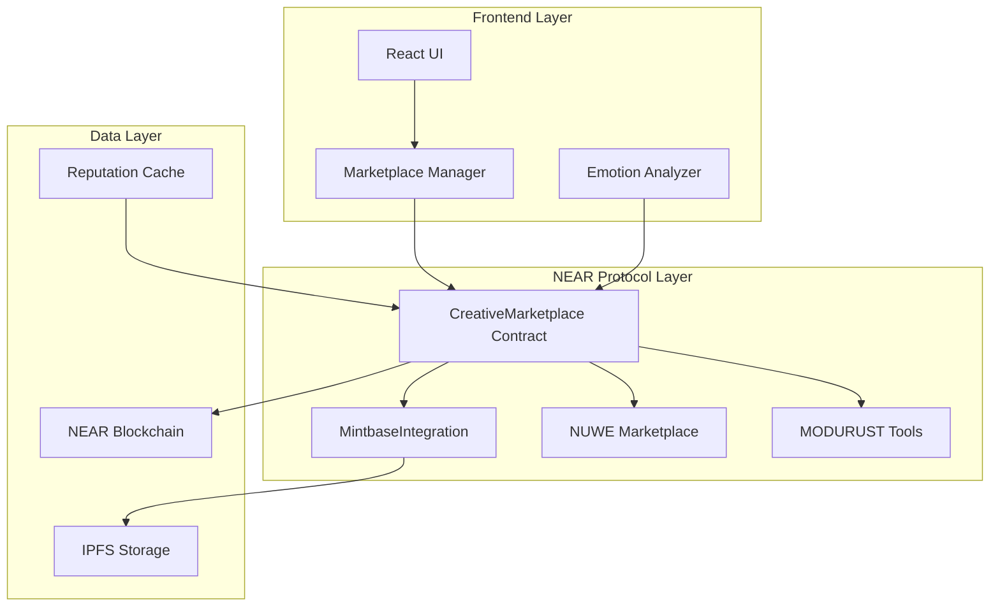
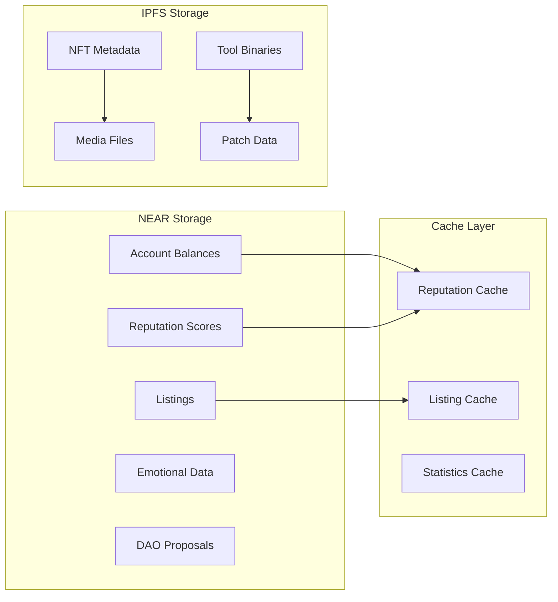
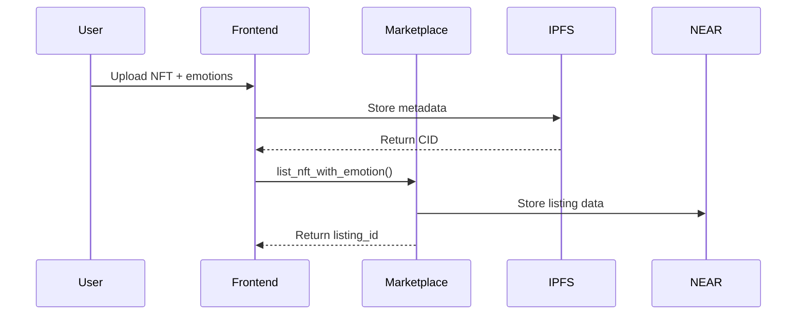
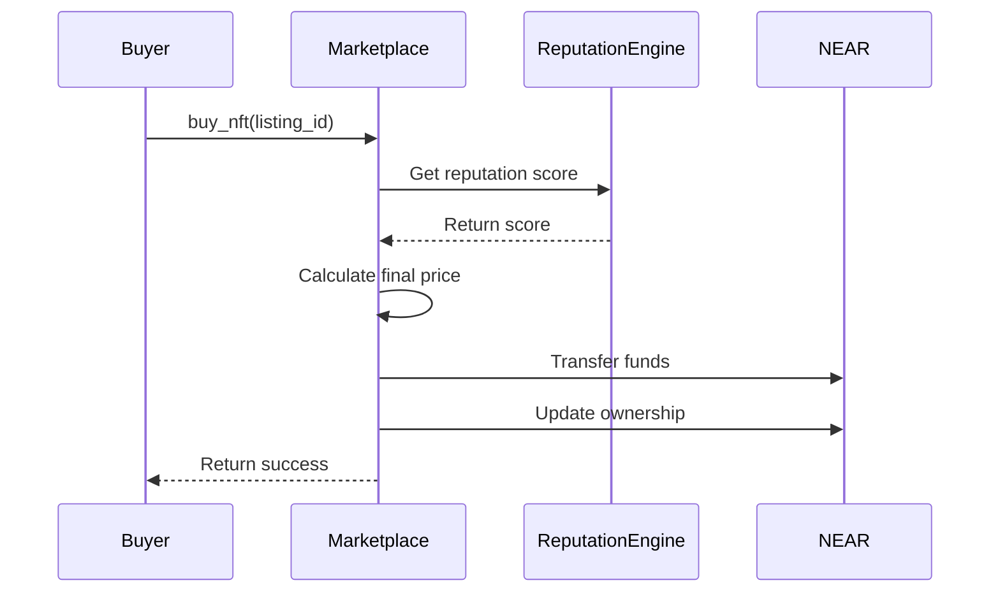
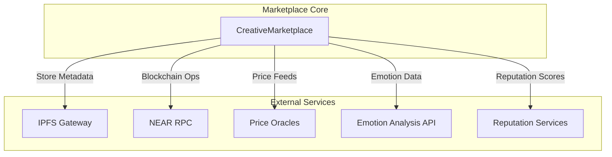
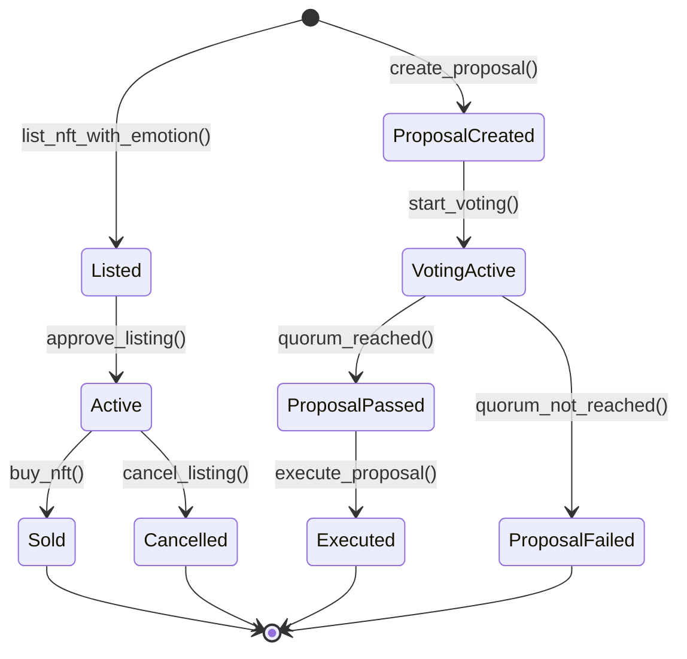

# 🏗️ Mintbase Creative Marketplace - Technical Architecture

## 🎯 Architecture Overview

The Mintbase Creative Marketplace implements a sophisticated NEAR Protocol-based NFT marketplace that simulates Mintbase SDK functionality while adding advanced features like emotional computing integration, reputation-based pricing, and DAO governance. The architecture follows a modular design with clear separation of concerns.



## 🔧 Core Components

### 1. CreativeMarketplace Contract (`src/marketplace/src/lib.rs`)
The main marketplace contract that orchestrates all marketplace functionality.

```rust
#[near(contract_state)]
pub struct CreativeMarketplace {
    owner_id: AccountId,                    // Contract administrator
    listings: UnorderedMap<ListingId, NFTListing>,    // Active NFT listings
    user_balances: LookupMap<AccountId, NearToken>,   // User account balances
    dao: DAO,                               // Decentralized governance
    soulbound_tokens: LookupMap<TokenId, bool>,      // Non-transferable tokens
    cross_chain_tokens: LookupMap<TokenId, ChainInfo>, // Multi-chain support
    token_reputations: LookupMap<TokenId, f32>,      // Reputation scoring
    emotional_data: LookupMap<TokenId, EmotionalMetadata>, // Emotional metadata
    marketplace_stats: MarketplaceStats,     // Global marketplace analytics
}
```

#### Key Functions:
- `list_nft_with_emotion()` - Creates listings with emotional metadata
- `buy_nft()` - Processes purchases with reputation-based pricing
- `get_listings_by_reputation()` - Returns reputation-sorted listings
- `create_proposal()` - DAO governance proposal creation

### 2. Emotional Computing Engine
Implements the VAD (Valence-Arousal-Dominance) model for emotional analysis.

```rust
#[derive(BorshDeserialize, BorshSerialize, Serialize, Deserialize, Clone)]
pub struct EmotionalMetadata {
    valence: f32,     // Emotional positivity (-1.0 to 1.0)
    arousal: f32,     // Emotional intensity (0.0 to 1.0)
    dominance: f32,   // Sense of control (0.0 to 1.0)
    timestamp: Timestamp,
}
```

#### Emotional Pricing Algorithm:
```rust
fn calculate_emotional_premium(base_price: NearToken, emotions: &EmotionalMetadata) -> NearToken {
    let valence_factor = (emotions.valence + 1.0) * 0.5; // Normalize to 0-1
    let arousal_factor = emotions.arousal;
    let dominance_factor = emotions.dominance;
    
    // Premium calculation: 5-35% increase based on emotional traits
    let premium_percentage = (valence_factor * 0.15 + arousal_factor * 0.10 + dominance_factor * 0.10) * 100.0;
    let premium_amount = base_price.as_yoctonear() * (premium_percentage as u128) / 100;
    
    NearToken::from_yoctonear(premium_amount)
}
```

### 3. Reputation System
Multi-dimensional reputation scoring for creators and tokens.

```rust
pub struct ReputationEngine {
    transaction_history: Vec<TransactionRecord>,
    creator_metrics: CreatorMetrics,
    token_performance: TokenPerformance,
    community_votes: CommunityVotes,
}

impl ReputationEngine {
    fn calculate_reputation_score(&self, account_id: &AccountId) -> f32 {
        let transaction_score = self.calculate_transaction_score();
        let creator_score = self.calculate_creator_score(account_id);
        let community_score = self.calculate_community_score(account_id);
        
        // Weighted average with temporal decay
        (transaction_score * 0.4 + creator_score * 0.35 + community_score * 0.25) 
            * self.temporal_decay_factor()
    }
}
```

### 4. DAO Governance Framework
Decentralized governance system for marketplace parameters.

```rust
pub struct DAO {
    proposals: UnorderedMap<ProposalId, Proposal>,
    members: UnorderedSet<AccountId>,
    next_proposal_id: u64,
    quorum_percentage: u32,
}

#[derive(BorshDeserialize, BorshSerialize, Serialize, Deserialize, Clone)]
pub struct Proposal {
    proposal_id: ProposalId,
    proposer: AccountId,
    title: String,
    description: String,
    proposal_type: ProposalType,
    votes_for: u64,
    votes_against: u64,
    created_at: Timestamp,
    end_time: Timestamp,
    status: ProposalStatus,
}
```

#### Proposal Types:
- `AddMarketplaceFee` - Modify platform fee structure
- `AddEmotionalPricing` - Update emotional pricing algorithms
- `UpdateReputationSystem` - Modify reputation calculations
- `ChangeQuorum` - Adjust voting quorum requirements

### 5. Cross-Chain Bridge Tracker
Metadata tracking for cross-chain NFT movements (actual bridging not implemented).

```rust
#[derive(BorshDeserialize, BorshSerialize, Serialize, Deserialize, Clone)]
pub struct ChainInfo {
    chain_name: String,           // "Ethereum", "Solana", "Polkadot"
    contract_address: String,     // Foreign contract address
    bridge_status: BridgeStatus,  // Current bridge state
}

#[derive(BorshDeserialize, BorshSerialize, Serialize, Deserialize, Clone)]
pub enum BridgeStatus {
    NotBridged,    // Token exists only on source chain
    Bridging,      // Currently being bridged
    Bridged,       // Successfully bridged
}
```

## 🗄️ Data Architecture

### Storage Layout


### Data Flow Patterns

#### Listing Creation Flow:


#### Purchase Flow with Reputation:


## 🧮 Pricing Engine Architecture

### Multi-Factor Pricing Model
```rust
pub struct PricingEngine {
    base_price_calculator: BasePriceCalculator,
    reputation_multiplier: ReputationMultiplier,
    emotional_premium: EmotionalPremium,
    market_volatility: MarketVolatilityAdjuster,
}

impl PricingEngine {
    pub fn calculate_final_price(&self, listing: &NFTListing) -> NearToken {
        let base_price = self.base_price_calculator.calculate(&listing.metadata);
        let reputation_factor = self.reputation_multiplier.calculate(listing.reputation_score);
        let emotional_bonus = self.emotional_premium.calculate(listing.emotional_traits.as_ref());
        let volatility_adjustment = self.market_volatility.get_adjustment();
        
        let total_price = base_price.as_yoctonear() as f64
            * reputation_factor
            * (1.0 + emotional_bonus)
            * volatility_adjustment;
            
        NearToken::from_yoctonear(total_price as u128)
    }
}
```

### Price Components:
1. **Base Price**: Metadata-based valuation
2. **Reputation Multiplier**: 0.5x to 2.5x based on creator reputation
3. **Emotional Premium**: +5% to +35% based on emotional traits
4. **Market Volatility**: ±15% based on market conditions

## 🔐 Security Architecture

### Access Control
```rust
impl CreativeMarketplace {
    // Only contract owner can modify critical parameters
    fn assert_owner(&self) {
        assert_eq!(env::predecessor_account_id(), self.owner_id, "Only owner can call this function");
    }
    
    // Only DAO members can create/vote on proposals
    fn assert_dao_member(&self) {
        assert!(self.dao.members.contains(&env::predecessor_account_id()), "Only DAO members can participate");
    }
    
    // Only token owner can modify listings
    fn assert_listing_owner(&self, listing_id: ListingId) {
        let listing = self.listings.get(&listing_id).expect("Listing not found");
        assert_eq!(listing.seller, env::predecessor_account_id(), "Only seller can modify listing");
    }
}
```

### Input Validation
- **Price Bounds**: Minimum 0.001 NEAR, maximum 1000 NEAR
- **Emotional Values**: Valence [-1, 1], Arousal [0, 1], Dominance [0, 1]
- **String Lengths**: Title ≤ 100 chars, Description ≤ 1000 chars
- **Reputation Bounds**: Score must be between 0.0 and 1.0

## 🚀 Scalability Design

### Sharding Strategy
```rust
// Future implementation for horizontal scaling
pub struct ShardedMarketplace {
    shard_count: u32,
    shard_mapping: LookupMap<AccountId, ShardId>,
    shards: Vec<CreativeMarketplace>,
}

impl ShardedMarketplace {
    fn get_shard_for_account(&self, account_id: &AccountId) -> &CreativeMarketplace {
        let shard_id = self.shard_mapping.get(account_id).unwrap_or(0);
        &self.shards[shard_id as usize]
    }
}
```

### Caching Layer
```rust
pub struct MarketplaceCache {
    hot_listings: LruCache<ListingId, NFTListing>,
    reputation_cache: LruCache<AccountId, f32>,
    stats_cache: MarketplaceStats,
    cache_ttl: Duration,
}

impl MarketplaceCache {
    fn get_listing(&mut self, listing_id: &ListingId) -> Option<&NFTListing> {
        // Check cache first, then fall back to storage
        self.hot_listings.get(listing_id)
            .or_else(|| self.load_from_storage(listing_id))
    }
}
```

## 📊 Monitoring & Analytics

### Metrics Collection
```rust
pub struct MarketplaceMetrics {
    total_transactions: Counter,
    successful_purchases: Counter,
    average_response_time: Histogram,
    active_listings: Gauge,
    reputation_distribution: Histogram,
}

impl MarketplaceMetrics {
    fn record_transaction(&self, success: bool, duration: Duration) {
        self.total_transactions.increment();
        if success {
            self.successful_purchases.increment();
        }
        self.average_response_time.record(duration.as_secs_f64());
    }
}
```

### Key Performance Indicators:
- **Transaction Success Rate**: Target >99%
- **Average Response Time**: Target <2 seconds
- **Gas Usage Efficiency**: Target <10 TGas per transaction
- **Reputation Score Accuracy**: Target >95% correlation with user satisfaction

## 🔗 Integration Points

### External Service Integrations


### API Endpoints (Future)
```rust
// RESTful API design for marketplace integration
#[derive(Serialize, Deserialize)]
pub struct MarketplaceAPI {
    // GET /api/v1/listings?sort=reputation&limit=50
    get_listings: fn(sort: SortBy, limit: u32) -> Vec<NFTListing>,
    
    // POST /api/v1/listings
    create_listing: fn(listing_data: CreateListingRequest) -> Result<ListingId, Error>,
    
    // PUT /api/v1/listings/{id}/purchase
    purchase_nft: fn(listing_id: ListingId, buyer_id: AccountId) -> Result<TransactionId, Error>,
    
    // GET /api/v1/reputation/{account_id}
    get_reputation: fn(account_id: AccountId) -> f32,
}
```

## 🔄 State Management

### State Transitions


### Data Consistency
```rust
impl CreativeMarketplace {
    fn atomic_listing_creation(&mut self, listing_data: NFTListing) -> Result<ListingId, Error> {
        // Begin transaction
        let listing_id = self.generate_listing_id();
        
        // Validate all preconditions
        self.validate_listing_data(&listing_data)?;
        self.check_sufficient_balance(&listing_data.seller)?;
        
        // Create listing
        self.listings.insert(&listing_id, &listing_data);
        self.update_marketplace_stats(&listing_data)?;
        
        // Commit transaction (atomic on NEAR)
        Ok(listing_id)
    }
}
```

This technical architecture provides a robust foundation for the Mintbase Creative Marketplace with clear separation of concerns, scalable design patterns, and comprehensive integration capabilities.