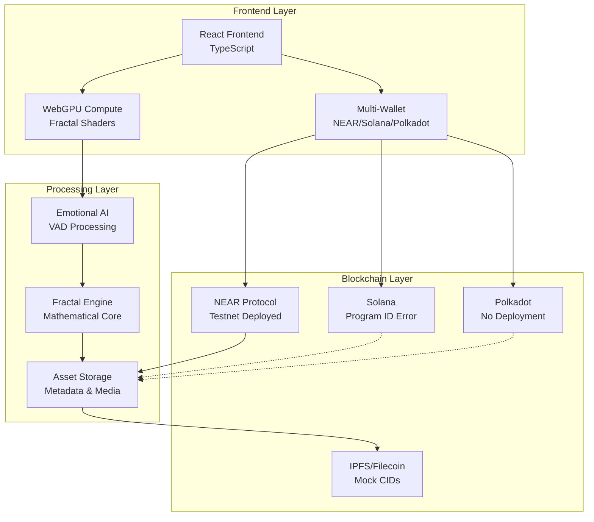
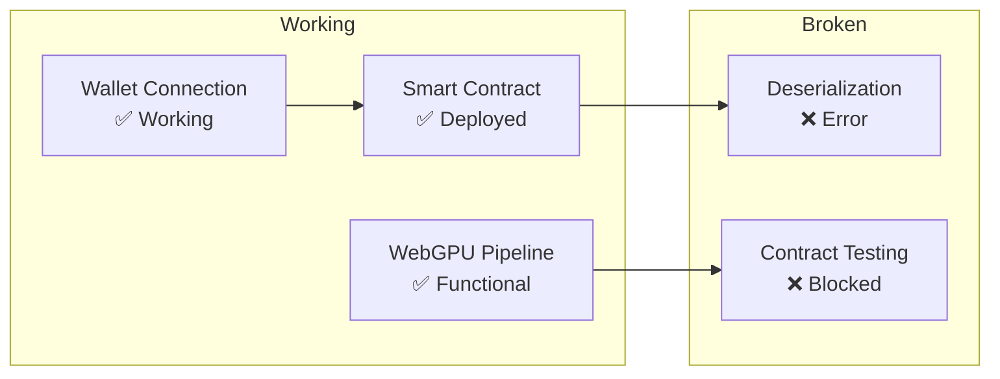
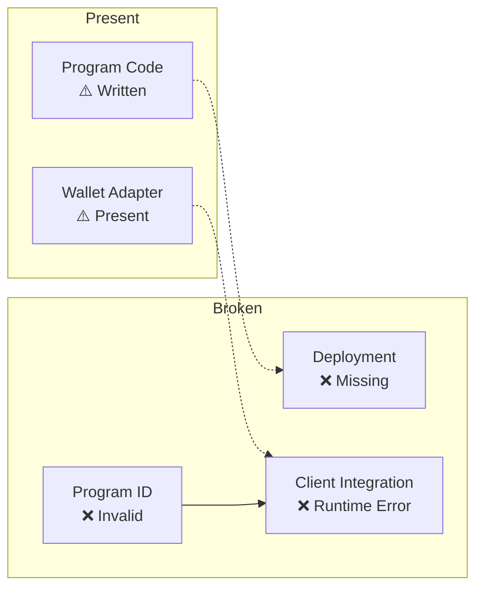
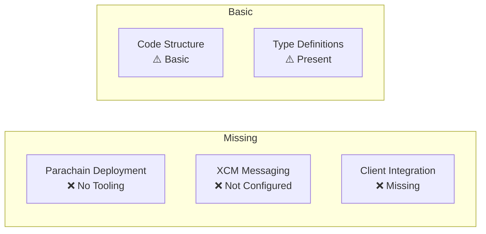

# Multi-Chain Creative Engine - Technical Architecture

## 🚨 SYSTEM-WIDE STATUS: ~40% FUNCTIONAL (PROTOTYPE LEVEL)

### ❌ CRITICAL BLOCKERS ACROSS ALL CHAINS:
- **NEAR Contract**: Deserialization errors preventing proper function calls
- **Solana Program**: Invalid program ID causing runtime failures
- **Polkadot Integration**: Missing deployment tooling and parachain setup
- **IPFS Storage**: Web3.Storage token not configured, using mock CIDs
- **LanceDB**: Requires protoc compiler (environment limitation)

### ✅ WORKING COMPONENTS:
- **WebGPU Fractal Engine**: Compute shaders with emotion parameters
- **NEAR Wallet Integration**: Real wallet connection and transaction signing
- **React Frontend**: Multi-chain wallet interface operational
- **Emotion Processing**: VAD (Voice Activity Detection) system functional

---

## 🏗️ Multi-Chain Architecture Overview



---

## 📊 Chain-by-Chain Technical Reality

### NEAR Creative Engine (67% Functional)
**Status**: Most advanced implementation



**Technical Issues**:
- Contract state corruption causing WASM deserialization failures
- Frontend unable to properly initialize contract state
- Deployment script needs contract reinitialization

### Solana Emotional Metadata (10% Functional)
**Status**: Severely limited by deployment issues



**Technical Issues**:
- Invalid public key at `src/utils/solana-client.ts:117`
- Missing Anchor framework setup and devnet deployment
- Program ID placeholder not replaced with deployed program

### Polkadot Cross-Chain (5% Functional)
**Status**: Minimal implementation



**Technical Issues**:
- No parachain deployment tooling configured
- XCM messaging not properly set up
- Missing Substrate client integration

---

## 🔧 Technical Implementation Details

### Current Blockers and Dependencies

| Component | Blocker | Required Action | Priority |
|-----------|---------|-----------------|----------|
| NEAR Contract | Deserialization Error | Redeploy with clean state | HIGH |
| Solana Program | Invalid Program ID | Deploy to devnet, update client | HIGH |
| IPFS Storage | Missing Web3.Token | Configure real storage token | MEDIUM |
| LanceDB | protoc compiler | Install build dependencies | LOW |
| Polkadot | No deployment | Set up parachain tooling | LOW |

### Environment Requirements

```bash
# Required for full functionality
rustup target add wasm32-unknown-unknown
npm install -g @solana/cli
npm install -g @project-serum/anchor
# protoc compiler for LanceDB
# Web3.Storage API token for real IPFS uploads
```

---

## 🎯 Next Steps for Technical Completion

### Immediate Actions (High Priority)
1. **Fix NEAR Contract**: Redeploy with proper initialization to resolve deserialization
2. **Deploy Solana Program**: Set up Anchor and deploy to devnet
3. **Update Program IDs**: Replace placeholders with actual deployed addresses
4. **Configure Web3.Storage**: Add real token for IPFS uploads

### Medium Priority
1. **Polkadot Deployment**: Configure parachain tooling
2. **LanceDB Setup**: Install protoc compiler dependencies
3. **End-to-end Testing**: Validate multi-chain integrations

### Low Priority
1. **Performance Optimization**: Optimize WebGPU shaders
2. **Error Handling**: Improve blockchain error recovery
3. **Documentation**: Update technical specs with real implementations

---

**Document Status**: Updated November 26, 2025 - Reflects current technical reality, not aspirational architecture