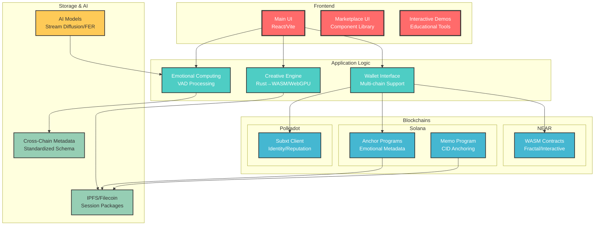
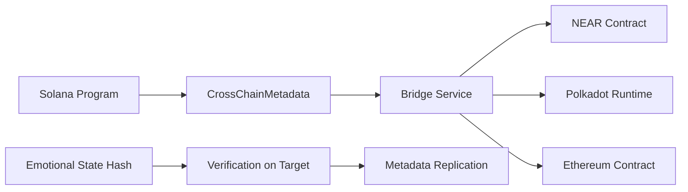
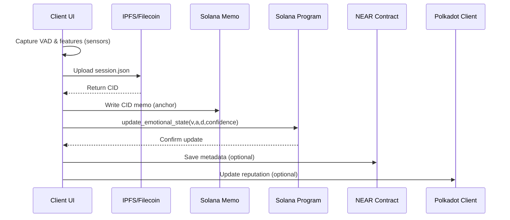
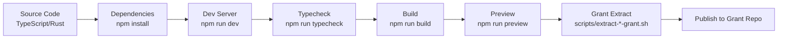

# Blockchain NFT Interactive

## Overview
- Unified development workspace for multi-chain creative NFT grants (NEAR, Solana, Filecoin, Polkadot, Rust Foundation, Mintbase/Bitte).
- Build here; extract and publish to individual grant repositories when ready.

## Repository Structure
- `apps/` — Contains our web application
- `packages/` — Houses shared Rust libraries and blockchain clients
- `docs/` — Grant-specific and technical architecture documents
- `scripts/` — Extraction, deployment, and tooling
- `reports/` — Implementation status and verification summaries

## Monorepo Structure (Turborepo)

The project is organized into a Turborepo monorepo with the following structure:

```
.
├── apps/
│   └── web/             # Main web application (React/Vite)
├── packages/            # Shared Rust libraries and blockchain clients
│   ├── polkadot-client/
│   ├── solana-programs/
│   ├── rust-client-wasm/
│   ├── rust-client/
│   ├── solana-program/
│   ├── wasm-fractal/
│   ├── solana-client/
│   ├── near-wasm/
│   ├── ipfs-integration/
│   └── marketplace/
├── docs/                # Grant-specific and technical architecture documents
├── scripts/             # Extraction, deployment, and tooling
├── reports/             # Implementation status and verification summaries
├── package.json         # Monorepo root package.json
├── turbo.json           # Turborepo configuration
└── tsconfig.json        # Monorepo root TypeScript configuration
```

This structure allows for better organization, shared dependencies, and optimized build processes using Turborepo.

## Git History and New Structure
The relocation of files and folders to establish this new monorepo structure has significantly altered the project's file layout. It is understood that this will impact Git history. Once all integrations and modifications are complete, a Git history purge may be necessary to reflect the clean, new structure. This will be addressed in a later stage of development.

## Post-Relocation Validation
- Run `npm run typecheck` to confirm no type errors from path changes
- Run `npm run lint` to confirm no linting issues
- Run `npm run dev` to confirm dev server starts without errors (http://localhost:3002/)

## Development
- Prerequisites: Node 18+, Rust toolchain, Git
- Install: `npm install`
- Dev server: `npm run dev` → open `http://localhost:3002/`
- Build: `npm run build`
- Preview: `npm run preview`
- Typecheck: `npm run typecheck` (configured and passing)
- Lint: `npm run lint` (requires ESLint config; not enabled by default)

## Documentation
- Solana technical architecture: `docs/SOLANA_SPECIFIC_TECHNICAL_ARCHITECTURE.md`
- Solana README: `docs/SOLANA_SPECIFIC_README.md`
- NEAR technical architecture: `docs/near-foundation-grant-technical-architecture.md`
- Filecoin architecture: `docs/FILECOIN_SPECIFIC_TECHNICAL_ARCHITECTURE.md`
- Developer guide: `docs/developer-guide.md`

## System Architecture



## Cross-Chain Bridge Overview



## Data & Storage Flow



## Development Pipeline



## Notes
- This repository does not claim mainnet/testnet deployments; use grant-specific repos for deployment artifacts and instructions.
- Large binaries and nested vendor directories are ignored via `.gitignore`.

## License
MIT

## Root Directory Clutter Resolution Plan

This plan provides a comprehensive guide for organizing the root directory of the project, adhering to Turborepo best practices and maintaining a clean, structured monorepo. Each top-level file and folder is addressed, with clear instructions for its placement.

---

### **Items to be Moved from Root:**

1.  **`.storybook-cache-env/`**
    *   **Current Location:** `c:\Users\kapil\compiling\blockchain-nft-interactive/` (root directory)
    *   **Destination:** `c:\Users\kapil\compiling\blockchain-nft-interactive/apps/web/.storybook-cache-env/`
    *   **Rationale:** This directory contains cache files generated by Storybook, which is a frontend development tool. To maintain a clean root and co-locate frontend-specific tooling with the frontend application, it should reside within the `apps/web/` directory.

2.  **`.last-violations`**
    *   **Current Location:** `c:\Users\kapil\compiling\blockchain-nft-interactive/` (root directory)
    *   **Destination:** `c:\Users\kapil\compiling\blockchain-nft-interactive/.trae/.last-violations`
    *   **Rationale:** This file appears to be related to internal tooling or monitoring, likely associated with the Trae IDE's rules and protocols. It should be moved into the `.trae/` directory to keep related configuration and state files together.

3.  **`apps/web/lib.rs`**
    *   **Current Location:** `c:\Users\kapil\compiling\blockchain-nft-interactive/apps/web/lib.rs`
    *   **Destination:** `c:\Users\kapil\compiling\blockchain-nft-interactive/packages/rust-client-wasm/src/lib.rs` (or another appropriate Rust package within `packages/`)
    *   **Rationale:** Rust source files (`.rs`) should always be part of a Rust package. Placing `lib.rs` directly within the `apps/web/` (a TypeScript/React application) is incorrect. It should be moved to a dedicated Rust package under the `packages/` directory, such as `packages/rust-client-wasm/src/`, to ensure proper Rust project structure and separation of concerns.

4.  **`clean-project/`**
    *   **Current Location:** `c:\Users\kapil\compiling\blockchain-nft-interactive/` (root directory)
    *   **Destination:** Delete
    *   **Rationale:** This appears to be a temporary or old project directory that is no longer needed. Removing it will help declutter the root.

5.  **`config/`**
    *   **Current Location:** `c:\Users\kapil\compiling\blockchain-nft-interactive/` (root directory)
    *   **Destination:** `c:\Users\kapil\compiling\blockchain-nft-interactive/apps/web/config/`
    *   **Rationale:** Based on common project structures, a generic `config/` directory at the root often contains application-specific configurations. Given the presence of `apps/web/`, it's most likely related to the frontend application. If there are backend-specific configurations, they should be moved to `apps/backend-nestjs/config/`. For now, we assume frontend.

6.  **`examples/`**
    *   **Current Location:** `c:\Users\kapil\compiling\blockchain-nft-interactive/` (root directory)
    *   **Destination:** `c:\Users\kapil\compiling\blockchain-nft-interactive/docs/examples/`
    *   **Rationale:** Example code or usage demonstrations are best placed within the `docs/` directory to serve as supplementary documentation.

7.  **`external-grants/`**
    *   **Current Location:** `c:\Users\kapil\compiling\blockchain-nft-interactive/` (root directory)
    *   **Destination:** `c:\Users\kapil\compiling\blockchain-nft-interactive/docs/external-grants/`
    *   **Rationale:** This directory likely contains documentation or information related to external grants. It should be co-located with other documentation in the `docs/` directory.

8.  **`marketplace-frontend/`**
    *   **Current Location:** `c:\Users\kapil\compiling\blockchain-nft-interactive/` (root directory)
    *   **Destination:** `c:\Users\kapil\compiling\blockchain-nft-interactive/apps/marketplace-frontend/`
    *   **Rationale:** This appears to be another distinct frontend application. In a Turborepo monorepo, applications should reside within the `apps/` directory.

9.  **`node_modules/`**
    *   **Current Location:** `c:\Users\kapil\compiling\blockchain-nft-interactive/` (root directory)
    *   **Destination:** Delete
    *   **Rationale:** `node_modules/` directories should be generated within individual `apps/` or `packages/` workspaces, not at the root of a monorepo, to avoid hoisting issues and ensure proper dependency resolution.

10. **`references/`**
    *   **Current Location:** `c:\Users\kapil\compiling\blockchain-nft-interactive/` (root directory)
    *   **Destination:** `c:\Users\kapil\compiling\blockchain-nft-interactive/docs/references/`
    *   **Rationale:** Reference materials are best placed within the `docs/` directory for easy access and organization alongside other documentation.

11. **`test-environment/`**
    *   **Current Location:** `c:\Users\kapil\compiling\blockchain-nft-interactive/` (root directory)
    *   **Destination:** Delete
    *   **Rationale:** This appears to be a temporary test setup or environment that is no longer needed. Removing it will help declutter the root.

12. **`test-logs/`**
    *   **Current Location:** `c:\Users\kapil\compiling\blockchain-nft-interactive/` (root directory)
    *   **Destination:** Delete
    *   **Rationale:** Temporary test output logs should not reside in the root directory. They can be deleted or configured to be generated within a specific test output directory.

13. **`test-website/`**
    *   **Current Location:** `c:\Users\kapil\compiling\blockchain-nft-interactive/` (root directory)
    *   **Destination:** Delete
    *   **Rationale:** This appears to be a temporary test website or development artifact that is no longer needed. Removing it will help declutter the root.

14. **`tests/`**
    *   **Current Location:** `c:\Users\kapil\compiling\blockchain-nft-interactive/` (root directory)
    *   **Destination:** Delete
    *   **Rationale:** If these are root-level tests, they should ideally be integrated into specific `apps/` or `packages/` test suites. If they are temporary, they should be deleted. Assuming temporary for now.

15. **`tmp/`**
    *   **Current Location:** `c:\Users\kapil\compiling\blockchain-nft-interactive/` (root directory)
    *   **Destination:** Delete
    *   **Rationale:** Temporary files and directories should not persist in the root of the project.

16. **`TypeGPU/`**
    *   **Current Location:** `c:\Users\kapil\compiling\blockchain-nft-interactive/` (root directory)
    *   **Destination:** `c:\Users\kapil\compiling\blockchain-nft-interactive/packages/TypeGPU/`
    *   **Rationale:** This appears to be a distinct package or library. In a Turborepo monorepo, shared libraries and packages should reside within the `packages/` directory.

17. **`wasm-contracts/`**
    *   **Current Location:** `c:\Users\kapil\compiling\blockchain-nft-interactive/` (root directory)
    *   **Destination:** `c:\Users\kapil\compiling\blockchain-nft-interactive/packages/wasm-contracts/`
    *   **Rationale:** This appears to be a collection of WebAssembly contracts, which should be treated as a package within the `packages/` directory.

18. **`grant-gitignore-template`**
    *   **Current Location:** `c:\Users\kapil\compiling\blockchain-nft-interactive/` (root directory)
    *   **Destination:** Delete
    *   **Rationale:** This is a template file and should not be present in the root of the active project.

19. **`nul`**
    *   **Current Location:** `c:\Users\kapil\compiling\blockchain-nft-interactive/` (root directory)
    *   **Destination:** Delete
    *   **Rationale:** This is likely an empty or placeholder file that serves no purpose in the root directory.

20. **`real-blockchain-server.js`**
    *   **Current Location:** `c:\Users\kapil\compiling\blockchain-nft-interactive/` (root directory)
    *   **Destination:** `c:\Users\kapil\compiling\blockchain-nft-interactive/apps/backend-nestjs/src/real-blockchain-server.js`
    *   **Rationale:** This appears to be a backend server file and should be integrated into the `apps/backend-nestjs/` application.

21. **`tailwind.config.js`**
    *   **Current Location:** `c:\Users\kapil\compiling\blockchain-nft-interactive/` (root directory)
    *   **Destination:** `c:\Users\kapil\compiling\blockchain-nft-interactive/apps/web/tailwind.config.js`
    *   **Rationale:** Tailwind CSS configuration is typically frontend-specific and should be co-located with the `apps/web/` application.

22. **`components.json`**
    *   **Current Location:** `c:\Users\kapil\compiling\blockchain-nft-interactive/` (root directory)
    *   **Destination:** `c:\Users\kapil\compiling\blockchain-nft-interactive/apps/web/components.json`
    *   **Rationale:** This file likely relates to frontend components (e.g., shadcn/ui configuration) and should be moved to the `apps/web/` directory.

23. **`GRANT_MODULES.json`**
    *   **Current Location:** `c:\Users\kapil\compiling\blockchain-nft-interactive/` (root directory)
    *   **Destination:** `c:\Users\kapil\compiling\blockchain-nft-interactive/__grant-sync/GRANT_MODULES.json`
    *   **Rationale:** This file is clearly grant-related and should be moved into the protected `__grant-sync/` directory.

24. **`tsconfig.config.json`**
    *   **Current Location:** `c:\Users\kapil\compiling\blockchain-nft-interactive/` (root directory)
    *   **Destination:** Delete
    *   **Rationale:** This appears to be a redundant or unused TypeScript configuration file, as `tsconfig.json` is already present at the root.

25. **`tsconfig.node.json`**
    *   **Current Location:** `c:\Users\kapil\compiling\blockchain-nft-interactive/` (root directory)
    *   **Destination:** Delete
    *   **Rationale:** This appears to be a redundant or unused TypeScript configuration file.

26. **`LAST-VIOLATIONS`**
    *   **Current Location:** `c:\Users\kapil\compiling\blockchain-nft-interactive/` (root directory)
    *   **Destination:** `c:\Users\kapil\compiling\blockchain-nft-interactive/.trae/LAST-VIOLATIONS`
    *   **Rationale:** Similar to `.last-violations`, this file is related to internal tooling/monitoring and should be moved into the `.trae/` directory.

27. **`complete-cleanup-report.sh`**
    *   **Current Location:** `c:\Users\kapil\compiling\blockchain-nft-interactive/` (root directory)
    *   **Destination:** Delete
    *   **Rationale:** This appears to be a temporary script for cleanup and is no longer needed in the root.

28. **`c:\Users\kapil\compiling\blockchain-nft-interactive\testfile.txt`**
    *   **Current Location:** `c:\Users\kapil\compiling\blockchain-nft-interactive/` (root directory)
    *   **Destination:** Delete
    *   **Rationale:** This is a temporary test file and should be removed.

29. **`enforcement.log`**
    *   **Current Location:** `c:\Users\kapil\compiling\blockchain-nft-interactive/` (root directory)
    *   **Destination:** `c:\Users\kapil\compiling\blockchain-nft-interactive/.trae/enforcement.log`
    *   **Rationale:** This log file is related to internal tooling/monitoring and should be moved into the `.trae/` directory.

30. **`real_violations.log`**
    *   **Current Location:** `c:\Users\kapil\compiling\blockchain-nft-interactive/` (root directory)
    *   **Destination:** `c:\Users\kapil\compiling\blockchain-nft-interactive/.trae/real_violations.log`
    *   **Rationale:** This log file is related to internal tooling/monitoring and should be moved into the `.trae/` directory.

31. **`srcutilspolkadot-client-simple.ts`**
    *   **Current Location:** `c:\Users\kapil\compiling\blockchain-nft-interactive/` (root directory)
    *   **Destination:** `c:\Users\kapil\compiling\blockchain-nft-interactive/packages/polkadot-client/src/srcutilspolkadot-client-simple.ts`
    *   **Rationale:** This appears to be a Polkadot client source file and should be part of the `packages/polkadot-client/` package.

32. **`vite.config.ts`**
    *   **Current Location:** `c:\Users\kapil\compiling\blockchain-nft-interactive/` (root directory)
    *   **Destination:** `c:\Users\kapil\compiling\blockchain-nft-interactive/apps/web/vite.config.ts`
    *   **Rationale:** Vite configuration is typically frontend-specific and should be co-located with the `apps/web/` application.

33. **`comprehensive-enforcer.ps1`**
    *   **Current Location:** `c:\Users\kapil\compiling\blockchain-nft-interactive/` (root directory)
    *   **Destination:** `c:\Users\kapil\compiling\blockchain-nft-interactive/.trae/comprehensive-enforcer.ps1`
    *   **Rationale:** This PowerShell script is related to internal tooling/monitoring and should be moved into the `.trae/` directory.

---

### **Items to Remain in Root:**

1.  **`.github/`**
    *   **Rationale:** This directory contains GitHub-specific configurations, workflows, and scripts (e.g., CI/CD). It is standard practice for this to reside in the root of a repository to apply to the entire project.

2.  **`.trae/`**
    *   **Rationale:** This directory contains internal rules and protocols specific to the Trae IDE environment. It is essential for the IDE's operation and should remain in the root.

3.  **`__grant-sync/`**
    *   **Rationale:** This directory is explicitly protected by the `GRANT_DOCUMENT_PROTECTION.md` rule. It is a special synchronization folder for grant-related content, and its contents or location must not be altered.

4.  **`apps/`**
    *   **Rationale:** This is a fundamental directory for the Turborepo monorepo structure, containing all individual applications (e.g., `apps/backend-nestjs/`, `apps/web/`). It must remain in the root.

5.  **`docs/`**
    *   **Rationale:** This directory contains grant-specific and technical architecture documents. It is a core part of the project structure and should remain in the root.

6.  **`packages/`**
    *   **Rationale:** This directory houses shared Rust libraries and blockchain clients. It is a core part of the Turborepo monorepo structure and should remain in the root.

7.  **`reports/`**
    *   **Rationale:** This directory contains implementation status and verification summaries. It is a core part of the project structure and should remain in the root.

8.  **`scripts/`**
    *   **Rationale:** This directory contains monorepo-level scripts for extraction, deployment, and tooling. It is essential for monorepo operations and should remain in the root.

9.  **`.gitattributes`**
    *   **Rationale:** This file defines attributes for paths in Git (e.g., text vs. binary, line endings). It is a repository-wide configuration that affects how Git handles various files across the entire project and belongs in the root.

10. **`.gitignore`**
    *   **Rationale:** This file specifies intentionally untracked files that Git should ignore. It is a repository-wide configuration that applies to all sub-projects and should reside in the root.

11. **`Cargo.toml`**
    *   **Rationale:** This is the manifest file for the Rust workspace, defining the Rust projects within the monorepo. It is essential for Rust build processes and must remain in the root. Its `[workspace]` section has already been updated to reflect the correct paths within `packages/`.

12. **`package.json`**
    *   **Rationale:** This is the monorepo root package.json, defining workspace configurations and scripts. It is essential for Node.js and Turborepo operations and should remain in the root.

13. **`package-lock.json`**
    *   **Rationale:** This file records the exact versions of dependencies used in the monorepo. It is essential for consistent builds and should remain in the root.

14. **`tsconfig.json`**
    *   **Rationale:** This is the monorepo root TypeScript configuration file. It is essential for TypeScript compilation across the monorepo and should remain in the root.

15. **`turbo.json`**
    *   **Rationale:** This file contains the Turborepo configuration, defining tasks and dependencies for the monorepo. It is essential for Turborepo operations and should remain in the root.

16. **`Cargo.lock`**
    *   **Rationale:** This file records the exact versions of Rust dependencies used in the workspace. It is essential for consistent Rust builds and should remain in the root.

---

### **Manual Instructions for Moving Files:**

To move the identified directories and files, please follow these steps:

1.  **Open your terminal or file explorer.**
2.  **Navigate to the root directory of your project:** `c:\Users\kapil\compiling\blockchain-nft-interactive`
3.  **Move the directories/files using the command line (PowerShell on Windows):**
    ```powershell
    mv .storybook-cache-env apps/web/
    mv .last-violations .trae/
    mv apps/web/lib.rs packages/rust-client-wasm/src/lib.rs
    rm -r clean-project/
    mv config/ apps/web/
    mv examples/ docs/
    mv external-grants/ docs/
    mv marketplace-frontend/ apps/
    rm -r node_modules/
    mv references/ docs/
    rm -r test-environment/
    rm -r test-logs/
    rm -r test-website/
    rm -r tests/
    rm -r tmp/
    mv TypeGPU/ packages/
    mv wasm-contracts/ packages/
    rm grant-gitignore-template
    rm nul
    mv real-blockchain-server.js apps/backend-nestjs/src/
    mv tailwind.config.js apps/web/
    mv components.json apps/web/
    mv GRANT_MODULES.json __grant-sync/
    rm tsconfig.config.json
    rm tsconfig.node.json
    mv LAST-VIOLATIONS .trae/
    rm complete-cleanup-report.sh
    rm testfile.txt
    mv enforcement.log .trae/
    mv real_violations.log .trae/
    mv srcutilspolkadot-client-simple.ts packages/polkadot-client/src/
    mv vite.config.ts apps/web/
    mv comprehensive-enforcer.ps1 .trae/
    ```
    *   **Alternatively, using a file explorer:** Drag and drop the respective folders and files to their new locations.

---

### **`Cargo.toml` Update (Already Performed):**

The `Cargo.toml` file in the root directory has already been updated to correctly reflect the Rust workspace members.

**Old `Cargo.toml` `[workspace]` section:**

```toml
[workspace]
members = [
    "src/rust-client",
    "src/ipfs-integration",
    "src/polkadot-client",
    # "contracts/near/soulbound-nft", # Requires cargo-near, exclude for now
]
exclude = [
    "src/near-wasm",
    "src/solana-client",
    "src/marketplace",
    "src/wasm-fractal",
]
```

**New `Cargo.toml` `[workspace]` section:**

```toml
[workspace]
members = [
    "packages/polkadot-client",
    "packages/solana-programs",
    "packages/rust-client-wasm",
    "packages/rust-client",
    "packages/solana-program",
    "packages/wasm-fractal",
    "packages/solana-client",
    "packages/near-wasm",
    "packages/ipfs-integration",
    "packages/marketplace",
    # "contracts/near/soulbound-nft", # Requires cargo-near, exclude for now
]
```

---