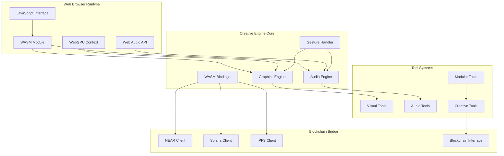

# 🦀 Rust Web-Based Audiovisual System - Technical Architecture

## 🏗️ System Architecture Overview

The Rust Web-Based Audiovisual System serves as the **WASM/Web implementation foundation** for our NUWE and Modurust creative ecosystem. This document details the technical architecture of the browser-native creative engine that combines Shader Studio visual tools with Modurust audio tools.

## 🎯 Core Components



## 🔧 Technical Stack

### Core Technologies
- **Language**: Rust (Edition 2021)
- **Compilation Target**: WebAssembly (WASM)
- **Graphics**: WebGPU API with WebGL fallback
- **Audio**: Web Audio API integration
- **Build Tool**: wasm-pack
- **Testing**: Built-in Rust test framework

### Dependencies
```toml
[dependencies]
wasm-bindgen = "0.2"
web-sys = { version = "0.3", features = ["WebGpu", "AudioContext"] }
serde = { version = "1.0", features = ["derive"] }
serde_json = "1.0"
getrandom = { version = "0.2", features = ["js"] }
wgpu = { version = "0.18", features = ["webgl"] }
cpal = "0.15"  # Audio processing
```

## 🎨 Graphics Engine Architecture

### WebGPU Shader System
```rust
// Simple shader compilation for web deployment
pub struct GraphicsEngine {
    device: wgpu::Device,
    queue: wgpu::Queue,
    shader_modules: HashMap<String, wgpu::ShaderModule>,
    render_pipelines: HashMap<String, wgpu::RenderPipeline>,
}

impl GraphicsEngine {
    pub async fn new() -> Result<Self, GraphicsError> {
        let instance = wgpu::Instance::new(wgpu::InstanceDescriptor {
            backends: wgpu::Backends::BROWSER_WEBGPU | wgpu::Backends::GL,
            ..Default::default()
        });
        
        let adapter = instance.request_adapter(&wgpu::RequestAdapterOptions {
            power_preference: wgpu::PowerPreference::HighPerformance,
            compatible_surface: None,
            force_fallback_adapter: false,
        }).await.ok_or(GraphicsError::NoAdapter)?;
        
        let (device, queue) = adapter.request_device(
            &wgpu::DeviceDescriptor {
                features: wgpu::Features::empty(),
                limits: wgpu::Limits::downlevel_webgl2_defaults(),
                label: None,
            },
            None,
        ).await?;
        
        Ok(Self {
            device,
            queue,
            shader_modules: HashMap::new(),
            render_pipelines: HashMap::new(),
        })
    }
    
    /// Compile simple shader for web deployment
    pub fn compile_shader(&mut self, name: &str, wgsl_code: &str) -> Result<(), GraphicsError> {
        let shader = self.device.create_shader_module(wgpu::ShaderModuleDescriptor {
            label: Some(name),
            source: wgpu::ShaderSource::Wgsl(wgsl_code.into()),
        });
        
        self.shader_modules.insert(name.to_string(), shader);
        Ok(())
    }
}
```

### Basic Pattern Generation
```rust
// Simple pattern shaders for web visual tools
const BASIC_PATTERN_SHADER: &str = r#"
@vertex
fn vs_main(@builtin(vertex_index) vertex_index: u32) -> @builtin(position) vec4<f32> {
    let x = f32(vertex_index) * 0.1;
    let y = sin(x * 10.0) * 0.5;
    return vec4<f32>(x - 0.5, y, 0.0, 1.0);
}

@fragment
fn fs_main() -> @location(0) vec4<f32> {
    return vec4<f32>(0.5, 0.8, 1.0, 1.0);
}
"#;
```

## 🎵 Audio Engine Architecture

### Web Audio API Integration
```rust
use wasm_bindgen::prelude::*;
use web_sys::{AudioContext, OscillatorType, GainNode};

pub struct AudioEngine {
    context: AudioContext,
    oscillators: Vec<web_sys::OscillatorNode>,
    gain_nodes: Vec<GainNode>,
}

impl AudioEngine {
    pub fn new() -> Result<Self, AudioError> {
        let context = AudioContext::new()?;
        
        Ok(Self {
            context,
            oscillators: Vec::new(),
            gain_nodes: Vec::new(),
        })
    }
    
    /// Create simple oscillator for web audio
    pub fn create_oscillator(&mut self, frequency: f32, osc_type: OscillatorType) -> Result<(), AudioError> {
        let oscillator = self.context.create_oscillator()?;
        oscillator.set_type(osc_type);
        oscillator.frequency().set_value(frequency);
        
        let gain_node = self.context.create_gain()?;
        gain_node.gain().set_value(0.1);
        
        oscillator.connect_with_audio_node(&gain_node)?;
        gain_node.connect_with_audio_node(&self.context.destination())?;
        
        oscillator.start()?;
        
        self.oscillators.push(oscillator);
        self.gain_nodes.push(gain_node);
        
        Ok(())
    }
}
```

## 🤏 Gesture Control System

### Gesture-to-Parameter Mapping
```rust
#[derive(Debug, Clone)]
pub struct GestureData {
    pub x: f32,
    pub y: f32,
    pub pressure: f32,
    pub velocity: f32,
    pub gesture_type: GestureType,
}

#[derive(Debug, Clone)]
pub enum GestureType {
    Point,
    Swipe,
    Pinch,
    Rotate,
    Tap,
}

pub struct GestureHandler {
    current_gesture: Option<GestureData>,
    gesture_history: Vec<GestureData>,
}

impl GestureHandler {
    pub fn new() -> Self {
        Self {
            current_gesture: None,
            gesture_history: Vec::new(),
        }
    }
    
    /// Map gesture to audio parameters
    pub fn map_to_audio(&self, gesture: &GestureData) -> AudioParameters {
        AudioParameters {
            frequency: 200.0 + (gesture.x * 800.0),
            gain: gesture.pressure * 0.5,
            filter_cutoff: 1000.0 + (gesture.velocity * 4000.0),
        }
    }
    
    /// Map gesture to visual parameters
    pub fn map_to_visual(&self, gesture: &GestureData) -> VisualParameters {
        VisualParameters {
            color_hue: (gesture.x * 360.0) % 360.0,
            scale: 0.5 + (gesture.pressure * 2.0),
            rotation: gesture.velocity * 180.0,
            opacity: gesture.y,
        }
    }
}
```

## 🔧 WASM Compilation System

### WASM Bindings Architecture
```rust
use wasm_bindgen::prelude::*;

#[wasm_bindgen]
pub struct CreativeEngine {
    audio_engine: AudioEngine,
    graphics_engine: GraphicsEngine,
    gesture_handler: GestureHandler,
}

#[wasm_bindgen]
impl CreativeEngine {
    #[wasm_bindgen(constructor)]
    pub fn new() -> Result<CreativeEngine, JsValue> {
        let audio_engine = AudioEngine::new()
            .map_err(|e| JsValue::from_str(&e.to_string()))?;
        
        let graphics_engine = GraphicsEngine::new()
            .map_err(|e| JsValue::from_str(&e.to_string()))?;
        
        let gesture_handler = GestureHandler::new();
        
        Ok(CreativeEngine {
            audio_engine,
            graphics_engine,
            gesture_handler,
        })
    }
    
    /// Process gesture input from JavaScript
    #[wasm_bindgen]
    pub fn process_gesture(&mut self, x: f32, y: f32, pressure: f32, velocity: f32) -> Result<(), JsValue> {
        let gesture = GestureData {
            x,
            y,
            pressure,
            velocity,
            gesture_type: GestureType::Point,
        };
        
        let audio_params = self.gesture_handler.map_to_audio(&gesture);
        let visual_params = self.gesture_handler.map_to_visual(&gesture);
        
        // Apply parameters to engines
        self.audio_engine.update_parameters(audio_params)
            .map_err(|e| JsValue::from_str(&e.to_string()))?;
        
        self.graphics_engine.update_parameters(visual_params)
            .map_err(|e| JsValue::from_str(&e.to_string()))?;
        
        Ok(())
    }
    
    /// Compile and register a simple shader
    #[wasm_bindgen]
    pub fn register_shader(&mut self, name: &str, shader_code: &str) -> Result<(), JsValue> {
        self.graphics_engine.compile_shader(name, shader_code)
            .map_err(|e| JsValue::from_str(&e.to_string()))?;
        
        Ok(())
    }
}
```

## 🌐 Cross-Platform Integration

### Build Pipeline Configuration
```rust
// wasm-pack configuration for web deployment
use wasm_bindgen::prelude::*;

#[wasm_bindgen(start)]
pub fn main() {
    console_error_panic_hook::set_once();
    
    // Initialize the creative engine
    let engine = CreativeEngine::new().expect("Failed to create creative engine");
    
    // Make engine available to JavaScript
    wasm_bindgen::throw_val(engine.into());
}

// Build configuration for different targets
#[cfg(target_arch = "wasm32")]
pub mod web_config {
    pub const MAX_SHADER_SIZE: usize = 1024 * 1024; // 1MB for web
    pub const MAX_AUDIO_VOICES: usize = 16; // Limited for browser performance
    pub const WEBGPU_FALLBACK: bool = true;
}

#[cfg(not(target_arch = "wasm32"))]
pub mod native_config {
    pub const MAX_SHADER_SIZE: usize = 10 * 1024 * 1024; // 10MB for native
    pub const MAX_AUDIO_VOICES: usize = 128; // Full polyphony
    pub const WEBGPU_FALLBACK: bool = false;
}
```

## 📊 Performance Optimization

### Memory Management for Web
```rust
pub struct WebMemoryPool {
    shader_buffers: Vec<wgpu::Buffer>,
    audio_buffers: Vec<web_sys::AudioBuffer>,
    max_memory_mb: usize,
}

impl WebMemoryPool {
    pub fn new(max_memory_mb: usize) -> Self {
        Self {
            shader_buffers: Vec::new(),
            audio_buffers: Vec::new(),
            max_memory_mb,
        }
    }
    
    /// Check memory usage and cleanup if needed
    pub fn check_memory_usage(&mut self) -> Result<(), MemoryError> {
        let current_usage = self.calculate_current_usage();
        
        if current_usage > self.max_memory_mb * 1024 * 1024 {
            // Cleanup oldest buffers
            self.cleanup_old_buffers();
        }
        
        Ok(())
    }
    
    fn cleanup_old_buffers(&mut self) {
        // Remove oldest shader buffers
        while self.shader_buffers.len() > 4 {
            self.shader_buffers.remove(0);
        }
        
        // Remove oldest audio buffers
        while self.audio_buffers.len() > 2 {
            self.audio_buffers.remove(0);
        }
    }
}
```

## 🔒 Security & Sandboxing

### WASM Security Measures
```rust
pub struct SecurityValidator {
    max_shader_instructions: usize,
    max_audio_frequency: f32,
    allowed_gesture_range: (f32, f32),
}

impl SecurityValidator {
    pub fn new() -> Self {
        Self {
            max_shader_instructions: 10000,
            max_audio_frequency: 20000.0, // Prevent ultrasonic frequencies
            allowed_gesture_range: (0.0, 1.0),
        }
    }
    
    /// Validate shader code for security
    pub fn validate_shader(&self, code: &str) -> Result<(), SecurityError> {
        // Check for potentially harmful operations
        if code.contains("unsafe") || code.contains("transmute") {
            return Err(SecurityError::UnsafeOperations);
        }
        
        // Check instruction count
        let instruction_count = code.lines().count();
        if instruction_count > self.max_shader_instructions {
            return Err(SecurityError::ShaderTooComplex);
        }
        
        Ok(())
    }
    
    /// Validate audio parameters
    pub fn validate_audio(&self, frequency: f32, gain: f32) -> Result<(), SecurityError> {
        if frequency > self.max_audio_frequency {
            return Err(SecurityError::FrequencyTooHigh);
        }
        
        if gain > 1.0 || gain < 0.0 {
            return Err(SecurityError::InvalidGain);
        }
        
        Ok(())
    }
}
```

## 🚀 Deployment Architecture

### Build & Deployment Pipeline
```bash
# Development build with debug symbols
wasm-pack build --dev --target web --out-dir dist/dev

# Production build with optimizations  
wasm-pack build --release --target web --out-dir dist/prod

# Bundle size optimization
wasm-opt -Oz -o dist/prod/creative_engine_opt.wasm dist/prod/creative_engine.wasm

# Generate TypeScript definitions
wasm-bindgen-typescript-definition dist/prod/creative_engine.wasm
```

### Cross-Platform Distribution
- **Browser**: Direct WASM import with ES6 modules
- **Node.js**: WASM with Node.js compatibility layer  
- **Native**: Direct Rust library integration
- **Mobile**: WASM via React Native WebView or similar

## 🔗 Integration Points

### NEAR Protocol Integration
```rust
pub struct NearBridge {
    contract_id: String,
    tool_registry: HashMap<String, ToolMetadata>,
}

impl NearBridge {
    pub async fn publish_tool(&self, tool: CreativeTool) -> Result<String, BlockchainError> {
        // Serialize tool metadata
        let metadata = serde_json::to_string(&tool.metadata)?;
        
        // Call NEAR contract to register tool
        let result = near_contract::publish_tool({
            tool_id: tool.id,
            metadata: metadata,
            creator: tool.creator,
        }).await?;
        
        Ok(result.transaction_hash)
    }
    
    pub async fn get_tool(&self, tool_id: &str) -> Result<CreativeTool, BlockchainError> {
        let metadata = near_contract::get_tool_metadata(tool_id).await?;
        let tool = CreativeTool::from_metadata(metadata)?;
        
        Ok(tool)
    }
}
```

## 📈 Monitoring & Analytics

### Performance Metrics Collection
```rust
pub struct WebPerformanceMonitor {
    wasm_load_time: Duration,
    audio_latency: Duration,
    graphics_fps: f32,
    memory_usage: usize,
}

impl WebPerformanceMonitor {
    pub fn new() -> Self {
        Self {
            wasm_load_time: Duration::default(),
            audio_latency: Duration::default(),
            graphics_fps: 0.0,
            memory_usage: 0,
        }
    }
    
    /// Collect performance metrics for web analytics
    pub fn collect_metrics(&mut self) -> WebMetrics {
        WebMetrics {
            wasm_load_time_ms: self.wasm_load_time.as_millis(),
            audio_latency_ms: self.audio_latency.as_millis(),
            graphics_fps: self.graphics_fps,
            memory_usage_mb: self.memory_usage / (1024 * 1024),
            timestamp: js_sys::Date::now(),
        }
    }
}
```

---

*Architecture designed for simple, web-based creative computing with WASM compilation and blockchain integration for our NUWE and Modurust ecosystem foundation.*