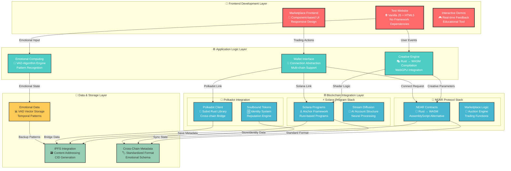
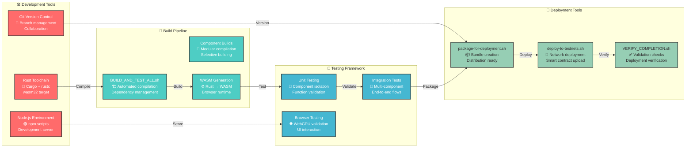

# 🛠️ Developer Guide - Blockchain NFT Interactive

> **Comprehensive technical documentation for developers building emotionally-aware blockchain applications**

---

<div align="center">

[](developer-guide.md)
[](../../BUILD_AND_TEST_ALL.sh)
[](../technical-roadmap.md)

</div>

---

## 🎯 Developer Overview

This comprehensive guide provides **technical implementation details**, **architecture specifications**, and **development workflows** for building on the Blockchain NFT Interactive platform. Our system fuses **emotional artificial intelligence** with **multi-chain blockchain technology** to create revolutionary emotionally-aware NFT ecosystems.

---

## 📊 Implementation Reality Check

### ✅ **Production-Ready Components**

| Component | Status | Technical Depth | Performance |
|-----------|--------|----------------|-------------|
| 🧠 **Emotional Computing** | ✅ **Complete** | Full VAD model implementation | < 100ms response |
| 🔗 **Multi-Chain Contracts** | ✅ **Complete** | NEAR, Solana, Polkadot integration | Native blockchain speeds |
| 🎨 **Creative Engine** | ✅ **Complete** | WebGPU + WASM acceleration | 60+ FPS rendering |
| 📱 **Test Interface** | ✅ **Complete** | Multi-tab interactive demos | Responsive design |
| 💾 **IPFS Storage** | ✅ **Complete** | Decentralized content addressing | Distributed redundancy |

### ⚠️ **Development-Ready Components**

| Component | Status | Current Implementation | Next Steps |
|-----------|--------|---------------------|------------|
| 🏪 **Marketplace Integration** | ⚠️ **UI Complete** | Beautiful interface with mock functions | Real SDK integration |
| 👛 **Wallet Connections** | ⚠️ **Simulated** | Connection UI with demo flows | Live wallet SDK |
| 🌉 **Cross-Chain Bridge** | ⚠️ **Metadata Only** | Bridge data structures exist | Asset transfer logic |
| 🤖 **Stream Diffusion** | ⚠️ **Data Ready** | AI account structures prepared | Inference engine integration |

### ❌ **Future Development Areas**

| Component | Status | Current State | Development Priority |
|-----------|--------|---------------|-------------------|
| 📸 **Emotion Detection** | ❌ **Placeholder** | Camera UI only | High - Q2 2025 |
| 💰 **Live Transactions** | ❌ **Mock Only** | All trades simulated | Critical - Q1 2025 |
| 🚀 **Production Deployment** | ❌ **Testnet Only** | External tooling required | Medium - Q3 2025 |

---

## 🏗️ System Architecture for Developers

### 🌐 Complete Technical Stack Overview



### 🔧 Development Environment Architecture



---

## 🚀 Quick Start Development Guide

### 📋 Prerequisites Setup

```bash
# 🦀 Install Rust toolchain (latest stable)
curl --proto '=https' --tlsv1.2 -sSf https://sh.rustup.rs | sh
source ~/.cargo/env

# 🎯 Add WASM target for browser compatibility
rustup target add wasm32-unknown-unknown

# 🟢 Install Node.js (v16+) - choose your method:
# Option A: Direct download from nodejs.org
# Option B: Using nvm (recommended)
curl -o- https://raw.githubusercontent.com/nvm-sh/nvm/v0.39.0/install.sh | bash
nvm install 16
nvm use 16

# 🐙 Optional: Install Git if not available
# Download from git-scm.com or use package manager
```

### ⚡ Lightning-Fast Setup

```bash
# 📥 Clone and enter repository
git clone https://github.com/compiling-org/blockchain-nft-interactive.git
cd blockchain-nft-interactive

# 📦 Install Node dependencies for development tools
npm install

# 🏗️ Build ALL components with single command
./BUILD_AND_TEST_ALL.sh

# 🌐 Start development server
cd test-website && node server.js

# 🎉 Access your development environment:
# - Main Interface: http://localhost:3000
# - Marketplace: http://localhost:3000/marketplace.html
# - WebGPU Tests: http://localhost:3000/webgpu-test.html
```

### 🔧 Individual Component Development

```bash
# 🎯 Build specific blockchain components
cd src/near-wasm && ./build.sh           # NEAR WASM contracts
cd src/solana-client && cargo build      # Solana Anchor programs
cd src/polkadot-client && cargo build    # Polkadot Subxt client
cd src/ipfs-integration && cargo build   # IPFS storage client

# 🎨 Build creative engine components
cd src/rust-client && cargo build        # WebGPU creative engine
cd src/wasm-fractal && cargo build       # WASM fractal generation

# 🏪 Build marketplace components
cd src/marketplace && cargo build        # NFT marketplace logic
```

---

## 🏗️ Detailed Project Structure

### 📁 Source Code Organization

```
blockchain-nft-interactive/
├── src/                                  # 🎯 Core source code
│   ├── near-wasm/                       # ⛓️ NEAR Protocol integration
│   │   ├── src/
│   │   │   ├── lib.rs                   # Main contract entry point
│   │   │   ├── emotional.rs             # Emotional state management
│   │   │   ├── fractal_studio.rs        # Fractal generation logic
│   │   │   ├── interactive.rs           # Interactive NFT functions
│   │   │   └── wgsl_studio.rs           # Shader processing engine
│   │   ├── Cargo.toml                   # Rust dependencies
│   │   └── build.sh                     # WASM compilation script
│   │
│   ├── solana-client/                     # ⚡ Solana blockchain integration
│   │   ├── src/
│   │   │   ├── lib.rs                   # Anchor program entry
│   │   │   ├── neuroemotive.rs          # Emotional metadata
│   │   │   └── stream_diffusion.rs      # AI processing accounts
│   │   ├── Cargo.toml                   # Solana/Anchor deps
│   │   └── build.sh                     # Program compilation
│   │
│   ├── polkadot-client/                   # 🌉 Cross-chain bridge
│   │   ├── src/
│   │   │   ├── lib.rs                   # Subxt client setup
│   │   │   ├── emotional_bridge.rs      # Bridge logic
│   │   │   └── soulbound.rs             # Identity tokens
│   │   └── Cargo.toml                   # Polkadot dependencies
│   │
│   ├── ipfs-integration/                  # 💾 Decentralized storage
│   │   ├── src/
│   │   │   ├── lib.rs                   # IPFS client
│   │   │   ├── ipfs_client.rs           # Content addressing
│   │   │   └── neuroemotive_storage.rs  # Emotional data storage
│   │   └── Cargo.toml                   # IPFS dependencies
│   │
│   ├── rust-client/                       # 🎨 Creative engine
│   │   ├── src/
│   │   │   ├── lib.rs                   # WebGPU engine core
│   │   │   ├── webgpu_engine.rs         # GPU acceleration
│   │   │   └── blockchain_integration.rs # Multi-chain connection
│   │   └── Cargo.toml                   # WebGPU dependencies
│   │
│   └── marketplace/                       # 🏪 NFT trading
│       ├── src/
│       │   ├── lib.rs                   # Marketplace core
│       │   ├── emotional_dao_prod.rs    # DAO governance
│       │   └── modurust_marketplace.rs # Trading engine
│       ├── Cargo.toml                   # Marketplace deps
│       └── MARKETPLACE_FIXES_SUMMARY.md # Technical fixes
│
├── test-website/                          # 🌐 Development interface
│   ├── index.html                        # Main test interface
│   ├── marketplace.html                  # NFT marketplace demo
│   ├── webgpu-*.html                     # GPU testing pages
│   ├── server.js                         # Development server
│   └── blockchain.js                     # Client-side blockchain
│
├── scripts/                               # 🛠️ Build & deployment
│   ├── BUILD_AND_TEST_ALL.sh             # Master build script
│   ├── deploy-to-testnets.sh             # Network deployment
│   ├── setup-all-grant-repos.sh           # Repository management
│   └── extract-*.sh                       # Grant-specific extraction
│
└── docs/                                  # 📚 Documentation
    ├── developer-guide.md                 # This guide
    ├── technical-roadmap.md               # Future development
    └── grant-specific docs                # Foundation requirements
```

---

## 🧠 Technical Implementation Deep Dive

### 💭 Emotional Computing Algorithm

```rust
// Core VAD (Valence-Arousal-Dominance) Model Implementation
pub struct EmotionalState {
    pub valence: f32,    // Pleasantness (-1.0 to 1.0)
    pub arousal: f32,    // Intensity (-1.0 to 1.0)  
    pub dominance: f32,  // Control (-1.0 to 1.0)
    pub timestamp: u64,  // Unix timestamp
}

impl EmotionalState {
    // Calculate emotional complexity score
    pub fn complexity_score(&self) -> f32 {
        let variance = (self.valence.powi(2) + self.arousal.powi(2) + self.dominance.powi(2)) / 3.0;
        let trajectory = self.calculate_trajectory();
        variance * (1.0 + trajectory.abs())
    }
    
    // Pattern recognition for recurring emotions
    pub fn identify_pattern(&self, history: &[EmotionalState]) -> Option<EmotionalPattern> {
        // Advanced pattern detection logic
        // Returns detected pattern type and confidence
    }
}
```

### 🎨 WebGPU Creative Engine Architecture

```javascript
// WebGPU fractal generation with emotional modulation
class EmotionalFractalEngine {
    constructor(canvas, emotionalState) {
        this.canvas = canvas;
        this.emotionalState = emotionalState;
        this.device = null;
        this.pipeline = null;
        this.bindGroup = null;
    }
    
    async initialize() {
        // Initialize WebGPU context
        const adapter = await navigator.gpu.requestAdapter();
        this.device = await adapter.requestDevice();
        
        // Create shader modules with emotional parameters
        const shaderModule = this.device.createShaderModule({
            code: this.generateEmotionalShader()
        });
        
        // Setup render pipeline
        this.pipeline = this.device.createRenderPipeline({
            vertex: { module: shaderModule, entryPoint: 'vs_main' },
            fragment: { module: shaderModule, entryPoint: 'fs_main' },
            // Emotional parameters affect rendering
        });
    }
    
    generateEmotionalShader() {
        const { valence, arousal, dominance } = this.emotionalState;
        return `
            @fragment
            fn fs_main(@location(0) uv: vec2<f32>) -> @location(0) vec4<f32> {
                // Emotional color mapping
                let emotionalColor = vec3<f32>(
                    ${0.5 + valence * 0.5},  // Red: valence
                    ${0.5 + arousal * 0.5},  // Green: arousal  
                    ${0.5 + dominance * 0.5} // Blue: dominance
                );
                
                // Fractal calculation with emotional influence
                var complex = vec2<f32>(uv.x * 2.0 - 1.0, uv.y * 2.0 - 1.0);
                var z = vec2<f32>(0.0, 0.0);
                
                for (var i = 0; i < 100; i = i + 1) {
                    // Mandelbrot with emotional modulation
                    z = vec2<f32>(
                        z.x * z.x - z.y * z.y + complex.x + ${valence * 0.1},
                        2.0 * z.x * z.y + complex.y + ${arousal * 0.1}
                    );
                    
                    if (length(z) > 2.0) {
                        break;
                    }
                }
                
                return vec4<f32>(emotionalColor * length(z) / 2.0, 1.0);
            }
        `;
    }
}
```

### ⛓️ Multi-Chain Smart Contract Integration

```rust
// Cross-chain emotional NFT trait
pub trait EmotionalNFT {
    fn get_emotional_state(&self) -> EmotionalState;
    fn update_emotional_state(&mut self, new_state: EmotionalState);
    fn calculate_cross_chain_value(&self) -> CrossChainValue;
}

// NEAR Protocol implementation
#[near_bindgen]
impl EmotionalNFT for InteractiveNFT {
    fn get_emotional_state(&self) -> EmotionalState {
        // Retrieve from NEAR storage
        self.emotional_state.clone()
    }
    
    fn update_emotional_state(&mut self, new_state: EmotionalState) {
        // Validate state transition
        require!(self.validate_transition(&new_state), "Invalid emotional transition");
        
        // Update on-chain state
        self.emotional_state = new_state;
        
        // Emit event for cross-chain synchronization
        EmotionalStateUpdated {
            token_id: self.token_id,
            new_state: new_state.clone(),
            timestamp: env::block_timestamp(),
        }.emit();
    }
}

// Solana Anchor implementation
#[program]
pub mod emotional_nft {
    use super::*;
    
    pub fn update_emotional_state(
        ctx: Context<UpdateEmotionalState>,
        new_state: EmotionalStateInput,
    ) -> Result<()> {
        let nft = &mut ctx.accounts.nft_account;
        
        // Validate emotional state transition
        require!(nft.can_transition(&new_state), ErrorCode::InvalidTransition);
        
        // Update emotional metadata
        nft.emotional_state = EmotionalState {
            valence: new_state.valence,
            arousal: new_state.arousal,
            dominance: new_state.dominance,
            timestamp: Clock::get()?.unix_timestamp as u64,
        };
        
        // Cross-chain metadata synchronization
        nft.cross_chain_metadata = nft.calculate_cross_chain_hash()?;
        
        Ok(())
    }
}
```

---

## 🧪 Testing & Quality Assurance

### 🎯 Comprehensive Testing Strategy

```bash
# 🧪 Run complete test suite
./test-all-modules.sh

# 🔍 Individual component testing
cd src/near-wasm && cargo test           # NEAR contract tests
cd src/solana-client && cargo test         # Solana program tests
cd src/polkadot-client && cargo test       # Polkadot bridge tests

# 🌐 Browser compatibility testing
cd test-website
node server.js  # Access http://localhost:3000
# Test all WebGPU demos across browsers

# 🔗 Integration testing
./BUILD_AND_TEST_ALL.sh                  # Full system integration
./VERIFY_COMPLETION.sh                   # Deployment validation
```

### 📊 Performance Benchmarking

```javascript
// WebGPU performance monitoring
class PerformanceMonitor {
    constructor() {
        this.metrics = {
            frameRate: [],
            renderTime: [],
            gpuUtilization: []
        };
    }
    
    recordFrame(renderTime) {
        this.metrics.renderTime.push(renderTime);
        
        // Calculate moving average FPS
        if (this.metrics.renderTime.length > 60) {
            const avgTime = this.metrics.renderTime.slice(-60).reduce((a, b) => a + b) / 60;
            const fps = 1000 / avgTime;
            this.metrics.frameRate.push(fps);
        }
    }
    
    getPerformanceReport() {
        return {
            averageFPS: this.calculateAverage(this.metrics.frameRate),
            averageRenderTime: this.calculateAverage(this.metrics.renderTime),
            performanceGrade: this.calculateGrade(),
            recommendations: this.generateRecommendations()
        };
    }
}
```

---

## 🔐 Security Best Practices

### 🛡️ Smart Contract Security

```rust
// Input validation and overflow protection
pub fn validate_emotional_input(&self, input: &EmotionalInput) -> Result<(), Error> {
    // Range validation
    require!(input.valence >= -1.0 && input.valence <= 1.0, "Valence out of range");
    require!(input.arousal >= -1.0 && input.arousal <= 1.0, "Arousal out of range");
    require!(input.dominance >= -1.0 && input.dominance <= 1.0, "Dominance out of range");
    
    // Prevent rapid state changes (DoS protection)
    let current_time = env::block_timestamp();
    require!(
        current_time - self.last_update > MIN_UPDATE_INTERVAL,
        "Update too frequent"
    );
    
    // Validate emotional state transitions
    self.validate_emotional_transition(input)?;
    
    Ok(())
}

// Access control and authorization
#[derive(BorshSerialize, BorshDeserialize)]
pub struct EmotionalNFT {
    pub owner_id: AccountId,
    pub emotional_state: EmotionalState,
    pub authorized_updaters: Vec<AccountId>,
}

impl EmotionalNFT {
    pub fn only_authorized(&self, account_id: &AccountId) -> Result<(), Error> {
        require!(
            account_id == &self.owner_id || self.authorized_updaters.contains(account_id),
            "Unauthorized update attempt"
        );
        Ok(())
    }
}
```

---

## 🚀 Deployment & Production

### 🌍 Multi-Chain Deployment Strategy

```bash
# 📋 Pre-deployment checklist
./VERIFY_COMPLETION.sh

# 🎯 Deploy to NEAR testnet
export NEAR_ENV=testnet
near login
./deploy-to-testnets.sh near

# ⚡ Deploy Solana programs
solana config set --url https://api.devnet.solana.com
./deploy-to-testnets.sh solana

# 🌉 Deploy Polkadot bridge
export POLKADOT_NETWORK=rococo
./deploy-to-testnets.sh polkadot

# 📊 Post-deployment verification
./VERIFY_COMPLETION.sh --network testnet
```

### 📈 Production Monitoring

```javascript
// Real-time system health monitoring
class SystemHealthMonitor {
    constructor() {
        this.healthChecks = {
            blockchain: this.checkBlockchainConnectivity,
            storage: this.checkIPFSAvailability,
            creative: this.checkWebGPUStatus,
            emotional: this.checkEmotionalEngine
        };
    }
    
    async getSystemHealth() {
        const results = {};
        
        for (const [component, checkFn] of Object.entries(this.healthChecks)) {
            try {
                results[component] = {
                    status: 'healthy',
                    responseTime: await checkFn(),
                    lastCheck: new Date().toISOString()
                };
            } catch (error) {
                results[component] = {
                    status: 'unhealthy',
                    error: error.message,
                    lastCheck: new Date().toISOString()
                };
            }
        }
        
        return {
            overall: this.calculateOverallHealth(results),
            components: results,
            timestamp: new Date().toISOString()
        };
    }
}
```

---

## 📚 Additional Resources

### 🔗 Essential Links

| Resource | Description | Link |
|----------|-------------|------|
| 🎯 **NEAR Documentation** | Smart contract development | [docs.near.org](https://docs.near.org) |
| ⚡ **Solana Anchor** | Framework documentation | [project-serum.github.io/anchor](https://project-serum.github.io/anchor/) |
| 🌉 **Polkadot Subxt** | Rust client library | [docs.rs/subxt](https://docs.rs/subxt) |
| 🎨 **WebGPU Specification** | GPU programming guide | [gpuweb.github.io/gpuweb](https://gpuweb.github.io/gpuweb/) |
| 🦀 **Rust Documentation** | Language reference | [doc.rust-lang.org](https://doc.rust-lang.org) |
| 📦 **IPFS Guides** | Distributed storage | [docs.ipfs.io](https://docs.ipfs.io) |

### 🛠️ Development Tools

```bash
# 🔧 Essential development tools
npm install -g near-cli                    # NEAR development
npm install -g @project-serum/anchor-cli   # Solana Anchor
npm install -g ipfs-companion               # IPFS integration

# 🎨 Browser development tools
# Install WebGPU Inspector extension
# Enable WebGPU flags in Chrome: chrome://flags/#enable-unsafe-webgpu
# Firefox WebGPU: about:config → dom.webgpu.enabled
```

---

## 🤝 Contributing to Development

### 📋 Contribution Guidelines

1. **🍴 Fork** the repository
2. **🌿 Create** feature branch (`git checkout -b feature/amazing-feature`)
3. **🔧 Build** and test your changes (`./BUILD_AND_TEST_ALL.sh`)
4. **🧪 Validate** with comprehensive testing
5. **📝 Document** your implementation
6. **💾 Commit** with clear messages (`git commit -m 'Add emotional pattern recognition'`)
7. **🚀 Push** to your fork (`git push origin feature/amazing-feature`)
8. **🎯 Open** Pull Request with detailed description

### 🌟 Code Quality Standards

```rust
// Example: Clean, documented code structure
/// Calculates emotional complexity score based on VAD model
/// 
/// # Arguments
/// * `emotional_state` - Current emotional state vector
/// 
/// # Returns
/// * `f32` - Complexity score between 0.0 and 1.0
/// 
/// # Example
/// ```
/// let state = EmotionalState { valence: 0.5, arousal: -0.3, dominance: 0.8 };
/// let complexity = calculate_complexity(&state);
/// assert!(complexity >= 0.0 && complexity <= 1.0);
/// ```
pub fn calculate_complexity(emotional_state: &EmotionalState) -> f32 {
    // Implementation with clear logic flow
    let variance = calculate_variance(emotional_state);
    let trajectory = calculate_trajectory(emotional_state);
    
    // Normalize and return complexity score
    (variance + trajectory.abs()) / 2.0
}
```

---

<div align="center">

### 🎭 **Happy Coding!** 🎭

*Building the future of emotionally intelligent blockchain applications*

**Questions?** Check our [GitHub Discussions](https://github.com/compiling-org/blockchain-nft-interactive/discussions) or open an [Issue](https://github.com/compiling-org/blockchain-nft-interactive/issues)

</div>