# NEAR Foundation Grant - Technical Architecture

## 🏗️ System Overview

This document provides comprehensive technical architecture for the NEAR Foundation grant implementation: "NEAR Creative Engine - Fractal Studio".

## 📊 Architecture Overview


## 🔧 Component Architecture

### Fractal Engine Core

```mermaid
graph TD
    subgraph "Fractal Processing"
        MANDELBROT["Mandelbrot Set<br/>z = z² + c"]
        JULIA["Julia Set<br/>Parameterized Variants"]
        BURNING["Burning Ship<br/>Absolute Value Variant"]
        NOVA["Nova Fractal<br/>Newton Method"]
    end
    
    subgraph "Mathematical Operations"
        COMPLEX["Complex Arithmetic<br/>Addition, Multiplication"]
        ITERATION["Iteration Control<br/>Escape Time Algorithm"]
        COLORING["Color Mapping<br/>Gradient & Smoothing"]
        OPTIMIZATION["Performance Optimization<br/>SIMD, Parallelization"]
    end
    
    subgraph "Emotional Modulation"
        VAD["VAD Vector Input<br/>Valence, Arousal, Dominance"]
        PARAMS["Parameter Mapping<br/>Zoom, Iteration, Color"]
        REALTIME["Real-time Updates<br/>60 FPS Target"]
    end
    
    MANDELBROT --> COMPLEX
    JULIA --> COMPLEX
    BURNING --> COMPLEX
    NOVA --> COMPLEX
    
    COMPLEX --> ITERATION
    ITERATION --> COLORING
    COLORING --> OPTIMIZATION
    
    VAD --> PARAMS
    PARAMS --> REALTIME
    REALTIME --> OPTIMIZATION
```



### Emotional Computing Integration


## 🏛️ Smart Contract Architecture

### Contract Structure


### Data Flow Architecture


## 🛡️ Security Architecture

### Security Layers


## 📊 Performance Architecture

### Optimization Strategies


## 🗄️ Storage Architecture

### Data Storage Strategy

```mermaid
graph TB
    subgraph "On-Chain Storage"
        CONTRACT_STATE["Contract State<br/>Critical Data"]
        TOKEN_DATA["Token Metadata<br/>Ownership & Transfers"]
        EMOTIONAL_DATA["Emotional States<br/>VAD Vectors"]
    end
    
    subgraph "Off-Chain Storage"
        IPFS_METADATA["IPFS Metadata<br/>JSON Documents"]
        ASSETS["Creative Assets<br/>Images & Media"]
        HISTORY["Historical Data<br">Session Logs"]
    end
    
    subgraph "Local Storage"
        CACHE["Browser Cache<br">Temporary Data"]
        PREFERENCES["User Preferences<br">Settings"]
        SESSION["Session Data<br">Current State"]
    end
    
    CONTRACT_STATE --> IPFS_METADATA
    TOKEN_DATA --> ASSETS
    EMOTIONAL_DATA --> HISTORY
    
    IPFS_METADATA --> CACHE
    ASSETS --> PREFERENCES
    HISTORY --> SESSION
```

## 🔍 Monitoring & Observability

### Monitoring Stack

```mermaid
graph TD
    subgraph "Metrics Collection"
        PERFORMANCE["Performance Metrics<br/>Render Time, FPS"]
        USAGE["Usage Metrics<br">Session Duration"]
        ERROR["Error Metrics<br">Failure Rates"]
        BUSINESS["Business Metrics<br">Transaction Volume"]
    end
    
    subgraph "Logging System"
        CLIENT_LOGS["Client Logs<br">Browser Console"]
        CONTRACT_LOGS["Contract Logs<br">NEAR Events"]
        ERROR_LOGS["Error Logs<br">Exception Tracking"]
        AUDIT_LOGS["Audit Logs<br">Security Events"]
    end
    
    subgraph "Alerting"
        THRESHOLDS["Threshold Alerts<br">Performance Degradation"]
        ANOMALY["Anomaly Detection<br">Unusual Patterns"]
        SECURITY["Security Alerts<br">Threat Detection"]
        AVAILABILITY["Availability Alerts<br">Service Down"]
    end
    
    PERFORMANCE --> THRESHOLDS
    USAGE --> ANOMALY
    ERROR --> SECURITY
    BUSINESS --> AVAILABILITY
    
    CLIENT_LOGS --> THRESHOLDS
    CONTRACT_LOGS --> ANOMALY
    ERROR_LOGS --> SECURITY
    AUDIT_LOGS --> AVAILABILITY
```

## 🚀 Deployment Architecture

### Deployment Pipeline

```mermaid
graph LR
    subgraph "Development Pipeline"
        CODE["Source Code<br/>Rust/TypeScript"]
        TEST["Testing Suite<br/>Unit & Integration"]
        BUILD["Build Process<br/>WASM Compilation"]
        DEPLOY["Deployment<br">NEAR Testnet"]
    end
    
    subgraph "Production Pipeline"
        STAGING["Staging Environment<br">NEAR Testnet"]
        PRODUCTION["Production Environment<br">NEAR Mainnet"]
        MONITORING["Monitoring<br">Metrics & Alerts"]
        ROLLBACK["Rollback Strategy<br">Quick Reversion"]
    end
    
    subgraph "Infrastructure"
        CDN["CDN Distribution<br">Global Assets"]
        GATEWAY["IPFS Gateway<br">Content Delivery"]
        RPC_NODES["RPC Nodes<br">Network Access"]
    end
    
    CODE --> TEST
    TEST --> BUILD
    BUILD --> DEPLOY
    
    DEPLOY --> STAGING
    STAGING --> PRODUCTION
    PRODUCTION --> MONITORING
    MONITORING --> ROLLBACK
    
    PRODUCTION --> CDN
    CDN --> GATEWAY
    GATEWAY --> RPC_NODES
```

## 📈 Scalability Architecture

### Scaling Strategy

```mermaid
graph TD
    subgraph "Horizontal Scaling"
        LOAD_BALANCER["Load Balancer<br">Traffic Distribution"]
        MULTIPLE_INSTANCES["Multiple Instances<br">Parallel Processing"]
        DATABASE_SHARDING["Database Sharding<br">Data Partitioning"]
        CACHE_CLUSTER["Cache Cluster<br">Distributed Caching"]
    end
    
    subgraph "Vertical Scaling"
        RESOURCE_UPGRADE["Resource Upgrade<br">CPU/Memory"]
        OPTIMIZATION["Code Optimization<br">Performance Tuning"]
        ARCHITECTURE_REFACTOR["Architecture Refactor<br">System Redesign"]
    end
    
    subgraph "Content Scaling"
        STATIC_CDN["Static CDN<br">Asset Distribution"]
        DYNAMIC_CDN["Dynamic CDN<br">API Caching"]
        EDGE_COMPUTING["Edge Computing<br">Processing at Edge"]
    end
    
    LOAD_BALANCER --> MULTIPLE_INSTANCES
    MULTIPLE_INSTANCES --> DATABASE_SHARDING
    DATABASE_SHARDING --> CACHE_CLUSTER
    
    RESOURCE_UPGRADE --> OPTIMIZATION
    OPTIMIZATION --> ARCHITECTURE_REFACTOR
    
    STATIC_CDN --> DYNAMIC_CDN
    DYNAMIC_CDN --> EDGE_COMPUTING
```

---

## 📋 Implementation Status

### ✅ Completed Components
- **Core Fractal Engine**: Mathematical implementations complete
- **WASM Compilation**: Browser-ready modules
- **NEAR Contract Integration**: Smart contract deployment ready
- **Emotional Computing**: VAD model implementation
- **IPFS Integration**: Metadata storage system

### ⚠️ In Progress
- **Camera Integration**: Facial recognition implementation
- **Advanced Shaders**: Complex visual effects
- **Performance Optimization**: Fine-tuning for 60 FPS target
- **Mobile Support**: Responsive design adaptation

### ❌ Planned for Future
- **AI Integration**: Advanced emotion detection
- **Multi-user Sessions**: Collaborative fractal creation
- **Advanced Analytics**: Usage pattern analysis
- **Enterprise Features**: Business analytics and reporting

---

**📝 Architecture Status**: Foundation complete, optimization in progress

**🔄 Last Updated**: November 2025

**📊 Version**: 1.0.0