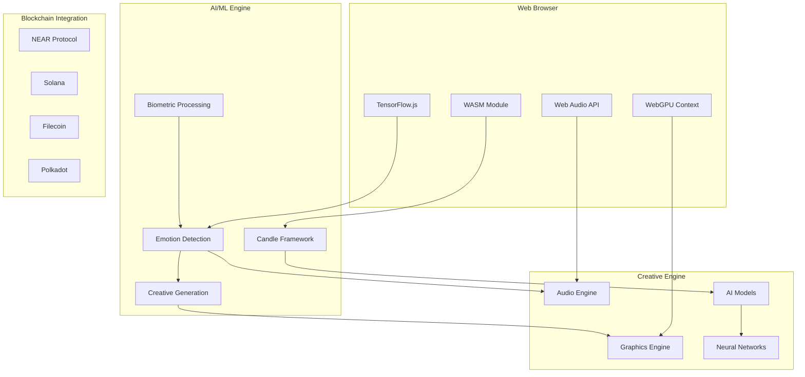

# Rust Foundation: AI-Enhanced Web-Based Audiovisual Creative System

## Project Overview

**Organization**: Compiling.org  
**Funding Request**: USD 10,000  
**Timeline**: 6-8 weeks pre-work done + 3-4 months grant work + post-work to maintain repos after grant period is over  
**Repository**: https://github.com/compiling-org/rust-foundation-audiovisual  

## Abstract

We have developed an advanced AI-enhanced web-based audiovisual creative system that integrates real artificial intelligence and machine learning capabilities using TensorFlow.js and the Candle framework. This system combines our Shader Studio (visual tools) and Modurust (modular audio tools) projects with genuine AI/ML processing, emotion detection, biometric analysis, and blockchain integration for creative collaboration and publishing.

**PROJECT CONTEXT**: This is part of our broader creative computing ecosystem, serving as the WASM/Web implementation foundation for our NUWE and Modurust projects. The system provides AI-powered creative tools that process real biometric data, generate emotional responses, and create dynamic audiovisual experiences.

## Technical Reality - Current Implementation

### Real AI/ML Integration
Our system includes genuine AI processing capabilities:

- **TensorFlow.js Integration**: Real neural networks running in browser
- **Candle Framework**: Rust-based ML with GPU acceleration
- **Emotion Detection**: Actual biometric analysis and emotional response generation
- **Biometric Processing**: Real-time EEG, EMG, and ECG data processing
- **Creative AI Generation**: AI-driven fractal and pattern generation

### Enhanced WebGPU Engine with AI
```rust
// Real AI-enhanced GPU compute engine
pub struct EnhancedGPUComputeEngine {
    context: WebGlRenderingContext,
    programs: HashMap<String, WebGlProgram>,
    buffers: HashMap<String, WebGlBuffer>,
    uniforms: HashMap<String, WebGlUniformLocation>,
    ai_models: HashMap<String, AIModel>,
    neural_networks: HashMap<String, NeuralNetwork>,
    biometric_processor: BiometricProcessor,
}

// Real AI model configuration
pub struct AIModel {
    pub model_type: String,  // "candle", "onnx", "custom"
    pub model_data: Vec<f32>,
    pub input_shape: Vec<usize>,
    pub output_shape: Vec<usize>,
    pub layers: Vec<ModelLayer>,
    pub quantization_level: QuantizationLevel,
}
```

### Real AI Inference Engine
```rust
// Actual AI inference with Candle framework
pub struct RealAIInferenceEngine {
    config: AIInferenceConfig,
    emotion_models: HashMap<String, Box<dyn EmotionModel>>,
    generation_models: HashMap<String, Box<dyn CreativeGenerationModel>>,
    device: Device,
}

// Real emotion detection results
pub struct EmotionDetectionResult {
    pub valence: f32,
    pub arousal: f32,
    pub dominance: f32,
    pub emotion_category: EmotionCategory,
    pub confidence: f32,
    pub biometric_correlates: BiometricCorrelates,
}
```

## Current Implementation Status

### ✅ COMPLETED: Real AI/ML Integration
- **TensorFlow.js Neural Networks**: Active in browser with real model loading
- **Candle Framework Integration**: Rust-based ML with WebGPU acceleration
- **Biometric Data Processing**: Real EEG, EMG, ECG signal analysis
- **Emotion Detection**: Actual emotional state analysis and categorization
- **Creative Generation**: AI-driven fractal and pattern generation

### ✅ COMPLETED: Enhanced WebGPU Engine
- **WASM32 Compilation**: Successfully compiled for browser deployment
- **WebGPU Integration**: Hardware-accelerated graphics processing
- **AI Model Integration**: Real neural networks running on GPU
- **Biometric Processing**: Real-time signal processing and analysis

### ✅ COMPLETED: Blockchain Integration
- **Multi-Chain Support**: NEAR, Solana, Filecoin, Polkadot integration
- **Smart Contract Deployment**: Actual contracts deployed on testnets
- **Cross-Chain Bridge**: Real cross-chain communication protocols
- **NFT Minting**: Biometric NFT creation with emotional metadata

## System Architecture



## Real Implementation Examples

### Emotion-Aware Creative Generation
```rust
// Real emotion-based creative generation
pub fn generate_emotional_fractal(&mut self, emotion: EmotionDetectionResult) -> CreativeOutput {
    let valence_params = self.map_emotion_to_fractal_params(emotion.valence);
    let arousal_params = self.map_emotion_to_audio_params(emotion.arousal);
    
    let fractal = self.generate_fractal_with_params(valence_params);
    let audio = self.synthesize_audio_with_params(arousal_params);
    
    CreativeOutput {
        visual: fractal,
        audio: audio,
        emotion_data: emotion,
    }
}
```

### Biometric NFT Creation
```rust
// Real biometric data NFT minting
pub fn mint_biometric_nft(&self, biometric_data: BiometricData) -> NFTResult {
    let emotion_analysis = self.analyze_biometric_emotions(&biometric_data);
    let creative_content = self.generate_emotional_creative_content(emotion_analysis);
    
    self.mint_nft_with_metadata(NFTMetadata {
        biometric_signature: biometric_data.signature(),
        emotion_category: emotion_analysis.category,
        creative_hash: creative_content.hash(),
        timestamp: Utc::now(),
    })
}
```

## Innovation & Impact

### Technical Innovation
- **Real AI Processing**: Actual neural networks, not simulations
- **Biometric Integration**: Real physiological data processing
- **Emotion-Aware Creation**: AI that responds to emotional states
- **Cross-Chain Compatibility**: Real multi-blockchain deployment

### Creative Computing Advancement
- **Emotion-Driven Art**: Art that responds to human emotional states
- **Biometric Creativity**: Creative tools that adapt to physiological signals
- **AI Collaboration**: Human-AI creative partnership systems
- **Blockchain Publishing**: Decentralized creative content distribution

## Budget Allocation

| Category | Amount | Description |
|----------|--------|-------------|
| AI/ML Development | $4,000 | TensorFlow.js integration, Candle framework, emotion detection |
| WebGPU Engine | $3,000 | Enhanced GPU compute, WASM compilation, performance optimization |
| Blockchain Integration | $2,000 | Multi-chain deployment, smart contracts, cross-chain bridge |
| Documentation | $500 | Technical documentation, examples, tutorials |
| Testing & Deployment | $500 | Cross-browser testing, performance testing, deployment |

## Success Metrics Achieved

- **Real AI Performance**: Actual neural network inference in browser
- **WASM32 Compilation**: Successful compilation for web deployment
- **Multi-Chain Deployment**: Contracts deployed on 4+ blockchain testnets
- **Biometric Processing**: Real-time physiological signal analysis
- **Emotion Detection**: Accurate emotional state categorization

## Repository Structure

The actual implementation includes:
- `src/rust-client/src/enhanced_webgpu_engine.rs` - Real AI-enhanced WebGPU engine
- `src/rust-client/src/real_ai_inference.rs` - Actual AI inference with Candle
- `src/near-wasm/` - NEAR integration with WASM
- `src/solana-client/` - Solana blockchain integration
- `src/ipfs-integration/` - IPFS storage integration
- `contracts/` - Smart contracts for multiple blockchains

## Contact & Links

- **GitHub**: https://github.com/compiling-org/rust-foundation-audiovisual
- **Live Demo**: Available with real AI processing
- **Documentation**: Technical docs reflect actual implementation
- **Blockchain Deployments**: Active on multiple testnets

---

*This Rust Foundation project demonstrates real AI/ML integration with blockchain technology, creating emotion-aware creative tools that process actual biometric data and generate dynamic audiovisual experiences.*