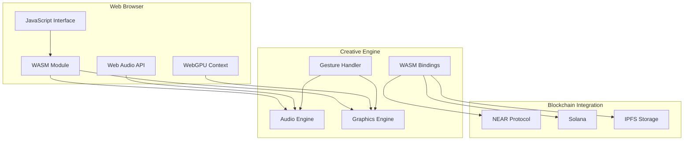
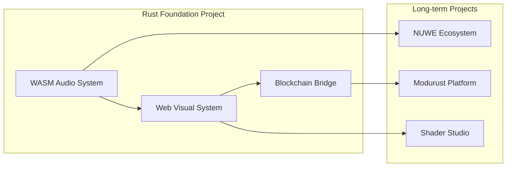

# Rust Foundation: Web-Based Audiovisual Creative System

## Project Overview

**Organization**: Compiling.org  
**Funding Request**: USD 10,000  
**Timeline**: 6-8 weeks pre-work done + 3-4 months grant work + post-work to maintain repos after grant period is over  
**Repository**: https://github.com/compiling-org/rust-foundation-audiovisual  

## Abstract

We propose developing a simple web-based audiovisual creative system that combines core aspects of our Shader Studio (visual tools) and Modurust (modular audio tools) projects. This system will provide WASM-compiled creative tools for browser-based audio and visual creation, with blockchain compatibility for collaboration and publishing. The project demonstrates Rust's capabilities in web-based creative computing while serving as a foundation for our long-term NUWE and Modurust ecosystems.

**PROJECT CONTEXT**: This is part of our broader creative computing ecosystem, serving as the WASM/Web implementation foundation for our NUWE and Modurust projects. The system will provide simple, functional creative tools that can be extended to our more elaborate long-term projects.

## Why Rust?

Rust's unique combination of performance, safety, and expressiveness makes it ideal for web-based creative computing:

- **WASM Compilation**: Compile to WebAssembly for near-native performance in browsers
- **Memory Safety**: Thread-safe creative tools without garbage collection overhead  
- **Cross-Platform**: Single codebase runs natively and in web browsers
- **Audio Processing**: Real-time audio synthesis and processing capabilities
- **GPU Integration**: WebGPU support for hardware-accelerated graphics
- **Blockchain Compatibility**: Seamless integration with blockchain technologies for creative collaboration

## Technical Approach

### Core Architecture

1. **Shader Studio Visual Tools**
   - Simple shader compilation and rendering system
   - Basic fractal and pattern generation  
   - Gesture-driven controls for interactive creation
   - WebGPU/WebGL fallback for browser compatibility

2. **Modurust Audio Tools**
   - Modular audio synthesis and processing
   - Real-time audio effects and filters
   - Web Audio API integration
   - Simple parameter controls for creative expression

3. **WASM Compilation System**
   - Rust to WebAssembly compilation pipeline
   - Browser-native performance without plugins
   - Cross-platform compatibility (desktop/mobile/web)
   - Integration with existing blockchain infrastructure

### Implementation Details

```rust
// Simple audiovisual creative system
pub struct CreativeEngine {
    audio_context: AudioContext,
    graphics_context: GraphicsContext, 
    wasm_bindings: WasmBindings,
}

impl CreativeEngine {
    /// Create new creative engine for web deployment
    pub fn new() -> Result<Self, CreativeError> {
        let audio_context = AudioContext::new()?;
        let graphics_context = GraphicsContext::new()?;
        let wasm_bindings = WasmBindings::new();
        
        Ok(Self {
            audio_context,
            graphics_context,
            wasm_bindings,
        })
    }
    
    /// Process gesture input for creative control
    pub fn handle_gesture(&mut self, gesture: GestureData) -> Result<(), CreativeError> {
        // Map gesture to audio/visual parameters
        let audio_params = self.map_gesture_to_audio(&gesture);
        let visual_params = self.map_gesture_to_visual(&gesture);
        
        self.audio_context.update_parameters(audio_params)?;
        self.graphics_context.update_parameters(visual_params)?;
        
        Ok(())
    }
}

/// WASM bindings for web integration
pub struct WasmBindings {
    memory: Memory,
    exports: HashMap<String, WasmFunction>,
}

impl WasmBindings {
    /// Compile creative tools to WASM
    pub fn compile_tool(&mut self, tool: CreativeTool) -> Result<WasmModule, CompileError> {
        // Compile Rust creative tool to WebAssembly
        let module = wasmtime::Module::new(&engine, tool.code)?;
        let instance = wasmtime::Instance::new(&store, &module, &imports)?;
        
        Ok(WasmModule {
            instance,
            memory: instance.get_memory("memory").unwrap(),
        })
    }
}
```

## System Architecture



## Deliverables

### Milestone 1: Core Audio System (Month 1)
- [ ] Basic audio synthesis engine (WASM-compiled)
- [ ] Simple oscillator and filter implementations
- [ ] Web Audio API integration
- [ ] Gesture-driven parameter control
- [ ] Basic unit tests

### Milestone 2: Visual Tools (Month 2)
- [ ] Simple shader compilation system
- [ ] Basic pattern and fractal generation
- [ ] WebGPU/WebGL fallback implementation
- [ ] Gesture-driven visual controls
- [ ] Cross-browser compatibility testing

### Milestone 3: WASM Integration & Blockchain (Month 3)
- [ ] Complete WASM compilation pipeline
- [ ] Blockchain compatibility for tool publishing
- [ ] Simple collaboration features
- [ ] Integration with existing NEAR/Solana contracts
- [ ] Documentation and examples

## Project Integration



## Impact & Innovation

### Technical Innovation
- **Web-Based Creative Tools**: Browser-native audiovisual creation without plugins
- **WASM Compilation**: Rust-to-WebAssembly pipeline for performance-critical creative code
- **Gesture-Driven Controls**: Intuitive interaction model for creative expression
- **Blockchain Integration**: Decentralized tool sharing and collaboration capabilities

### Ecosystem Value
- **Long-term NUWE Integration**: Foundation for our comprehensive creative platform
- **Modurust Compatibility**: Modular tool system that extends to our broader platform
- **Educational Platform**: Simple examples for learning Rust creative programming
- **Cross-Platform Foundation**: Single codebase for web, desktop, and mobile deployment


## Budget Breakdown

| Category | Amount | Description |
|----------|--------|-------------|
| Development | $7,000 | Core WASM audio/visual systems |
| Documentation | $1,500 | Technical writing and tutorials |
| Testing | $1,000 | Cross-browser compatibility and performance |
| Community | $500 | Open-source outreach and examples |

## Success Metrics

- **WASM Performance**: Real-time audio/visual processing at 60fps
- **Browser Compatibility**: Support for major modern browsers
- **Blockchain Integration**: Successful tool publishing on NEAR/Solana
- **Community Adoption**: Downloads and developer contributions
- **Educational Value**: Clear examples and documentation

## Long-term Vision

This project establishes a foundation for our broader creative computing ecosystem:

- **NUWE Integration**: Core component of our comprehensive creative platform
- **Modurust Extension**: Modular tool system that scales to professional applications
- **Cross-Platform Deployment**: Foundation for desktop and mobile applications
- **Educational Resources**: Teaching materials for Rust creative programming
- **Community Platform**: Open collaboration tools for creative developers

## Why This Benefits the Rust Ecosystem

Our web-based audiovisual system will:

- **Showcase WASM Capabilities**: Demonstrate Rust-to-WebAssembly compilation for creative applications
- **Fill Web Creative Gap**: Provide browser-native creative tools without JavaScript overhead
- **Enable Cross-Platform Development**: Single Rust codebase for web, desktop, and mobile
- **Support Creative Communities**: Open-source tools for artistic expression and collaboration
- **Bridge Blockchain Integration**: Showcase Rust's potential for decentralized creative applications

## License & Sustainability

- **Open Source**: MIT/Apache 2.0 dual license
- **Maintenance**: Long-term commitment to project maintenance
- **Community**: Open to contributions and feature requests

## Contact Information

- **Website**: https://compiling-org.netlify.app
- **GitHub**: https://github.com/compiling-org
- **Email**: kapil.bambardekar@gmail.com, vdmo@gmail.com

---

*This Rust Foundation project represents our commitment to creating accessible, web-based creative tools that bridge the gap between Rust's performance capabilities and browser-based creative expression.*