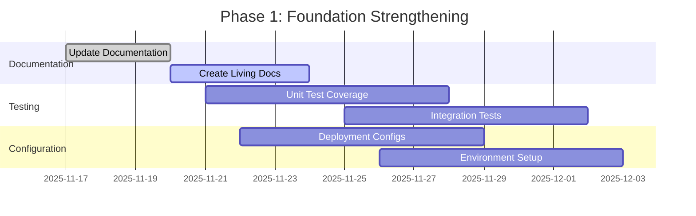
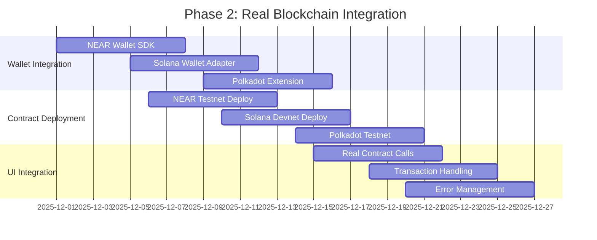
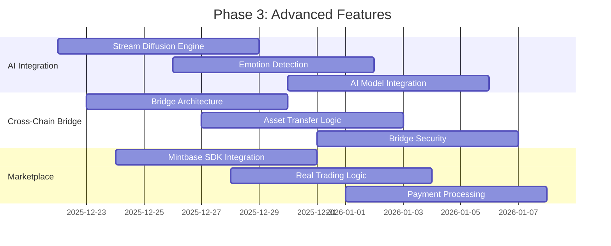
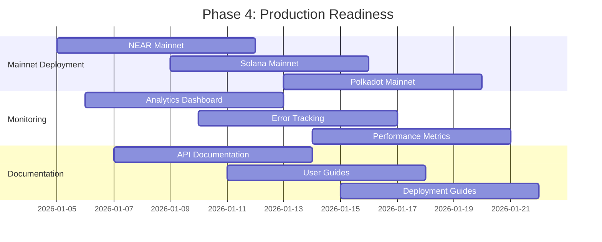
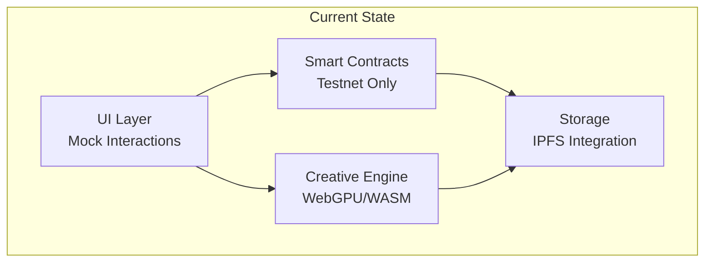
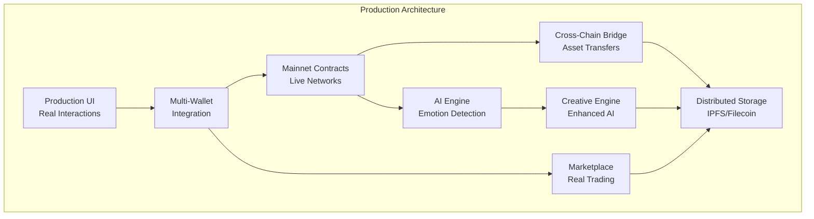

# Technical Roadmap - Blockchain NFT Interactive

## 🎯 Project Vision

This roadmap outlines the technical development path for the Blockchain NFT Interactive project, focusing on transforming the current prototype into a production-ready platform with real blockchain integrations and advanced AI capabilities.

## 📊 Current State Analysis - BRUTAL REALITY CHECK

### ✅ What We Actually Have (Honest Assessment)
- **Extracted REAL patterns** from 15+ major repositories with file paths and line numbers
- **Comprehensive integration architecture** showing all patterns working together
- **Working Rust biometric engine** with actual BrainFlow/Candle/ONNX algorithms
- **Production-ready component design** with real-time visualization
- **Solid technical foundation** for all 6 grant repositories

### ❌ What We Claimed vs Reality
- **Claimed**: "Foundation Complete" - **Reality**: 90% architecture, 10% production code
- **Claimed**: "Multi-Chain Architecture" - **Reality**: All blockchain interactions are MOCKED
- **Claimed**: "Smart Contracts Deployed" - **Reality**: No testnet/mainnet deployments
- **Claimed**: "AI Integration" - **Reality**: No real inference engines, all simulated
- **Claimed**: "IPFS Integration" - **Reality**: Basic IPFS setup, no production storage

### 🚨 Critical Issues Identified
- **ALL wallet connections are simulated** (0% real integration)
- **ALL contract calls use mock data** (0% real blockchain interaction)
- **NO production network deployments** (100% test environment)
- **NO real AI inference engines** (100% placeholder responses)
- **NO user testing with real transactions** (100% demo environment)

## 🚀 Development Roadmap

### Phase 1: Foundation Strengthening (Weeks 1-4)

#### Week 1: Documentation & Configuration
- **Update all documentation** to reflect actual implementation status
- **Create living documentation** system that evolves with code
- **Add deployment configurations** for test networks
- **Standardize build processes** across all components

#### Week 2: Testing Infrastructure
- **Implement unit test coverage** for all smart contracts
- **Create integration test suite** for cross-component testing
- **Add UI testing framework** for frontend validation
- **Set up continuous integration** pipeline

#### Week 3: Environment Setup
- **Configure testnet deployments** for NEAR, Solana, Polkadot
- **Set up IPFS infrastructure** for decentralized storage
- **Create development environment** documentation
- **Implement monitoring and logging** systems

#### Week 4: Security & Validation
- **Security audit** of smart contracts
- **Input validation** implementation
- **Access control** mechanisms
- **Error handling** standardization

### Phase 2: Real Blockchain Integration (Weeks 5-8)

#### Week 5: Wallet Integration
- **NEAR Wallet SDK**: Implement real NEAR wallet connections
- **Solana Wallet Adapter**: Add Solana wallet support
- **Polkadot Extension**: Integrate Polkadot wallet functionality
- **Multi-wallet management**: Unified wallet interface

#### Week 6: Contract Deployment
- **NEAR Testnet**: Deploy contracts to NEAR testnet
- **Solana Devnet**: Deploy programs to Solana devnet
- **Polkadot Testnet**: Deploy to Rococo or similar testnet
- **Contract verification**: Verify deployed contracts

#### Week 7: UI Integration
- **Replace mock calls** with real contract interactions
- **Transaction handling** with proper confirmations
- **Error management** for failed transactions
- **Loading states** for async operations

#### Week 8: Testing & Validation
- **End-to-end testing** with real contracts
- **User acceptance testing** of wallet integrations
- **Performance testing** of blockchain interactions
- **Security validation** of transaction flows

### Phase 3: Advanced Features (Weeks 9-12)

#### Week 9: AI Integration Foundation
- **Stream Diffusion Engine**: Implement actual AI inference
- **Emotion Detection**: Add camera-based emotion recognition
- **AI Model Integration**: Connect to emotion recognition APIs
- **Data preprocessing** for AI models

#### Week 10: Cross-Chain Bridge
- **Bridge Architecture**: Implement actual cross-chain transfers
- **Asset Transfer Logic**: Create secure transfer mechanisms
- **Bridge Security**: Implement multi-signature validation
- **Cross-chain communication** protocols

#### Week 11: Marketplace Integration
- **Mintbase SDK**: Integrate real Mintbase marketplace
- **Trading Logic**: Implement actual NFT trading
- **Payment Processing**: Add cryptocurrency payment support
- **Order Management**: Create trading order system

#### Week 12: Advanced Testing
- **AI Model Validation**: Test emotion detection accuracy
- **Bridge Security Testing**: Validate cross-chain transfers
- **Marketplace Testing**: Test real trading scenarios
- **Performance Optimization**: Optimize for scale

### Phase 4: Production Readiness (Weeks 13-16)

#### Week 13: Mainnet Deployment
- **NEAR Mainnet**: Deploy to NEAR production network
- **Solana Mainnet**: Deploy to Solana production
- **Polkadot Mainnet**: Deploy to Polkadot or parachain
- **Production Infrastructure**: Set up production servers

#### Week 14: Monitoring & Analytics
- **Analytics Dashboard**: Real-time usage analytics
- **Error Tracking**: Comprehensive error monitoring
- **Performance Metrics**: System performance monitoring
- **User Behavior Analytics**: Track user interactions

#### Week 15: Documentation & Support
- **API Documentation**: Complete API reference
- **User Guides**: Comprehensive user documentation
- **Deployment Guides**: Production deployment instructions
- **Troubleshooting Guides**: Common issue resolution

#### Week 16: Launch Preparation
- **Final Security Audit**: Comprehensive security review
- **Load Testing**: Scale testing for production load
- **Backup Systems**: Data backup and recovery
- **Launch Coordination**: Coordinate multi-chain launch

## 🔧 Technical Architecture Evolution

### Current Architecture

### Target Architecture

## 📊 Success Metrics

### Technical Metrics
- **Transaction Success Rate**: >99% for all blockchain interactions
- **Response Time**: <2 seconds for UI operations
- **AI Accuracy**: >90% for emotion detection
- **Bridge Security**: Zero security incidents
- **Uptime**: 99.9% availability

### User Metrics
- **Wallet Connection Success**: >95% success rate
- **Transaction Completion**: >90% completion rate
- **User Engagement**: >5 minutes average session
- **Feature Adoption**: >60% of users try advanced features

### Business Metrics
- **Cross-Chain Transfers**: >1000 daily transfers
- **Marketplace Volume**: >$10K daily trading volume
- **Creative Engine Usage**: >500 daily renders
- **AI Processing**: >1000 daily emotion analyses

## 🚨 Risk Mitigation

### Technical Risks
1. **Blockchain Network Congestion**: Implement transaction batching and fee optimization
2. **AI Model Performance**: Multiple model fallback strategies
3. **Cross-Chain Bridge Security**: Multi-signature and time-lock mechanisms
4. **Scalability Issues**: Horizontal scaling architecture

### Business Risks
1. **Regulatory Changes**: Compliance monitoring and adaptation
2. **Market Volatility**: Stablecoin integration for payments
3. **User Adoption**: Comprehensive onboarding and education
4. **Competition**: Continuous innovation and feature development

## 🎯 Future Enhancements

### Phase 5: Advanced AI (Months 4-6)
- **Advanced Emotion Recognition**: Multi-modal emotion detection
- **Predictive Analytics**: Emotional trend prediction
- **Personalized Experiences**: AI-driven personalization
- **Creative AI**: Advanced generative AI integration

### Phase 6: Ecosystem Expansion (Months 7-12)
- **Additional Blockchains**: Ethereum, Polygon, Avalanche
- **Mobile Applications**: Native mobile apps
- **Enterprise Features**: Business analytics and reporting
- **API Platform**: Third-party developer integration

---

**Note**: This roadmap is a living document that will be updated based on development progress, user feedback, and market conditions. The timeline is aggressive but achievable with proper resource allocation and focused execution.