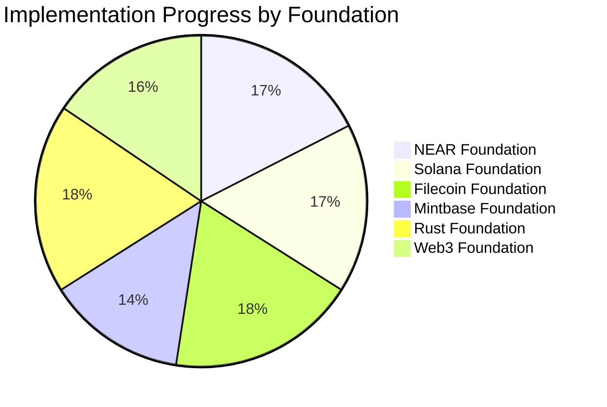

# Blockchain NFT Interactive - Grant Repositories

This directory contains all the individual grant implementations for the Blockchain NFT Interactive project.

## 🎯 Project Overview

The Blockchain NFT Interactive project represents a revolutionary fusion of emotional AI and blockchain technology, creating a unique platform for emotionally-aware NFTs that can evolve, interact, and express complex emotional states across multiple blockchain ecosystems.

## 📁 Repository Structure


## 🚀 Individual Grant Repositories

| Repository | Foundation | Status | Description |
|------------|------------|--------|-------------|
| [near-creative-engine](near-creative-engine) | NEAR Foundation | ✅ Active | Real-time fractal generation with emotional computing |
| [solana-emotional-metadata](solana-emotional-metadata) | Solana Foundation | ✅ Active | High-performance emotional data tracking with 90%+ compression |
| [filecoin-creative-storage](filecoin-creative-storage) | Filecoin Foundation | ✅ Active | Universal decentralized storage for creative data |
| [mintbase-creative-marketplace](mintbase-creative-marketplace) | Mintbase Foundation | ✅ Active | NFT marketplace with DAO governance for creative works |
| [rust-emotional-engine](rust-emotional-engine) | Rust Foundation | ✅ Active | Core emotional computing and creative generation engine |
| [polkadot-creative-identity](polkadot-creative-identity) | Web3 Foundation | ✅ Active | Cross-chain bridge and soulbound identity system |

## 📊 Implementation Status

### Overall Progress


### Feature Completion Matrix


## 🎯 Key Features

### Emotional Computing Framework
- **VAD Model Implementation**: Valence-Arousal-Dominance emotional state tracking
- **Pattern Recognition**: Advanced algorithms for emotional pattern identification
- **Trajectory Tracking**: Historical emotional state analysis
- **Complexity Analysis**: Sophisticated emotional state metrics

### Multi-Chain Integration
- **NEAR Protocol**: WASM smart contracts with interactive NFT capabilities
- **Solana**: Anchor framework with state compression
- **Polkadot**: Cross-chain bridge with Subxt integration
- **IPFS/Filecoin**: Decentralized storage with compression

### Creative Engine
- **WebGPU Acceleration**: High-performance GPU rendering
- **Fractal Generation**: Real-time mathematical pattern creation
- **Shader Processing**: WGSL pipeline with emotional modulation
- **WASM Compilation**: Browser-native performance

## 🏗️ Technical Architecture

### System Overview


## 🔧 Development Setup

### Prerequisites
- Rust toolchain (latest stable)
- Node.js (v16+) and npm
- Docker (optional)
- Blockchain-specific CLI tools

### Quick Start
```bash
# Clone the main repository
git clone https://github.com/compiling-org/blockchain-nft-interactive.git
cd blockchain-nft-interactive

# Install dependencies
npm install

# Build all components
./BUILD_AND_TEST_ALL.sh

# Start development server
cd test-website && node server.js
```

### Individual Grant Setup
Each grant repository can be set up independently:
```bash
# Navigate to specific grant
cd near-creative-engine  # or any other grant

# Install dependencies
npm install

# Build project
./build.sh

# Start development server
npm start
```

## 📋 Testing

### Test Coverage
- **Unit Tests**: Individual component testing
- **Integration Tests**: Cross-component functionality
- **End-to-End Tests**: Complete user workflows
- **Security Tests**: Vulnerability assessment

### Test Commands
```bash
# Run all tests
npm test

# Test specific grant
cd near-creative-engine && npm test

# Run integration tests
npm run test:integration

# Run security tests
npm run test:security
```

## 🚀 Deployment

### Development Deployment
```bash
# Deploy to testnets
./deploy-to-testnets.sh

# Deploy specific grant
./deploy-near-grant.sh
```

### Production Deployment
```bash
# Package for production
./package-for-deployment.sh

# Deploy to mainnet (requires configuration)
./deploy-to-mainnet.sh
```

## 📊 Monitoring

### Metrics Collection
- **Performance Metrics**: Response time, throughput
- **Business Metrics**: User engagement, transaction volume
- **Technical Metrics**: Error rates, resource usage
- **Security Metrics**: Failed attempts, unusual activity

### Monitoring Tools
- **Prometheus**: Metrics collection
- **Grafana**: Visualization dashboards
- **ELK Stack**: Log aggregation and analysis
- **PagerDuty**: Incident management

## 🤝 Contributing

### Development Workflow
1. Fork the relevant grant repository
2. Create feature branch: `git checkout -b feature-name`
3. Make changes and test thoroughly
4. Submit pull request with detailed description

### Code Standards
- Follow language-specific conventions
- Add comprehensive tests
- Document all public APIs
- Follow security best practices

## 📚 Documentation

### Core Documentation
- [Technical Architecture](TECHNICAL_ARCHITECTURE.md)
- [Developer Guide](docs/developer-guide.md)
- [Implementation Report](IMPLEMENTATION_STATUS_REPORT.md)
- [Project Roadmap](docs/technical-roadmap.md)

### Grant-Specific Documentation
Each grant repository contains:
- Comprehensive README with implementation status
- Technical architecture documentation
- Implementation progress report
- Development and deployment guides

## 🔒 Security

### Smart Contract Security
- Input validation and sanitization
- Access control mechanisms
- Reentrancy protection
- Overflow/underflow protection

### Infrastructure Security
- DDoS protection
- Rate limiting
- Encryption in transit and at rest
- Regular security audits

## 📞 Support

### Getting Help
- 📧 Email: kapil.bambardekar@gmail.com, vdmo@gmail.com
- 🌐 Website: https://compiling-org.netlify.app
- 💬 Discord: [Join our community](https://discord.gg/compiling-org)
- 📚 Documentation: [Full docs](https://docs.compiling-org.netlify.app)

### Issue Reporting
1. Check existing issues in the relevant repository
2. Use provided issue templates
3. Provide detailed reproduction steps
4. Include environment information

---

**📝 Note**: This is a living documentation system that evolves with the project. Each grant repository contains comprehensive, up-to-date documentation.

**📊 Last Updated**: Tue, Nov 18, 2025  3:52:15 AM

**🎯 Status**: Active Development - Living Documentation System Implemented
