# Blockchain NFT Interactive - Project Status & Implementation Report

## 📊 Executive Summary

This document provides a comprehensive analysis of the current implementation status of the Blockchain NFT Interactive project, including what features are actually implemented versus what is claimed in various documentation.

## 🎯 Implementation Reality Check

### ✅ Actually Implemented Features

#### Emotional Computing Framework
- **VAD Model**: Complete implementation across all blockchain modules
- **Emotional Trajectory Tracking**: Working algorithms in NEAR, Solana, Polkadot, and Rust clients
- **Pattern Recognition**: Basic pattern identification in emotional data
- **Complexity Analysis**: Sophisticated metrics for emotional state complexity
- **Data Compression**: 90%+ compression for emotional AI data

#### Multi-Chain Smart Contracts
- **NEAR Protocol**: Complete WASM contracts with interactive NFT functionality
- **Solana**: Anchor programs with emotional state tracking accounts
- **Polkadot**: Subxt client with emotional bridge and soulbound tokens
- **IPFS Integration**: Custom client for decentralized storage

#### Creative Engine
- **WebGPU Engine**: Browser-based creative tools with emotional modulation
- **Fractal Generation**: Real-time mathematical pattern generation
- **WGSL Pipeline**: Shader processing with emotional influence
- **WASM Compilation**: Browser runtime for creative tools

### ⚠️ Partially Implemented Features

#### Marketplace Integration
- **UI Components**: Complete interface with tabs and forms
- **Mock Functions**: Simulated blockchain calls without real SDK integration
- **Contract Structures**: NEAR marketplace contract exists but not connected to live UI
- **Mintbase Integration**: Referenced but uses simulated calls only

#### Cross-Chain Bridge
- **Metadata Tracking**: Emotional state metadata stored across chains
- **Bridge Structures**: Data structures for cross-chain communication
- **No Actual Transfers**: Bridge operations are metadata-only, no asset transfers

#### Wallet Integration
- **Connection UI**: Wallet detection and connection interface
- **Simulated Connections**: Mock wallet connections for demonstration
- **No Real SDK Integration**: Missing actual wallet SDK implementations

#### Stream Diffusion
- **Data Structures**: Account structures for AI processing
- **No Inference Engine**: Missing actual AI model integration
- **Placeholder Implementation**: UI shows "not implemented" messages

### ❌ Missing/Unimplemented Features

#### Production Features
- **Real Marketplace Transactions**: All UI actions are simulated
- **Live Contract Deployment**: No production network deployments
- **Camera-Based Emotion Detection**: Placeholder functionality only
- **Real Cross-Chain Operations**: No actual bridge transfers or proofs

#### Advanced Functionality
- **Live AI Processing**: Stream diffusion without inference engine
- **Production Wallet Integration**: No real wallet connections
- **Advanced Analytics**: Basic metrics without sophisticated analysis
- **Production Monitoring**: No monitoring or logging infrastructure

## 📋 Detailed Component Analysis

### NEAR Implementation Status

```mermaid
graph LR
    subgraph "NEAR Components"
        NC["NEAR Contracts<br/>✅ Complete"]
        FS["Fractal Studio<br/>✅ Complete"]
        WS["WGSL Studio<br/>✅ Complete"]
        MS["Marketplace Contract<br/>✅ Complete"]
        MI["Mintbase Integration<br/>❌ Mock Only"]
    end
    
    subgraph "Build Status"
        BC["Build Script<br/>✅ Working"]
        WD["WASM Output<br/>✅ Generated"]
        DP["Deployment<br/>❌ Not Configured"]
    end
    
    NC --> BC
    FS --> BC
    WS --> BC
    MS --> BC
    BC --> WD
    WD --> DP
```

### Solana Implementation Status

```mermaid
graph LR
    subgraph "Solana Components"
        SP["Solana Programs<br/>✅ Complete"]
        NE["Neuroemotive<br/>✅ Data Structures"]
        SD["Stream Diffusion<br/>⚠️ Structure Only"]
        ST["Storage Advanced<br/>✅ Complete"]
    end
    
    subgraph "Build Issues"
        AC["Anchor Config<br/>❌ Missing"]
        BP["Build Process<br/>✅ Cargo Build"]
        DP["Deployment Config<br/>❌ Not Present"]
    end
    
    SP --> BP
    NE --> BP
    SD --> BP
    ST --> BP
    BP --> AC
    AC --> DP
```

### UI Implementation Status

```mermaid
graph TD
    subgraph "Frontend Components"
        TW["Test Website<br/>✅ Complete UI"]
        MF["Marketplace Frontend<br/>✅ Complete UI"]
        WC["Wallet Connections<br/>❌ Mock Only"]
        MI["Mintbase Integration<br/>❌ Mock Only"]
    end
    
    subgraph "Backend Integration"
        BC["Blockchain Calls<br/>❌ Simulated"]
        IPFS["IPFS Upload<br/>⚠️ Mock Upload"]
        EMOTION["Emotion Detection<br/>❌ Not Implemented"]
    end
    
    TW --> BC
    MF --> BC
    WC --> BC
    MI --> BC
    BC --> IPFS
    BC --> EMOTION
```

## 🔍 Code Quality Assessment

### Strengths
1. **Solid Architecture**: Well-designed modular structure
2. **Comprehensive Documentation**: Extensive documentation across components
3. **Build Scripts**: Automated build processes for all components
4. **Type Safety**: Strong TypeScript and Rust type systems
5. **Error Handling**: Proper error handling in smart contracts

### Weaknesses
1. **Mock-Heavy Implementation**: Too many simulated functions
2. **Missing Production Config**: No deployment configurations
3. **Incomplete SDK Integration**: Missing wallet and marketplace SDKs
4. **Limited Testing**: Insufficient test coverage
5. **Documentation Drift**: Some docs don't reflect actual implementation

## 📈 Build and Compilation Status

### Successful Builds
- ✅ Main Project - Compiles with minor warnings
- ✅ Rust Client - WebGPU engine compiles successfully
- ✅ IPFS Integration - Custom client builds without issues
- ✅ Polkadot Client - Subxt integration compiles
- ✅ NEAR WASM - Contract builds for wasm32 target
- ✅ Solana Client - Program compiles with warnings
- ✅ Marketplace - Contract builds successfully

### Build Issues
- ⚠️ Solana: Uses `cargo build` instead of `anchor build`
- ⚠️ Missing Anchor configuration files
- ⚠️ Deployment paths inconsistent with build outputs

## 🚨 Critical Issues Identified

### High Priority
1. **All UI Interactions Are Simulated**: No real blockchain transactions
2. **Missing Production Deployment**: No live network deployments
3. **Wallet Integration Is Mock**: No real wallet connections
4. **Marketplace Uses Simulated Calls**: No actual NFT trading

### Medium Priority
1. **Cross-Chain Bridge Is Metadata-Only**: No actual transfers
2. **Stream Diffusion Missing AI Engine**: No inference processing
3. **Camera Emotion Detection Not Implemented**: Placeholder only
4. **Missing Production Monitoring**: No logging or metrics

### Low Priority
1. **Documentation Inconsistencies**: Some claims exceed implementation
2. **Build Script Inconsistencies**: Different build approaches
3. **Test Coverage Gaps**: Limited testing infrastructure
4. **Code Style Variations**: Inconsistent formatting

## 🎯 Recommendations

### Immediate Actions (Week 1-2)
1. **Document Current State**: Update all documentation to reflect reality
2. **Add Implementation Status**: Clear indicators of what's implemented
3. **Fix Build Scripts**: Standardize build processes
4. **Add Missing Configs**: Create deployment configurations

### Short Term (Month 1)
1. **Implement Real Wallet Integration**: Add actual wallet SDKs
2. **Connect UI to Live Contracts**: Replace simulated calls
3. **Deploy to Test Networks**: Get contracts on testnets
4. **Add Basic Testing**: Implement unit and integration tests

### Medium Term (Month 2-3)
1. **Implement Cross-Chain Bridge**: Add actual transfer functionality
2. **Add AI Inference Engine**: Integrate stream diffusion processing
3. **Camera Emotion Detection**: Implement actual emotion detection
4. **Production Deployment**: Deploy to mainnet

### Long Term (Month 4+)
1. **Advanced Analytics**: Implement sophisticated metrics
2. **Production Monitoring**: Add comprehensive monitoring
3. **Performance Optimization**: Optimize for scale
4. **Advanced Features**: Add complex emotional AI features

## 📊 Implementation Progress Summary

| Component | Planned | Implemented | Status | Completion % |
|-----------|---------|---------------|---------|--------------|
| **NEAR Contracts** | 100% | 90% | ✅ Near Complete | 90% |
| **Solana Programs** | 100% | 85% | ⚠️ Missing AI Engine | 85% |
| **Polkadot Client** | 100% | 80% | ⚠️ Bridge Incomplete | 80% |
| **Rust Engine** | 100% | 95% | ✅ Almost Complete | 95% |
| **IPFS Integration** | 100% | 95% | ✅ Near Complete | 95% |
| **Marketplace UI** | 100% | 70% | ❌ Mock Only | 70% |
| **Wallet Integration** | 100% | 30% | ❌ Mock Only | 30% |
| **Cross-Chain Bridge** | 100% | 40% | ❌ Metadata Only | 40% |
| **Camera Detection** | 100% | 10% | ❌ Placeholder | 10% |
| **Stream Diffusion** | 100% | 60% | ⚠️ No AI Engine | 60% |

## 🏁 Conclusion

The Blockchain NFT Interactive project has a solid foundation with most core components implemented. However, there's a significant gap between the sophisticated architecture and the actual user-facing functionality. The project demonstrates strong technical capabilities in smart contract development and creative engine implementation, but falls short on production-ready features and real-world integrations.

**Key Takeaway**: This is a well-architected prototype with impressive technical depth, but it needs substantial work to become a production-ready platform. The gap between documentation claims and implementation reality needs to be addressed through either implementation of missing features or honest documentation of current limitations.

---

**Document Version**: 1.0  
**Last Updated**: November 2025  
**Status**: Living Document - Updated as implementation progresses