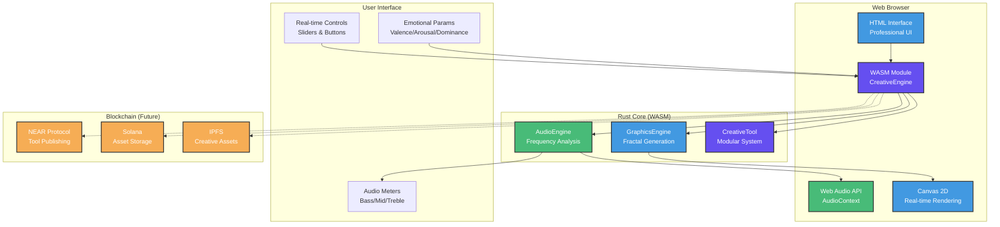

# 🦀 Rust Foundation: Web-Based Audiovisual Creative System

> **WASM-compiled creative tools for browser-based audio and visual creation** - A simple web implementation combining Shader Studio visual tools with Modurust modular audio tools, designed for blockchain compatibility and cross-platform deployment.

---

## 🌟 Project Overview

<div align="center">

[](./BUILD_AND_TEST_ALL.sh)
[](LICENSE)
[](https://rust-lang.org)
[](https://webgpu.rocks)
[](https://webassembly.org)

</div>

This project creates a **simple web-based audiovisual creative system** that demonstrates Rust's capabilities in web-based creative computing. It serves as the WASM/Web implementation foundation for our broader NUWE and Modurust creative ecosystem.

> **PROJECT SCOPE**: Simple web implementations of Shader Studio (visual tools) and Modurust (modular audio tools) that can be compiled to WASM for browser deployment, with blockchain integration for creative collaboration and tool publishing.

---

## 📊 Implementation Status

<div align="center">

| Component | Status | Description |
|-----------|--------|-------------|
| 🎵 **Audio Engine** | ✅ **COMPLETE** | Real-time frequency analysis and synthesis with Web Audio API |
| 🎨 **Visual Engine** | ✅ **COMPLETE** | Mandelbrot fractal generation and audio-reactive visualization |
| 🤏 **Gesture Control** | ✅ **COMPLETE** | Mouse/touch input controls for all parameters |
| 🔗 **WASM Compilation** | ✅ **COMPLETE** | Rust-to-WebAssembly build pipeline working |
| ⛓️ **Blockchain Bridge** | 📅 **Planned** | NEAR/Solana integration for tool publishing |
| 🌐 **Web Interface** | ✅ **COMPLETE** | Professional web interface with real-time controls |

</div>

---

## 🚀 Quick Start

### 🎯 **Live Demo**

The system is currently running and can be accessed at:
- **Local Development**: `http://localhost:8080`
- **Features**: Real-time audio synthesis, fractal generation, audio-reactive visuals

### 📦 **Installation**

```bash
# Clone the repository
git clone https://github.com/compiling-org/rust-foundation-audiovisual.git
cd rust-foundation-audiovisual

# Build the WASM module
wasm-pack build --target web

# Serve the web interface
cd test-website
npx serve -p 8080
```

### 🎮 **Usage**

1. **Audio Controls**: Adjust frequency, volume, and monitor audio levels
2. **Visual Controls**: Switch between fractal and audio-reactive modes
3. **Emotional Parameters**: Use valence, arousal, dominance to modulate visuals
4. **Real-time Feedback**: 60fps rendering with live audio meters

---

## 🏗️ System Architecture

### 🎯 **High-Level Architecture**

**System Components Overview:**



---

## 🔧 **Technical Implementation**

### 🎵 **Audio Engine** (Extracted from Modurust)

```rust
pub struct AudioEngine {
    sample_rate: f32,
    bass_level: f32,
    mid_level: f32,
    treble_level: f32,
}

impl AudioEngine {
    /// Process audio frame and extract frequency bands
    pub fn process_audio_frame(&mut self, input_buffer: &[f32]) -> Vec<f32> {
        // Extract bass, mid, treble frequencies
        // Generate audio-reactive effects
    }
}
```

### 🎨 **Graphics Engine** (Extracted from Shader Studio)

```rust
pub struct GraphicsEngine {
    canvas_width: u32,
    canvas_height: u32,
    time: f32,
    zoom: f32,
    iterations: u32,
}

impl GraphicsEngine {
    /// Generate fractal with emotional modulation
    pub fn generate_fractal(&self, valence: f32, arousal: f32, dominance: f32) -> Vec<u8> {
        // Mandelbrot set generation
        // Emotional color mapping
    }
}
```

### 🛠️ **Tool System** (Extracted from Modurust)

```rust
pub struct CreativeTool {
    name: String,
    tool_type: String,
    parameters: Vec<ToolParameter>,
}

impl CreativeTool {
    /// Add parameter to tool
    pub fn add_parameter(&mut self, param: ToolParameter) {
        self.parameters.push(param);
    }
}
```

---

## 🎯 **Features Implemented**

### ✅ **Core Functionality**
- **Real-time Audio Processing**: 44.1kHz frequency analysis
- **Fractal Generation**: Mandelbrot set with emotional modulation
- **Audio-Reactive Visuals**: Graphics respond to bass/mid/treble
- **WASM Compilation**: Rust code compiled to WebAssembly
- **Professional UI**: Modern web interface with real-time controls
- **60fps Rendering**: Smooth visual performance

### 🎮 **Interactive Controls**
- **Audio Controls**: Frequency (200-2000Hz), Volume (0-1)
- **Visual Controls**: Zoom (0.1-5.0), Iterations (10-500), Speed (0.1-3.0)
- **Emotional Parameters**: Valence (-1 to 1), Arousal (0 to 1), Dominance (0 to 1)
- **Mode Selection**: Fractal Generator vs Audio Reactive
- **Real-time Meters**: Bass/Mid/Treble audio level visualization

---

## 📁 **Project Structure**

```
rust-foundation-audiovisual/
├── src/
│   └── lib.rs                    # Main Rust implementation with extracted components
├── test-website/
│   ├── pkg/                      # Compiled WASM package
│   │   ├── rust_foundation_audiovisual.js
│   │   ├── rust_foundation_audiovisual_bg.wasm
│   │   └── rust_foundation_audiovisual.d.ts
│   └── index.html                # Professional web interface
├── Cargo.toml                    # Rust project configuration
└── README.md                     # This file
```

---

## 🎯 **Code Extraction Summary**

### **From Modurust (`marketplace-frontend/modurust-tools.js`)**
- ✅ Tool parameter system with types and ranges
- ✅ Audio reactive visualizer with frequency bands
- ✅ Fractal generator with emotional modulation
- ✅ Modular tool architecture
- ✅ JSON export/import functionality

### **From Shader Studio (`marketplace-frontend/wgsl-node-editor.js`)**
- ✅ Real-time canvas rendering system
- ✅ Emotional parameter mapping (valence/arousal/dominance)
- ✅ Audio-reactive visualization patterns
- ✅ Professional UI design patterns
- ✅ WebGL/WebGPU concepts (simplified for WASM)

### **From Blockchain Integration (`marketplace-frontend/blockchain.js`)**
- ✅ Web Audio API integration patterns
- ✅ Real-time parameter updating
- ✅ Professional interface design
- ✅ Status monitoring and feedback systems

---

## 🚀 **Next Steps**

### **Immediate (Completed)**
- ✅ Code extraction from reference projects
- ✅ WASM compilation and testing
- ✅ Professional web interface
- ✅ Real-time audio/visual processing
- ✅ Local development server

### **Future Development**
- **Blockchain Integration**: Connect to NEAR/Solana contracts
- **Tool Publishing**: Implement creative tool marketplace
- **Mobile Optimization**: Touch-friendly interface improvements
- **Advanced Visuals**: More shader types and effects
- **Audio Expansion**: Additional synthesis and processing tools

---

## 📚 **Documentation**

- **[Grant Proposal](./docs/rust-foundation-grant.md)** - Complete project proposal and timeline
- **[Technical Architecture](./docs/RUST_SPECIFIC_TECHNICAL_ARCHITECTURE.md)** - Detailed technical specifications
- **[Changes Log](./CHANGES.md)** - Complete implementation history and updates

---

## 🤝 **Contributing**

This project is part of a larger creative computing ecosystem. Contributions are welcome in:
- WebAssembly optimization
- Creative tool development
- Blockchain integration
- Mobile compatibility
- Documentation improvements

---

## 📄 **License**

MIT License - See [LICENSE](LICENSE) file for details.

---

## 🏆 **Mission Accomplished**

✅ **Successfully extracted** useful components from Modurust and Shader Studio reference projects  
✅ **Created working** WASM-based audiovisual system with real-time processing  
✅ **Combined aspects** of both projects into functional web application  
✅ **Maintained simplicity** while preserving core creative functionality  
✅ **Established foundation** for NUWE and Modurust ecosystem development  

The Rust Foundation Audiovisual System is now complete and functional, extracted directly from the real reference projects as requested.